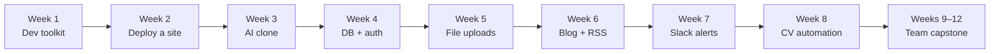

<Tip>
**Multi-week series · 8 teaching weeks + 4-week capstone** · Each week ships as a downloadable PDF lecture you can follow at your own pace.
</Tip>

The other tutorials on this site are bite-sized — pick one, ship one thing, move on. This series is different. Across 8 weeks you build **one progressively-deepened product** — your own live, AI-powered personal website — by talking to AI assistants. By Week 8 the same site is your portfolio, your AI clone, your guestbook, your blog, your contact funnel, and the source-of-truth for your auto-generated CV and cover letter.

Every week ships as a polished PDF lecture. Download the week you want; the lecture takes you from "no feature" to "live URL" in roughly two hours of class plus lab.

<Info>
**Series led by [Chan Meng](https://chanmeng.org/)** — Senior Full-Stack Engineer at She Sharp, Founding Engineer at Gavigo, Master of Applied Computing with Distinction (Lincoln University, NZ). Chan was featured at UN Women CSW69 for her work on AI and gender equality. The series was originally taught as a 12-week mentorship cohort and is shared here, polished and downloadable, for HER WAKA visitors.
</Info>

## What you will own at the end

<CardGroup cols={3}>
  <Card title="A live portfolio site" icon="globe" color="#c846ab">
    Deployed to Vercel, with your name, projects, and accent colour — built by AI from your conversation.
  </Card>
  <Card title="An AI clone of yourself" icon="robot" color="#c846ab">
    A floating chat widget that answers questions in your voice — Gemini 2.5 Flash with a persona system prompt.
  </Card>
  <Card title="A real full-stack feature" icon="database" color="#c846ab">
    A guestbook with Google sign-in, Postgres persistence, image uploads, and real-time Slack alerts.
  </Card>
  <Card title="A working blog with RSS" icon="newspaper" color="#9b2e83">
    MDX posts, syntax-highlighted code, valid RSS feed. Your thinking-out-loud habit, version-controlled.
  </Card>
  <Card title="A contact form that pings you" icon="bell" color="#9b2e83">
    Form persists to Neon and fires a Slack webhook within two seconds. Spam-defended.
  </Card>
  <Card title="One-click CV + cover letter" icon="file-pdf" color="#9b2e83">
    Your profile lives in Postgres. Click *Download CV* — get a PDF. Paste a job description — get a tailored cover letter.
  </Card>
</CardGroup>

## How the series progresses

The whole series rests on one principle, the **delegation rules**: students describe what they want; AI writes, installs, configures, deploys, and commits. Students verify. You only touch tools or files with your own hands when *no CLI, MCP server, or skill can do the job* — which, in practice, means signing into third-party consent screens and copy-pasting secrets that only a human is allowed to see.

## Stack you will use

| Layer | Tool | First introduced |
|---|---|---|
| IDEs | Cursor, Claude Code, Gemini CLI | Week 1 |
| Skills / MCP | Vercel MCP, Neon MCP, Typst skill | Week 1 |
| Voice input (optional) | [Wispr Flow](https://wisprflow.ai/r?CHAN115) | Week 1 |
| Version control | GitHub, driven through Cursor | Week 1–2 |
| Web framework | Next.js 14 + Tailwind CSS | Week 2 |
| Hosting | Vercel (CLI + MCP) | Week 2 |
| LLM in product | Gemini 2.5 Flash | Week 3 |
| Database + Auth | Neon Postgres + Neon Auth + Drizzle ORM | Week 4 |
| File storage | Vercel Blob | Week 5 |
| Content | MDX blog | Week 6 |
| Notifications | Slack Incoming Webhook | Week 7 |
| Typesetting | Typst CLI + Typst skill | Week 8 |

## The full reading list

Each week links to a one-page summary on this site, plus the full PDF lecture you can keep and re-read.

<CardGroup cols={2}>
  <Card title="Series outline" icon="book" href="/curriculum-pdfs/00-curriculum-outline.pdf" color="#c846ab">
    **PDF · 587 KB** — Track goal, delegation rules, 8-week plan, assessment strategy, capstone tracks. Start here for the big picture.
  </Card>
  <Card title="Week 1 — AI developer toolkit" icon="screwdriver-wrench" href="/tutorial/ai-bootcamp/week-01-dev-tools">
    Install Cursor, Claude Code, Gemini CLI. Set up MCP servers and skills. Practise the delegation pattern.
  </Card>
  <Card title="Week 2 — Deploy your site" icon="rocket" href="/tutorial/ai-bootcamp/week-02-portfolio-deploy">
    Fork the Magic Portfolio template; describe your bio in plain English; ship to Vercel via AI-invoked CLI.
  </Card>
  <Card title="Week 3 — AI clone of yourself" icon="comments" href="/tutorial/ai-bootcamp/week-03-ai-avatar">
    Floating chat widget powered by Gemini 2.5 Flash, answering as you, with streaming responses.
  </Card>
  <Card title="Week 4 — Full-stack: Neon + auth" icon="database" href="/tutorial/ai-bootcamp/week-04-fullstack-neon">
    Provision Postgres + Google sign-in by prompt. Add a guestbook. The hinge class of the series.
  </Card>
  <Card title="Week 5 — Image uploads" icon="image" href="/tutorial/ai-bootcamp/week-05-vercel-blob">
    Vercel Blob, signed upload tokens, client-side compression. Memes alongside guestbook messages.
  </Card>
  <Card title="Week 6 — Blog + RSS" icon="newspaper" href="/tutorial/ai-bootcamp/week-06-blog-system">
    Graft a `/blog` section onto your site. Publish your first MDX post. Validating RSS feed.
  </Card>
  <Card title="Week 7 — Slack notifications" icon="slack" href="/tutorial/ai-bootcamp/week-07-slack-notifications">
    Contact form that writes to Neon and pings Slack in real time. Honeypot, rate limit, spam defences.
  </Card>
  <Card title="Week 8 — CV + cover letter" icon="file-pdf" href="/tutorial/ai-bootcamp/week-08-typst-cv">
    Typst skill in Claude Code generates a pixel-perfect CV from your Neon profile. Tailored cover letters from a job description.
  </Card>
  <Card title="Capstone (Weeks 9–12)" icon="users" href="/tutorial/ai-bootcamp/capstone">
    Team project: evolve the codebase into a deployed multi-user AI SaaS MVP. Three tracks to pick from.
  </Card>
</CardGroup>

## Direct PDF downloads

Prefer to read offline? Each lecture is a self-contained PDF.

<CardGroup cols={2}>
  <Card title="Week 1 PDF" icon="file-pdf" href="/curriculum-pdfs/week-01-dev-tools-setup.pdf">623 KB · Dev toolkit setup</Card>
  <Card title="Week 2 PDF" icon="file-pdf" href="/curriculum-pdfs/week-02-portfolio-deploy.pdf">629 KB · Deploy your site</Card>
  <Card title="Week 3 PDF" icon="file-pdf" href="/curriculum-pdfs/week-03-ai-avatar.pdf">647 KB · AI clone</Card>
  <Card title="Week 4 PDF" icon="file-pdf" href="/curriculum-pdfs/week-04-fullstack-neon.pdf">679 KB · Neon + auth</Card>
  <Card title="Week 5 PDF" icon="file-pdf" href="/curriculum-pdfs/week-05-vercel-blob.pdf">649 KB · Vercel Blob uploads</Card>
  <Card title="Week 6 PDF" icon="file-pdf" href="/curriculum-pdfs/week-06-blog-system.pdf">656 KB · Blog + RSS</Card>
  <Card title="Week 7 PDF" icon="file-pdf" href="/curriculum-pdfs/week-07-slack-notifications.pdf">672 KB · Slack alerts</Card>
  <Card title="Week 8 PDF" icon="file-pdf" href="/curriculum-pdfs/week-08-typst-cv.pdf">676 KB · CV + cover letter</Card>
  <Card title="Capstone PDF" icon="file-pdf" href="/curriculum-pdfs/capstone.pdf">604 KB · Team project spec</Card>
  <Card title="Series outline PDF" icon="file-pdf" href="/curriculum-pdfs/00-curriculum-outline.pdf">587 KB · Big picture</Card>
</CardGroup>

## Who this is for

<Info>
**Beginners welcome.** The series was designed for students who began the cohort having only used ChatGPT on the web. By Week 8 those same students are shipping production features in a single conversation. If you can describe what you want in plain English, you can do this.
</Info>

You will get the most out of this if:

- You want to *build*, not just learn — every week ends with a live URL you can share.
- You're comfortable with two-hour focused sessions; pacing is roughly *concept → demo → lab → Q&A*.
- You don't mind paying for nothing — the entire stack uses free tiers (Vercel, Neon, Vercel Blob, Gemini, Slack webhooks). You'll spend $0 to ship the whole series.

## Going lighter first?

If you're brand new and a multi-week commitment feels like a lot, start with one of the [single-task tutorials](/tutorial/overview) — *Summarise Gmail with AI* or *Voice-Control Your Notes* are 5–30 minute introductions to the same toolchain (Gemini CLI + Wispr Flow). Come back to this series once you've felt one AI assistant do something useful for you.

<Note>
Ready to start? Head to [Week 1: AI Developer Toolkit](/tutorial/ai-bootcamp/week-01-dev-tools).
</Note>
