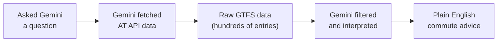

Your tools are ready. Now let's use them — ask Gemini CLI to check real-time Auckland Transport data and give you advice about your commute.

<Info>
**Keep your API key handy.** Every prompt in this section includes a URL with `YOUR_API_KEY` — replace it with your actual subscription key each time.
</Info>

## Find your route and stop numbers

Before checking specific routes, you need to know your route number and stop ID. Your bus route number is on the front of the bus (e.g., "62", "NX1"). Your stop number is on the physical bus stop sign — a 4-5 digit number.

If you're not sure, ask Gemini for help:

```text title="Copy this prompt — replace YOUR_API_KEY and your stop description"
I commute by bus in Auckland. I usually catch the bus from
[describe your stop, e.g., "the stop on Queen Street near Aotea Square"].

Can you help me figure out my route number and stop ID?
Auckland Transport stop numbers are usually 4-5 digit numbers shown on the bus stop sign.

You can check the Auckland Transport trip data here:
https://api.at.govt.nz/realtime/legacy/tripupdates?subscription-key=YOUR_API_KEY
```

<Tip>
**Already know your route and stop number?** Great — skip ahead to the prompts below.
</Tip>

## Prompt 1: Check for delays on your route

This is your first real commute query. Paste this into Gemini CLI:

```text title="Copy this prompt — replace YOUR_API_KEY and ROUTE_NUMBER"
Fetch the Auckland Transport real-time trip updates from:
https://api.at.govt.nz/realtime/legacy/tripupdates?subscription-key=YOUR_API_KEY

Look through the data for any trips on route ROUTE_NUMBER (e.g., route 62 or NX1).

Tell me:
- Are there any delays right now on this route?
- If yes, how long are the delays (in minutes)?
- Are any trips cancelled?
- What is the overall status — should I expect a normal commute or plan extra time?

Explain everything in plain English. I am not a developer.
```

You should see something like this:

> **Route NX1 (Northern Express) — Status: Minor delays**
> - 2 trips are running 3–5 minutes behind schedule
> - No cancellations
> - Overall: expect a roughly normal commute, but allow an extra 5 minutes

<Tip>
**Your results will be different.** The data is live, so you'll see whatever is happening right now on Auckland's transport network. If there are no delays, that's good news — Gemini will tell you the route is running on time.
</Tip>

## Prompt 2: Check service alerts

Service alerts cover everything — planned works, emergency disruptions, route changes, stop closures, and special events.

```text title="Copy this prompt — replace YOUR_API_KEY"
Fetch the Auckland Transport service alerts from:
https://api.at.govt.nz/realtime/legacy/servicealerts?subscription-key=YOUR_API_KEY

Summarise all current service alerts in plain English. For each alert, tell me:
- Which routes or stops are affected
- What is happening (detour, cancellation, delay, road works, etc.)
- When it started and when it is expected to end (if available)
- What I should do if I use that route

Group them by severity: critical first, then moderate, then minor.
```

<Info>
**This is the most useful query for daily commuters** because it catches things that the "delays" data might not show — like a planned detour next week or a stop closure you didn't know about.
</Info>

## Prompt 3: Morning commute briefing

This is the "wow" moment — combining all three API endpoints into one personalised briefing. **Customise the details to match your actual commute.**

```text title="Copy this prompt — replace YOUR_API_KEY and your commute details"
I need a morning commute briefing for Auckland. Here are my details:
- I catch bus route 62 from stop 7023 at about 8:00 AM
- My backup option is the Western Line train from Henderson station
- I work in the CBD (Britomart area)

Please check these three Auckland Transport data sources:
1. Trip updates: https://api.at.govt.nz/realtime/legacy/tripupdates?subscription-key=YOUR_API_KEY
2. Service alerts: https://api.at.govt.nz/realtime/legacy/servicealerts?subscription-key=YOUR_API_KEY
3. Vehicle positions: https://api.at.govt.nz/realtime/legacy/vehiclepositions?subscription-key=YOUR_API_KEY

Give me a morning briefing that includes:
- Current status of my bus route (on time, delayed, cancelled?)
- Any service alerts affecting my routes
- Whether my backup train option is running normally
- Your recommendation: should I take the bus, the train, or allow extra time?

Write it like a friendly weather report — clear, concise, and actionable.
```

You should see something like this:

> **Your Morning Commute Briefing**
>
> **Bus Route 62: Running normally** — No delays or cancellations detected. Your 8:00 AM departure from stop 7023 should be on schedule.
>
> **Western Line trains: Minor disruption** — There is a service alert about track maintenance between Henderson and New Lynn tonight (doesn't affect your morning commute).
>
> **Service alerts affecting you: None right now.**
>
> **Recommendation:** Take your usual bus. Everything looks clear this morning. Have a good commute!

<Tip>
**Customise this prompt for your actual commute.** Replace the route number, stop number, and stations with your own. The more specific you are, the more useful the briefing.
</Tip>

## Prompt 4: Compare commute options

Can't decide between bus and train? Let AI compare them for you.

```text title="Copy this prompt — replace YOUR_API_KEY and your routes"
I have two ways to get to work in Auckland CBD:
- Option A: Bus route 62 from stop 7023
- Option B: Western Line train from Henderson to Britomart

Check the Auckland Transport real-time data:
- Trip updates: https://api.at.govt.nz/realtime/legacy/tripupdates?subscription-key=YOUR_API_KEY
- Service alerts: https://api.at.govt.nz/realtime/legacy/servicealerts?subscription-key=YOUR_API_KEY

Compare both options right now:
- Which one has fewer delays?
- Are there any service alerts affecting either route?
- Which would you recommend I take today?

Present it as a simple comparison table, then give your recommendation.
```

## Prompt 5: Where is my bus right now?

A fun, visual query using the vehicle positions feed:

```text title="Copy this prompt — replace YOUR_API_KEY and ROUTE_NUMBER"
Fetch the Auckland Transport vehicle positions from:
https://api.at.govt.nz/realtime/legacy/vehiclepositions?subscription-key=YOUR_API_KEY

Find any vehicles currently operating on route ROUTE_NUMBER.

For each vehicle on this route, tell me:
- Where it is right now (latitude and longitude, and describe the approximate location)
- What direction it is heading
- How many vehicles are currently running on this route
```

## What just happened?



1. **Asked** — you typed a natural-language question about your commute
2. **Fetched** — Gemini CLI used its built-in web fetch tool to call the AT API
3. **Interpreted** — the API returned raw GTFS Realtime data (JSON with hundreds of entries); Gemini filtered it for your specific routes
4. **Summarised** — Gemini translated the technical data into plain-English advice

The key insight: the AT API returns data meant for apps to consume. AI bridges the gap between raw data and human understanding. You didn't need to write any code, parse any JSON, or understand the GTFS format — you just asked a question.

## Troubleshooting

<AccordionGroup>
  <Accordion title="Gemini says it can't fetch the URL">
    Make sure the URL is on a single line with no line breaks. Check that `subscription-key=YOUR_API_KEY` has your actual key with no spaces around the `=` sign.
  </Accordion>
  <Accordion title="The data looks empty or has no trips">
    Auckland Transport updates the real-time feed based on active services. If you're checking late at night or very early morning, there may be fewer (or no) active trips. Try again during commute hours (7–9 AM or 4–6 PM).
  </Accordion>
  <Accordion title="Gemini gives very long, technical output">
    Add this to the end of your prompt: "Explain everything in plain English. Keep it concise — no more than 10 bullet points. I am not a developer." This guides Gemini to simplify its response.
  </Accordion>
  <Accordion title="Gemini can't find my route">
    Auckland Transport route IDs in the API sometimes include a version suffix (e.g., "62-201" instead of just "62"). Ask Gemini: "List all route IDs in the data that contain the number 62" to find the exact ID.
  </Accordion>
  <Accordion title="Results seem outdated or wrong">
    The real-time feeds update frequently but reflect the current operational state. If services are running perfectly on time, the trip updates feed may have very few entries — it mainly reports deviations from schedule. This is normal — no news is good news.
  </Accordion>
</AccordionGroup>

<Note>
Great work — you've built a real commute intelligence workflow. Head to [Keep going](/tutorial/auckland-commute/keep-going) for ideas on automation and advanced queries.
</Note>
