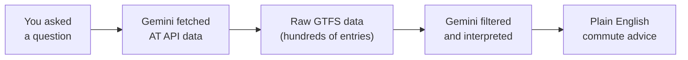

Your tools are ready. Now let's put them to work — ask Gemini CLI to check real-time Auckland Transport data and give you advice about your commute.

<Info>
**Keep your API key handy.** Every prompt in this section includes a URL with `YOUR_API_KEY` — replace it with your actual subscription key each time. If you are using Wispr Flow, speak the description part naturally, then paste the API URL with your key into the prompt.
</Info>

## Start Gemini CLI

Open your terminal and start Gemini CLI. This is the only raw command you need to type:

```bash title="Copy this command"
gemini
```

From here on, everything is natural language — speak it or type it.

## Check for delays on your route

This is your first real commute query. Say or type this prompt:

```text title="Say this or copy this prompt"
I want to check if my bus is running late in Auckland.
Fetch the real-time trip updates from this Auckland Transport API:
https://api.at.govt.nz/realtime/legacy/tripupdates?subscription-key=YOUR_API_KEY

Look for any trips on route 70 and tell me in plain English if there are delays, how long they are, and whether I should leave early.
```

<Tip>
**Replace `YOUR_API_KEY`** with your actual subscription key, and change `route 70` to your actual route number. If you are speaking with Wispr Flow, say the description naturally, then paste the URL line.
</Tip>

You should see something like this:

> **Route 70 — Status: Minor delays**
> - 2 trips are running 3–5 minutes behind schedule
> - No cancellations
> - Overall: expect a roughly normal commute, but allow an extra 5 minutes

<Tip>
**Your results will be different.** The data is live, so you'll see whatever is happening right now on Auckland's transport network. If there are no delays, that's good news — Gemini will tell you the route is running on time.
</Tip>

## Check service alerts

Service alerts cover everything — planned works, emergency disruptions, route changes, stop closures, and special events.

```text title="Say this or copy this prompt"
Check for service alerts on Auckland public transport.
Fetch the alerts from: https://api.at.govt.nz/realtime/legacy/servicealerts?subscription-key=YOUR_API_KEY

Summarise all current service alerts in plain English. Group them by severity — start with the most disruptive ones.
```

<Info>
**This is the most useful query for daily commuters** because it catches things that the "delays" data might not show — like a planned detour next week or a stop closure you didn't know about.
</Info>

## Morning commute briefing

This is the "wow" moment — combining all three API endpoints into one personalised briefing. **Customise the details to match your actual commute.**

```text title="Say this or copy this prompt"
I need a morning commute briefing for Auckland. I usually take the train from Britomart to Newmarket, or the bus route 70 from Queen Street. Check these three data sources:

1. Trip updates: https://api.at.govt.nz/realtime/legacy/tripupdates?subscription-key=YOUR_API_KEY
2. Service alerts: https://api.at.govt.nz/realtime/legacy/servicealerts?subscription-key=YOUR_API_KEY
3. Vehicle positions: https://api.at.govt.nz/realtime/legacy/vehiclepositions?subscription-key=YOUR_API_KEY

Give me a briefing in plain English: are my routes running on time, any alerts I should know about, and your recommendation for which route to take this morning.
```

<Tip>
**Customise this prompt for your actual commute.** Replace the routes and stations with your own. The more specific you are, the more useful the briefing. If you are speaking with Wispr Flow, say the description and your commute details naturally, then paste the three API URLs.
</Tip>

You should see something like this:

> **Your Morning Commute Briefing**
>
> **Bus Route 70: Running normally** — No delays or cancellations detected. Your departure from Queen Street should be on schedule.
>
> **Britomart to Newmarket train: Minor disruption** — There is a service alert about track maintenance between Newmarket and Remuera tonight (doesn't affect your morning commute).
>
> **Service alerts affecting you: None right now.**
>
> **Recommendation:** Take your usual bus. Everything looks clear this morning. Have a good commute!

## Compare your commute options

Can't decide between bus and train? Just ask AI to compare them for you.

```text title="Say this or copy this prompt"
I have two ways to get to work in Auckland:
Option A: Bus route 70 from Queen Street
Option B: Train from Britomart to Newmarket

Check the real-time data for both routes:
- Trip updates: https://api.at.govt.nz/realtime/legacy/tripupdates?subscription-key=YOUR_API_KEY
- Vehicle positions: https://api.at.govt.nz/realtime/legacy/vehiclepositions?subscription-key=YOUR_API_KEY

Compare both options right now and tell me which one will get me to work faster today.
```

## Where is my bus right now?

A fun, visual query using the vehicle positions feed:

```text title="Say this or copy this prompt"
Fetch the Auckland Transport vehicle positions from:
https://api.at.govt.nz/realtime/legacy/vehiclepositions?subscription-key=YOUR_API_KEY

Find any vehicles currently operating on route 70.
Tell me where each bus is right now, what direction it is heading, and how many buses are currently running on this route.
```

## What just happened?



1. **Asked** — you spoke or typed a natural-language question about your commute
2. **Fetched** — Gemini CLI used its built-in web fetch tool to call the AT API
3. **Interpreted** — the API returned raw GTFS Realtime data (JSON with hundreds of entries); Gemini filtered it for your specific routes
4. **Summarised** — Gemini translated the technical data into plain-English advice

The key insight: the AT API returns data meant for apps to consume. AI bridges the gap between raw data and human understanding. You didn't need to write any code, parse any JSON, or understand the GTFS format — you just asked a question.

## Go further — try your own questions

The prompts above are just the beginning. Here are some creative questions to show how flexible natural language is:

```text title="Say this or copy this prompt"
Based on the trip update data, what's the average delay across all Auckland bus routes right now?
Fetch the data from: https://api.at.govt.nz/realtime/legacy/tripupdates?subscription-key=YOUR_API_KEY
```

```text title="Say this or copy this prompt"
Are there any trains running early today? Check the trip updates and find any positive schedule deviations:
https://api.at.govt.nz/realtime/legacy/tripupdates?subscription-key=YOUR_API_KEY
```

```text title="Say this or copy this prompt"
Give me a confidence rating from 1 to 10 on whether my bus route 70 will be on time today. Base it on the current trip updates and service alerts:
- Trip updates: https://api.at.govt.nz/realtime/legacy/tripupdates?subscription-key=YOUR_API_KEY
- Service alerts: https://api.at.govt.nz/realtime/legacy/servicealerts?subscription-key=YOUR_API_KEY
```

<Tip>
**This is the magic of natural language.** You do not need to memorise API endpoints or data formats — just describe what you want to know and Gemini handles the rest. If Gemini is not sure what you mean, it will ask you to clarify.
</Tip>

## Troubleshooting

<AccordionGroup>
  <Accordion title="Gemini says it can't fetch the URL">
    Make sure the URL is on a single line with no line breaks. Check that `subscription-key=YOUR_API_KEY` has your actual key with no spaces around the `=` sign.
  </Accordion>
  <Accordion title="The data looks empty or has no trips">
    Auckland Transport updates the real-time feed based on active services. If you're checking late at night or very early morning, there may be fewer (or no) active trips. Try again during commute hours (7–9 AM or 4–6 PM).
  </Accordion>
  <Accordion title="Gemini gives very long, technical output">
    Add this to the end of your prompt: "Explain everything in plain English. Keep it concise — no more than 10 bullet points. I am not a developer." This guides Gemini to simplify its response.
  </Accordion>
  <Accordion title="Gemini can't find my route">
    Auckland Transport route IDs in the API sometimes include a version suffix (e.g., "70-201" instead of just "70"). Ask Gemini: "List all route IDs in the data that contain the number 70" to find the exact ID.
  </Accordion>
  <Accordion title="Results seem outdated or wrong">
    The real-time feeds update frequently but reflect the current operational state. If services are running perfectly on time, the trip updates feed may have very few entries — it mainly reports deviations from schedule. This is normal — no news is good news.
  </Accordion>
  <Accordion title="My voice input has errors">
    Wispr Flow may occasionally mishear technical terms or proper nouns. You can review and correct the text in Gemini CLI before pressing Enter. If voice input is causing too many errors, switch to typing or pasting prompts instead.
  </Accordion>
</AccordionGroup>

<Note>
Great work — you've built a real commute intelligence workflow. Head to [Keep going](/tutorial/auckland-commute/keep-going) for ideas on making this a daily habit and advanced queries.
</Note>
