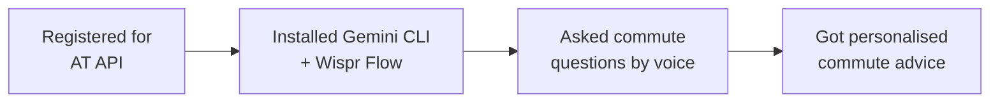

You built a real workflow for getting personalised commute intelligence using AI. Let's look at what you achieved and where to go next.

## What you built



- Registered for a free public API and learned what API keys are
- Used AI to fetch and interpret real-time transport data
- Built a morning commute briefing from multiple data sources — by speaking
- Compared commute options using natural language
- Tracked live vehicle positions across Auckland
- All for free, in under 45 minutes

## What you learned

<Tip>
**The skill that matters most here is knowing how to connect AI to real-world data sources.** Thousands of free APIs exist — weather, traffic, news, sports, finance. The technique you used today (give AI a URL + API key + a question) works with almost all of them. And with voice input, you can do it without touching the keyboard.
</Tip>

- How to register for and use a public API — a transferable skill for any data source
- How AI bridges the gap between raw data and human understanding
- How to write prompts that combine multiple data sources into one answer
- How to ask complex, multi-part questions in natural language — by voice or text
- How real-time transport data works (GTFS Realtime)
- How voice input with Wispr Flow makes the experience hands-free

## Make it a morning habit

The real power of this workflow is when it becomes part of your daily routine. Here's how to make your morning commute check take 10 seconds:

```text title="Say this or copy this prompt"
Morning commute check. I take bus route 70 from Queen Street or the train from Britomart to Newmarket. Check these and tell me which is better today:
- Trip updates: https://api.at.govt.nz/realtime/legacy/tripupdates?subscription-key=YOUR_API_KEY
- Service alerts: https://api.at.govt.nz/realtime/legacy/servicealerts?subscription-key=YOUR_API_KEY
```

<Tip>
**Save this as your daily prompt.** Keep it in a text file or a note on your phone. Each morning, open your terminal, start `gemini`, and say or paste your morning check. Over time, you will have your commute briefing down to a 10-second habit.
</Tip>

## Ideas to try

<CardGroup cols={2}>
  <Card title="Multi-modal commute" icon="route">
    Combine bus, train, and ferry data in one query. Just say: "What's the fastest way from Devonport to the CBD right now — ferry then walk, or bus to Britomart?"
  </Card>
  <Card title="Weather + commute combo" icon="cloud-sun">
    Add weather data to your morning briefing. Say: "Check the AT API and also tell me the weather in Auckland — is it raining? Should I take the bus instead of walking to the train station?"
  </Card>
  <Card title="Share with your team" icon="users">
    Create a commute briefing for your whole team. Collect everyone's routes and build a single prompt that checks all of them. Share the summary in Slack or Teams.
  </Card>
  <Card title="Event day planning" icon="calendar">
    Before big events at Eden Park or Mt Smart, ask: "Are there extra services running for the event tonight? What's the best public transport option?"
  </Card>
</CardGroup>

## Advanced prompts

<AccordionGroup>
  <Accordion title="Prompt: weekly commute analysis">
    ```text title="Say this or copy this prompt"
    Analyse the Auckland Transport service alerts and tell me which routes have the most disruptions right now.
    Fetch the alerts from: https://api.at.govt.nz/realtime/legacy/servicealerts?subscription-key=YOUR_API_KEY

    What are the most common causes — road works, mechanical issues, events?
    Based on the data, which routes seem most reliable today?
    I commute on route 70 and the train from Britomart. How are they looking?
    ```
  </Accordion>
  <Accordion title="Prompt: event day planning">
    ```text title="Say this or copy this prompt"
    There is a big event at Eden Park tonight. Check the Auckland Transport data for any special services or route changes:
    - Service alerts: https://api.at.govt.nz/realtime/legacy/servicealerts?subscription-key=YOUR_API_KEY
    - Trip updates: https://api.at.govt.nz/realtime/legacy/tripupdates?subscription-key=YOUR_API_KEY

    What is the best way to get to Eden Park from the CBD using public transport?
    What should I expect for the journey home after the event?
    ```
  </Accordion>
  <Accordion title="Prompt: accessibility check">
    ```text title="Say this or copy this prompt"
    Check the Auckland Transport service alerts for any accessibility issues:
    https://api.at.govt.nz/realtime/legacy/servicealerts?subscription-key=YOUR_API_KEY

    Are there any alerts about lift outages at train stations, temporary stop relocations, or services that are not wheelchair accessible?
    Summarise any accessibility-related alerts in plain English.
    ```
  </Accordion>
</AccordionGroup>

## Other APIs you can try

The same technique — give AI a URL + API key + a question — works with thousands of free APIs. Here are some relevant ones for New Zealand:

<CardGroup cols={2}>
  <Card title="OpenWeatherMap" icon="cloud">
    Free weather API. Combine it with AT data for weather-aware commute advice. Register at [openweathermap.org](https://openweathermap.org/).
  </Card>
  <Card title="data.govt.nz" icon="database">
    New Zealand's open government data portal. Hundreds of free datasets on everything from census data to environmental monitoring.
  </Card>
</CardGroup>

## Reflect

<AccordionGroup>
  <Accordion title="What surprised you about using voice + AI with live data?">
  Many people are surprised that you can speak a question and AI fetches and interprets real-time data without any coding. The API returns raw JSON designed for software to consume — but AI can read it and explain it in plain English. Adding voice input makes the experience feel like talking to a knowledgeable assistant who happens to have access to Auckland's entire transport network.
  </Accordion>
  <Accordion title="How does this compare to existing apps?">
  Google Maps and the AT app are polished and convenient for simple queries. The AI approach shines when you want to combine data, ask complex questions, or customise the output. Think of it as the difference between a calculator and a spreadsheet — both do maths, but one is more flexible. And with voice input, you can get answers without even looking at a screen.
  </Accordion>
  <Accordion title="What other data sources could you connect?">
  The same technique works with any API — weather, news, stock prices, sports scores, government data. New Zealand has many free data sources at data.govt.nz. Once you know how to give AI a URL and ask a question, the possibilities are wide open.
  </Accordion>
</AccordionGroup>

## Resources

| Resource | Description | Link |
|----------|-------------|------|
| Auckland Transport Developer Portal | Register and manage your API key | [dev-portal.at.govt.nz](https://dev-portal.at.govt.nz/) |
| AT GTFS Realtime docs | API documentation and endpoints | [dev-portal.at.govt.nz/realtime-api](https://dev-portal.at.govt.nz/realtime-api) |
| Gemini CLI | Google's AI assistant for the terminal | [github.com/google-gemini/gemini-cli](https://github.com/google-gemini/gemini-cli) |
| Wispr Flow | Voice input for any application | [wisprflow.ai](https://wisprflow.ai/r?CHAN115) |
| GTFS Realtime reference | Official GTFS Realtime specification | [gtfs.org/realtime](https://gtfs.org/realtime/) |
| data.govt.nz | New Zealand open government data | [data.govt.nz](https://data.govt.nz) |

<Note>
Thank you for completing this tutorial! You went from zero to querying real-time transport data with AI — by voice. The ability to connect AI to any data source and ask questions in natural language is a skill that grows more valuable every day — take it with you.
</Note>
