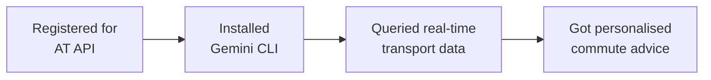

You built a real workflow for getting personalised commute intelligence using AI. Let's look at what you achieved and where to go next.

## What you built



- Registered for a free public API and learned what API keys are
- Used AI to fetch and interpret real-time transport data
- Built a morning commute briefing from multiple data sources
- Compared commute options using natural language
- Tracked live vehicle positions across Auckland
- All for free, in under 45 minutes

## What you learned

<Tip>
**The skill that matters most here is knowing how to connect AI to real-world data sources.** Thousands of free APIs exist — weather, traffic, news, sports, finance. The technique you used today (give AI a URL + API key + a question) works with almost all of them.
</Tip>

- How to register for and use a public API — a transferable skill for any data source
- How AI bridges the gap between raw data and human understanding
- How to write prompts that combine multiple data sources into one answer
- How to ask complex, multi-part questions in natural language
- How real-time transport data works (GTFS Realtime)

## Ideas to try

<CardGroup cols={2}>
  <Card title="Automate your morning briefing" icon="clock">
    Save your morning briefing prompt as a text file. Each morning, open Gemini CLI and paste it in. Over time, you'll have your commute check down to 10 seconds.
  </Card>
  <Card title="Multi-modal commute" icon="route">
    Combine bus, train, and ferry data in one query. Ask: "What's the fastest way from Devonport to the CBD right now — ferry then walk, or bus to Britomart?"
  </Card>
  <Card title="Weather + commute combo" icon="cloud-sun">
    Add weather data to your morning briefing. Ask Gemini to check both the AT API and a weather API, then advise: "Is it raining? Should I take the bus instead of walking to the train station?"
  </Card>
  <Card title="Share with your team" icon="users">
    Create a commute briefing for your whole team. Collect everyone's routes and build a single prompt that checks all of them. Share the summary in Slack or Teams.
  </Card>
</CardGroup>

## Advanced prompts

<AccordionGroup>
  <Accordion title="Prompt: weekly commute analysis">
    ```text title="Copy this prompt — replace YOUR_API_KEY"
    Check the Auckland Transport service alerts from:
    https://api.at.govt.nz/realtime/legacy/servicealerts?subscription-key=YOUR_API_KEY

    Analyse the current alerts and tell me:
    - Which routes have the most disruptions right now?
    - What are the most common causes (road works, mechanical issues, events)?
    - Based on the data, which routes seem most reliable today?

    I commute on route 62 and the Western Line. How are they looking?
    ```
  </Accordion>
  <Accordion title="Prompt: event day planning">
    ```text title="Copy this prompt — replace YOUR_API_KEY"
    There is a big event at Eden Park tonight. Check the Auckland Transport data:
    - Service alerts: https://api.at.govt.nz/realtime/legacy/servicealerts?subscription-key=YOUR_API_KEY
    - Trip updates: https://api.at.govt.nz/realtime/legacy/tripupdates?subscription-key=YOUR_API_KEY

    Are there any special services, extra buses, or route changes for the event?
    What is the best way to get to Eden Park from the CBD using public transport?
    What should I expect for the journey home after the event?
    ```
  </Accordion>
  <Accordion title="Prompt: accessibility check">
    ```text title="Copy this prompt — replace YOUR_API_KEY"
    Check the Auckland Transport service alerts:
    https://api.at.govt.nz/realtime/legacy/servicealerts?subscription-key=YOUR_API_KEY

    Are there any alerts that mention accessibility issues — such as lift outages
    at train stations, temporary stop relocations, or services that are not
    wheelchair accessible?

    Summarise any accessibility-related alerts in plain English.
    ```
  </Accordion>
</AccordionGroup>

## Other APIs you can try

The same technique — give AI a URL + API key + a question — works with thousands of free APIs. Here are some relevant ones for New Zealand:

<CardGroup cols={2}>
  <Card title="OpenWeatherMap" icon="cloud">
    Free weather API. Combine it with AT data for weather-aware commute advice. Register at [openweathermap.org](https://openweathermap.org/).
  </Card>
  <Card title="data.govt.nz" icon="database">
    New Zealand's open government data portal. Hundreds of free datasets on everything from census data to environmental monitoring.
  </Card>
</CardGroup>

## Reflect

<AccordionGroup>
  <Accordion title="What surprised you about using AI with live data?">
  Many people are surprised that AI can fetch and interpret real-time data without any coding. The API returns raw JSON designed for software to consume — but AI can read it and explain it in plain English. This is a fundamental shift in how people can access data.
  </Accordion>
  <Accordion title="How does this compare to existing apps?">
  Google Maps and the AT app are polished and convenient for simple queries. The AI approach shines when you want to combine data, ask complex questions, or customise the output. Think of it as the difference between a calculator and a spreadsheet — both do maths, but one is more flexible.
  </Accordion>
  <Accordion title="What other data sources could you connect?">
  The same technique works with any API — weather, news, stock prices, sports scores, government data. New Zealand has many free data sources at data.govt.nz. Once you know how to give AI a URL and ask a question, the possibilities are wide open.
  </Accordion>
</AccordionGroup>

## Resources

| Resource | Description | Link |
|----------|-------------|------|
| Auckland Transport Developer Portal | Register and manage your API key | [dev-portal.at.govt.nz](https://dev-portal.at.govt.nz/) |
| AT GTFS Realtime docs | API documentation and endpoints | [dev-portal.at.govt.nz/realtime-api](https://dev-portal.at.govt.nz/realtime-api) |
| Gemini CLI | Google's AI assistant for the terminal | [github.com/google-gemini/gemini-cli](https://github.com/google-gemini/gemini-cli) |
| GTFS Realtime reference | Official GTFS Realtime specification | [gtfs.org/realtime](https://gtfs.org/realtime/) |
| data.govt.nz | New Zealand open government data | [data.govt.nz](https://data.govt.nz) |

<Note>
Thank you for completing this tutorial! You went from zero to querying real-time transport data with AI. The ability to connect AI to any data source and ask questions in natural language is a skill that grows more valuable every day — take it with you.
</Note>
