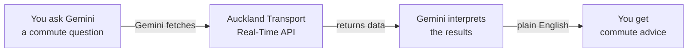

<Tip>
**Difficulty: ★★☆☆☆ Beginner** · Estimated time: ~30–45 minutes
</Tip>

It's 7:30 AM. You're heading to work in Auckland. Is the Northern Express on time? Is there a disruption on the Western Line? You could open three different apps, scroll through alerts, and piece together an answer — or you could ask AI to check everything and tell you what matters, in plain English.

**That's what we're building.** A workflow that checks real-time Auckland Transport data and gives you personalised commute advice — instantly.

<Info>
**Tutorial led by [Chan Meng](https://chanmeng.org/)** — Senior AI/ML Engineer, open-source contributor, and former ByteDance developer. Chan has built 30+ live applications and specialises in AI-powered solutions. She is also a panel speaker at this event and the developer behind this website.
</Info>

## But first — do you even need this?

There are already some great tools for Auckland commuters. Let's be honest about them.

<CardGroup cols={3}>
  <Card title="Google Maps" icon="map-location-dot">
    **Already great for most people**

    "Time to leave" notifications, live traffic, crowd-sourced delay reports, and alternative route suggestions. Free, no setup required.
  </Card>
  <Card title="AT Mobile App" icon="mobile">
    **The official option**

    Real-time departures, boarding reminders, service disruption alerts, and route subscriptions. Free from Auckland Transport.
  </Card>
  <Card title="Transit App" icon="route">
    **Multi-modal planner**

    Real-time arrivals, service alerts, trip planning across bus, train, and ferry. Free, clean interface.
  </Card>
</CardGroup>

<Tip>
**These apps are excellent.** If all you need is "when is my next bus?" then Google Maps or the AT Mobile app will serve you well. This tutorial is for people who want to go further — combining multiple data sources, asking complex questions in natural language, and building custom commute intelligence that no single app provides.
</Tip>

## So why use AI + the AT API?

| Capability | Google Maps / AT App | AI + AT API (this tutorial) |
|---|---|---|
| Next bus departure | Yes | Yes |
| Service alerts | Yes | Yes, with plain-English explanation |
| "Is route 62 faster than the train today?" | No | Yes |
| "Are there delays on any of my 3 commute routes?" | Check each separately | One question, one answer |
| "Give me a morning briefing for my commute" | No | Yes |
| Custom logic (e.g. "only tell me if delay > 5 min") | No | Yes |

## What you will build

<CardGroup cols={3}>
  <Card title="Connect" icon="key">
    Register for the free Auckland Transport API and get your access key
  </Card>
  <Card title="Query" icon="magnifying-glass">
    Ask Gemini CLI to fetch real-time bus, train, and alert data
  </Card>
  <Card title="Interpret" icon="sparkles">
    AI analyses the raw data and gives you plain-English commute advice
  </Card>
</CardGroup>

## How it works

You type a question about your commute in plain English. Gemini CLI fetches live data from Auckland Transport's API, analyses the raw transport data, and gives you a clear, actionable answer.

## What you will learn

- How to register for a free public API and use an API key
- How AI can fetch and interpret real-time data from the web
- How to write prompts that combine data from multiple sources
- How to ask complex commute questions in natural language
- How to work with real-world transport data (GTFS Realtime format)

<Note>
**No coding required.** You will copy-paste prompts into Gemini CLI. The AI handles all the technical work — your job is to ask the right questions about your commute.
</Note>

## Tools

<CardGroup cols={3}>
  <Card title="Gemini CLI" icon="terminal">
    Google's free AI assistant that runs in your terminal. It can fetch web data and interpret results.
  </Card>
  <Card title="Auckland Transport API" icon="bus">
    Free real-time data for all Auckland buses, trains, and ferries. Updated every 30 seconds.
  </Card>
  <Card title="Node.js" icon="node-js">
    Required to install Gemini CLI. Quick one-time setup.
  </Card>
</CardGroup>

## Cost

| Tool | Cost |
|------|------|
| Gemini CLI | Free (1,000 requests/day) |
| Auckland Transport API | Free (600 calls/min, 35,000/week) |
| Node.js | Free |
| **Total** | **$0** |

## Prerequisites

<CardGroup cols={3}>
  <Card title="A laptop with internet" icon="laptop">
    Windows or macOS. No special hardware needed.
  </Card>
  <Card title="About 30–45 minutes" icon="clock">
    Take your time — there's no rush. You can pause and come back anytime.
  </Card>
  <Card title="An Auckland commute (or curiosity)" icon="bus">
    You don't need to live in Auckland, but the data is Auckland-specific. Great for anyone who uses AT buses or trains.
  </Card>
</CardGroup>

<Note>
Ready to get started? Head to [Set up your tools](/tutorial/auckland-commute/setup) to register your API key and install Gemini CLI.
</Note>
