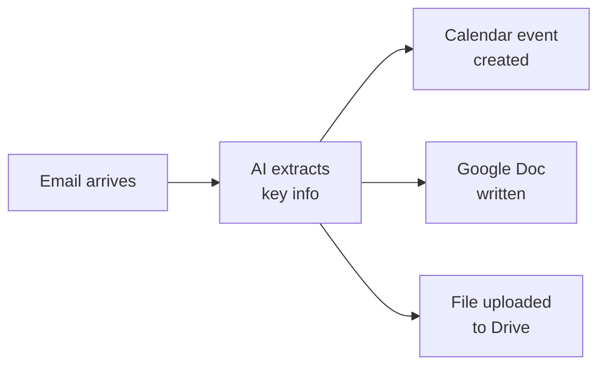

You've built a real cross-app workflow — AI reads your email, creates calendar events, and writes documents for you. Let's look at what you achieved and where to go next.

## What you built



- Connected AI to three Google apps — Gmail, Calendar, and Docs
- Read real emails and extracted action items, deadlines, and key details
- Created calendar events directly from email content
- Wrote email summaries to Google Docs without opening a browser
- Uploaded files to Google Drive from the command line
- Combined multiple actions into a single natural language prompt
- All for free, in under 30 minutes

## Make it a daily habit

The real power of cross-app workflows isn't a one-time task — it's using them regularly to stay on top of your work. Try these routines:

<CardGroup cols={2}>
  <Card title="Inbox to action" icon="inbox">
    At the end of each day, say: "Check my unread emails and create calendar events for anything that needs follow-up this week." Turn emails into scheduled tasks before you log off.
  </Card>
  <Card title="Meeting follow-up" icon="handshake">
    After every meeting, say: "Create a Google Doc with notes from today's meeting about [topic] and add a calendar event for the next follow-up." Capture everything while it's fresh.
  </Card>
  <Card title="Weekly planning" icon="calendar-week">
    Every Monday, say: "Read my emails from last week and create calendar events for any deadlines or follow-ups I need this week." Plan your week in 30 seconds.
  </Card>
  <Card title="Document everything" icon="folder-open">
    When important emails arrive, say: "Save this email as a Google Doc for my records." Build a searchable archive of key communications.
  </Card>
</CardGroup>

## Try more prompts

Now that you're comfortable with cross-app workflows, try these more sophisticated prompts. Say them with Wispr Flow, type them, or paste them — they all work the same way.

```text title="Say this or copy this prompt"
Find all emails this week with deadlines and create calendar events for each one.
```

```text title="Say this or copy this prompt"
Read the latest email from [person's name] and draft a reply, then save it as a Google Doc.
```

```text title="Say this or copy this prompt"
Search my emails for receipts from the last month and create a Google Doc listing each one with the date, vendor, and amount.
```

```text title="Say this or copy this prompt"
Check my Gmail for meeting invites I haven't responded to. Create a summary doc listing each one with the date, time, and who organised it.
```

```text title="Say this or copy this prompt"
Read all emails about [project name] from the past two weeks. Write a project status update in a new Google Doc and create a calendar event for the next milestone.
```

## Level up: From Gemini CLI to Claude Code

You have been using Gemini CLI in your terminal — speaking prompts, approving tool calls, and getting structured results across multiple apps. These are exactly the same skills used by professional developers with **Claude Code**, a more powerful CLI tool from Anthropic.

| | Gemini CLI | Claude Code |
|---|---|---|
| **What is the same** | Speak or type in the terminal. AI reads data, processes it, takes action. You approve actions. | Same workflow, same skills. |
| **What is different** | Free, great for everyday tasks | Smarter, can write and edit code, handles complex multi-step projects |

Keep building with Gemini CLI — it is free and you are learning fast. When you are ready for the next level, the [Vibe Coding tutorial](/tutorial/vibe-coding/overview) introduces Claude Code — and everything you have learned so far will transfer directly.

## Try another tutorial

Ready for your next AI-powered workflow? Try one of these:

<CardGroup cols={2}>
  <Card title="AI Morning Briefing" icon="sun" href="/tutorial/morning-briefing/overview">
    Start your day with an AI-generated briefing — today's meetings, urgent emails, and a standup summary in one command.
  </Card>
  <Card title="Meeting Prep with AI" icon="users" href="/tutorial/meeting-prep/overview">
    Use AI to prepare for meetings — gather context from emails, docs, and calendar automatically.
  </Card>
  <Card title="Summarise Gmail with AI" icon="envelope" href="/tutorial/gmail-summary/overview">
    Tame your inbox in seconds — AI reads and summarises your unread emails.
  </Card>
  <Card title="Create Professional PDFs" icon="file-pdf" href="/tutorial/professional-pdf/overview">
    Generate beautiful resumes, reports, and documents with AI and Typst.
  </Card>
</CardGroup>

## Reflect

<AccordionGroup>
  <Accordion title="What surprised you about connecting multiple Google apps through AI?">
  Many people are surprised at how seamless it feels. Instead of switching between Gmail, Calendar, and Docs — three separate apps with three separate interfaces — you gave one instruction and AI handled everything. The barrier between apps disappears when AI acts as the bridge.
  </Accordion>
  <Accordion title="How could cross-app workflows change the way you work?">
  Think about how much time you spend copying information between apps — reading an email, then manually creating a calendar event, then writing notes in a separate document. Cross-app workflows eliminate that repetition. Every email becomes a potential action, and AI handles the busywork.
  </Accordion>
  <Accordion title="What other apps or services would you want to connect?">
  The same approach works for Slack, Notion, Trello, spreadsheets, and more. Once you know how to describe a workflow in natural language, you can apply this skill to any combination of tools. The pattern is always the same: read data from one place, take action in another.
  </Accordion>
  <Accordion title="How would you explain this to a colleague who's never used AI tools?">
  Try this: "Instead of reading an email, then opening Calendar to make a reminder, then opening Docs to write notes — I just tell AI to do all three at once. It reads my email, creates the event, and writes the doc. One sentence, three actions." That's the pitch.
  </Accordion>
</AccordionGroup>

## Resources

| Resource | Description | Link |
|----------|-------------|------|
| Gemini CLI | Google's AI assistant for the terminal | [github.com/google-gemini/gemini-cli](https://github.com/google-gemini/gemini-cli) |
| gws (Google Workspace CLI) | Command-line tool for Google apps | [github.com/googleworkspace/cli](https://github.com/googleworkspace/cli) |
| Claude Code | Professional AI CLI tool (your next step) | [docs.anthropic.com](https://docs.anthropic.com/en/docs/claude-code) |
| Wispr Flow | Voice input for any application | [wisprflow.ai](https://wisprflow.ai/r?CHAN115) |
| Manage Google permissions | Revoke app access to your Google account | [myaccount.google.com/permissions](https://myaccount.google.com/permissions) |
| Google Calendar API | Documentation for Calendar integration | [developers.google.com/calendar](https://developers.google.com/calendar) |
| Google Docs API | Documentation for Docs integration | [developers.google.com/docs](https://developers.google.com/docs) |

<Note>
Thank you for completing this tutorial! You went from reading emails manually to building cross-app workflows that turn messages into real actions. The ability to connect tools, extract information, and take action across multiple apps is a skill that makes you faster in any role — take it with you.
</Note>
