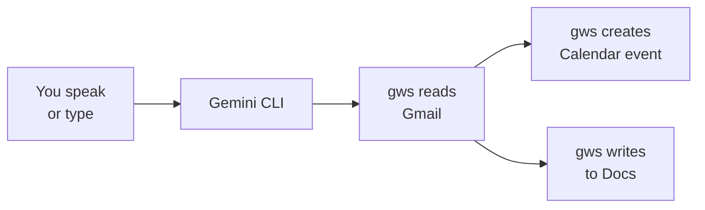

<Tip>
**Difficulty: ★★★☆☆ Intermediate** · Estimated time: ~30 minutes
</Tip>

Your manager emails you about an invoice that needs follow-up by Friday. Normally you'd read the email, open Google Calendar to create a reminder, then open Google Docs to write up your notes. Three apps, three context switches, five minutes gone.

Instead, you tell AI to do all three at once — read the email, create the calendar event, and write the summary doc. One instruction, three actions, ten seconds.

**That's what we're building.** A workflow where AI reads your Gmail, extracts what matters, and takes action across your Google apps — Calendar, Docs, and Drive.

<Info>
**Tutorial led by [Chan Meng](https://chanmeng.org/)** — Senior AI/ML Engineer, open-source contributor, and former ByteDance developer. Chan has built 30+ live applications and specialises in AI-powered solutions. She is also a panel speaker at this event and the developer behind this website.
</Info>

## What you will build

<CardGroup cols={3}>
  <Card title="Read & Extract" icon="magnifying-glass">
    AI reads your emails and pulls out key information — who sent it, what it's about, and what action is needed
  </Card>
  <Card title="Schedule" icon="calendar">
    Create Google Calendar events directly from email content — follow-ups, deadlines, and reminders
  </Card>
  <Card title="Document" icon="file-lines">
    Write summaries and notes to Google Docs — capture important details without opening your browser
  </Card>
</CardGroup>

## How it works

You give one natural language instruction. Gemini CLI understands what you need, reads your Gmail using the Google Workspace CLI (`gws`), and then takes action — creating calendar events, writing documents, or uploading files. All from your terminal, all in seconds.

## What you will learn

- Build cross-app workflows that connect Gmail, Calendar, and Google Docs
- Extract action items, deadlines, and key details from emails using AI
- Create Google Calendar events from email content using natural language
- Write email summaries to Google Docs without opening a browser
- Upload files to Google Drive from the command line
- Chain multiple actions into a single AI instruction

<Note>
**No coding required.** The AI handles everything — your job is to describe what you want done. If you can explain it to a colleague, you can do this.
</Note>

## Tools

<CardGroup cols={2}>
  <Card title="Gemini CLI" icon="terminal">
    Google's free AI assistant that runs in your terminal. Supports extensions for Google Workspace — Gmail, Calendar, Docs, and Drive.
  </Card>
  <Card title="gws (Google Workspace CLI)" icon="google">
    A command-line tool that controls your Google apps — Gmail, Calendar, Drive, Docs, Sheets — from the terminal.
  </Card>
  <Card title="Wispr Flow" icon="microphone">
    Optional voice input tool — speak instead of type. Works in any application, including your terminal.
  </Card>
  <Card title="Node.js" icon="node-js">
    Required to install Gemini CLI and gws. A one-time setup.
  </Card>
</CardGroup>

## Cost

| Tool | Cost |
|------|------|
| Gemini CLI | Free (1,000 requests/day) |
| gws | Free and open-source |
| Wispr Flow | Free trial ([invite link for a free month of Pro](https://wisprflow.ai/r?CHAN115)) |
| Node.js | Free |
| Gmail + Calendar + Docs | Free |
| **Total** | **$0** |

## Prerequisites

<CardGroup cols={3}>
  <Card title="A laptop with internet" icon="laptop">
    Windows or macOS. No special hardware needed.
  </Card>
  <Card title="30 minutes" icon="clock">
    Take your time — there's no rush. You can always come back and continue later.
  </Card>
  <Card title="A Google account" icon="envelope">
    Any personal or work Google account with Gmail, Calendar, and Docs enabled.
  </Card>
</CardGroup>

<Note>
Ready to get started? Head to [Set up your tools](/tutorial/email-to-action/setup) to get everything connected.
</Note>
