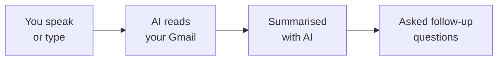

You've built a real productivity workflow — AI reads your email so you don't have to. Let's look at what you achieved and where to go next.

## What you built



- Connected an AI assistant to a live service (Gmail) — using real credentials
- Fetched real emails from your real inbox
- Produced structured summaries in multiple formats
- Filtered by sender, topic, and date using natural language
- Asked follow-up questions to find specific information
- All for free, in under 20 minutes

## Make it a daily habit

The real power of this tool isn't a one-time summary — it's using it regularly to stay on top of your inbox. Try these routines:

<CardGroup cols={2}>
  <Card title="Morning catch-up" icon="sun">
    Start each workday by saying "Summarise my overnight emails." Get up to speed in 30 seconds instead of 20 minutes.
  </Card>
  <Card title="End-of-day review" icon="moon">
    Before logging off, say: "Are there any emails I received today that still need a reply?" Never miss an important response.
  </Card>
  <Card title="Weekly digest" icon="calendar-week">
    Every Monday, say: "Give me a summary of the past week's emails." Great for spotting patterns or threads you overlooked.
  </Card>
  <Card title="Meeting prep" icon="users">
    Before a meeting, say: "Summarise all emails about [project name] from the last 2 weeks." Walk in fully prepared.
  </Card>
</CardGroup>

## Try more advanced prompts

Now that you're comfortable with basic summaries, try these more sophisticated prompts. Say them with Wispr Flow, type them, or paste them — they all work the same way.

```text title="Say this or copy this prompt"
Look through my emails from the past week and list every action item
or request directed at me. Group them by urgency: urgent, this week,
and when you have time.
```

```text title="Say this or copy this prompt"
Find the email thread with [person's name] about [topic].
Summarise the full conversation — who said what, what was agreed,
and what's still unresolved.
```

```text title="Say this or copy this prompt"
Based on my sent emails from the past week, draft a brief status update
of what I've been working on. Group by project or topic.
```

```text title="Say this or copy this prompt"
Check my unread emails and identify any that are asking me a question
or requesting a response. List them with the sender, subject, and
what they're asking for.
```

```text title="Say this or copy this prompt"
Compare the emails I received this week to last week. Are there any new topics, new senders, or trends I should be aware of?
```

## Explore Gmail's built-in AI features

Gmail itself now has AI features powered by Gemini that work without any setup:

<CardGroup cols={2}>
  <Card title="AI Overviews" icon="sparkles">
    Gmail automatically shows a summary at the top of long email threads. Look for it next time you open a thread with many replies.
  </Card>
  <Card title="Summarise this email" icon="compress">
    Click the "Summarise this email" button at the top of any email on desktop or mobile. Available to all Gmail users at no cost.
  </Card>
  <Card title="Help Me Write" icon="pen">
    When composing an email, click "Help me write" to get AI-generated drafts based on your instructions.
  </Card>
  <Card title="Smart Reply" icon="reply">
    Gmail suggests short replies at the bottom of emails. Tap one to reply instantly — great for quick acknowledgements.
  </Card>
</CardGroup>

<Tip>
**Best of both worlds:** Use the AI tools from this tutorial for big-picture inbox management (daily summaries, sender reports, action item extraction), and use Gmail's built-in features for quick, in-the-moment tasks (summarising a single thread, drafting a reply).
</Tip>

## Level up: From Gemini CLI to Claude Code

You have been using Gemini CLI in your terminal — speaking prompts, approving tool calls, and getting structured results. These are exactly the same skills used by professional developers with **Claude Code**, a more powerful CLI tool from Anthropic.

| | Gemini CLI | Claude Code |
|---|---|---|
| **What is the same** | Speak or type in the terminal. AI reads data, processes it, gives you results. You approve actions. | Same workflow, same skills. |
| **What is different** | Free, great for everyday tasks | Smarter, can write and edit code, handles complex multi-step projects |

Keep building with Gemini CLI — it is free and you are learning fast. When you are ready for the next level, the [Vibe Coding tutorial](/tutorial/vibe-coding/overview) introduces Claude Code — and everything you have learned so far will transfer directly.

## Try another tutorial

Ready for your next AI-powered workflow? Try one of these:

<CardGroup cols={2}>
  <Card title="Summarise Slack Channels" icon="slack" href="/tutorial/slack-summary/overview">
    Same concept, different tool — catch up on any Slack channel in seconds using AI.
  </Card>
  <Card title="Build Your Personal Website" icon="globe" href="/tutorial/personal-website/overview">
    Use AI to create and deploy your own website — no coding experience needed.
  </Card>
  <Card title="Create Professional PDFs" icon="file-pdf" href="/tutorial/professional-pdf/overview">
    Generate beautiful résumés, reports, and documents with AI and Typst.
  </Card>
  <Card title="Vibe Coding: Daily Report Bot" icon="robot" href="/tutorial/vibe-coding/overview">
    Build a bot that automatically posts daily reports to Slack. A more advanced challenge.
  </Card>
</CardGroup>

## Reflect

<AccordionGroup>
  <Accordion title="What surprised you about connecting AI to Gmail?">
  Many people are surprised at how quick and simple it is. Whether you used the Gemini App (Path A) or installed Gemini CLI with voice control (Path B), the barrier to connecting AI to your everyday tools is much lower than most expect.
  </Accordion>
  <Accordion title="How could voice-first AI change the way you work?">
  Think about the difference between typing a search query and simply saying what you need. Voice removes friction — you can catch up on your inbox while making coffee, preparing for a meeting, or walking to your desk. The ability to speak naturally to your tools opens up moments in the day that were previously wasted.
  </Accordion>
  <Accordion title="How could this workflow help your work or job search?">
  Think about: catching up after time off, preparing for meetings by reviewing all emails from a specific person, tracking action items across dozens of messages, or staying on top of recruiter emails during a job search. The ability to quickly extract information from your inbox is valuable in any role.
  </Accordion>
  <Accordion title="What other information would you like AI to summarise?">
  The same approach works for Slack channels, meeting transcripts, documents, news articles, and more. Once you know how to write effective prompts, you can apply this skill to any text-heavy task.
  </Accordion>
</AccordionGroup>

## Resources

| Resource | Description | Link |
|----------|-------------|------|
| Gemini CLI | Google's AI assistant for the terminal | [github.com/google-gemini/gemini-cli](https://github.com/google-gemini/gemini-cli) |
| Claude Code | Professional AI CLI tool (your next step) | [docs.anthropic.com](https://docs.anthropic.com/en/docs/claude-code) |
| Gemini App | Google's AI assistant in the browser | [gemini.google.com](https://gemini.google.com) |
| Wispr Flow | Voice input for any application | [wisprflow.ai](https://wisprflow.ai/r?CHAN115) |
| Gemini CLI Workspace Extension | Gemini CLI extension for Gmail | [github.com/gemini-cli-extensions/workspace](https://github.com/gemini-cli-extensions/workspace) |
| Manage Google permissions | Revoke app access to your Gmail | [myaccount.google.com/permissions](https://myaccount.google.com/permissions) |

<Note>
Thank you for completing this tutorial! You went from zero to summarising real emails with AI. The ability to connect tools, fetch data, and extract meaning from it is valuable in any role — take this skill with you.
</Note>
