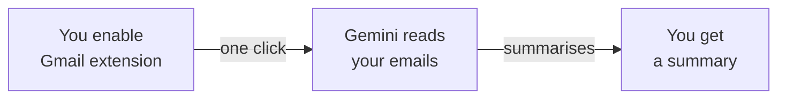
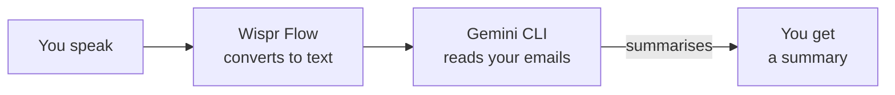

<Tip>
**Difficulty: ★☆☆☆☆ Getting Started** · Estimated time: ~5 to 20 minutes (depending on the path you choose)
</Tip>

You come back from a week of leave. Your inbox has 340 unread emails. There are 12 from your manager, a few newsletters you meant to cancel, three meeting invites buried somewhere in the middle, and a thread with "URGENT" in the subject that turned out to be a lunch order.

You could spend an hour scrolling, skimming, and sorting — or you could ask AI to summarise it all in 30 seconds.

**That's what we're building.** A workflow that reads your Gmail and gives you a clear, useful summary — instantly.

<Info>
**Tutorial led by [Chan Meng](https://chanmeng.org/)** — Senior AI/ML Engineer, open-source contributor, and former ByteDance developer. Chan has built 30+ live applications and specialises in AI-powered solutions. She is also a panel speaker at this event and the developer behind this website.
</Info>

## What you will build

<CardGroup cols={3}>
  <Card title="Connect" icon="plug">
    Link an AI tool to your Gmail account so it can read your emails
  </Card>
  <Card title="Fetch" icon="download">
    Pull emails — all unread, from a specific sender, or matching a search
  </Card>
  <Card title="Summarise" icon="sparkles">
    AI reads the emails and gives you a clear, actionable summary
  </Card>
</CardGroup>

## Two paths to choose from

This tutorial offers two ways to achieve the same result. Pick the one that suits your situation.

<CardGroup cols={2}>
  <Card title="Path A: Gemini App" icon="browser">
    **~5 minutes** · Quickest

    Open Gemini in your browser, turn on the Gmail extension, and start asking for summaries. No installation needed.
  </Card>
  <Card title="Path B: Gemini CLI + Voice" icon="microphone">
    **~20 minutes** · Recommended

    Install Gemini CLI, add the Google Workspace extension, and speak your prompts with Wispr Flow. A more powerful, voice-first experience you can use every day.
  </Card>
</CardGroup>

<Tip>
**Which path should I choose?** If you just want results as fast as possible, choose **Path A**. If you want a more powerful experience — speaking naturally to your inbox from the terminal — choose **Path B**. Both paths produce the same result: a useful summary of your Gmail messages.
</Tip>

<Tip>
**Voice or typing — both work.** Path B is designed as voice-first using Wispr Flow, but every prompt works exactly the same if you type or paste it instead. Wispr Flow is optional — it just makes the experience hands-free.
</Tip>

## How it works

**Path A: Gemini App (web)**

**Path B: Gemini CLI + Voice**

Both paths connect an AI assistant to your Gmail account. The AI reads your emails, analyses the content, and produces a structured summary — all in seconds. Path B adds voice input so you can speak your requests naturally instead of typing.

## What you will learn

- Connect an AI tool to a real service (Gmail) to access live data
- Write clear prompts that produce useful, structured email summaries
- Filter and search emails using natural language (by sender, date, topic)
- Customise summary formats for different needs (quick catch-up, executive briefing, action items)
- Ask follow-up questions about emails you haven't read
- Use voice input with Wispr Flow for a hands-free workflow (Path B)
- Work with AI as a daily productivity tool for inbox management

<Note>
**No coding required.** The AI handles everything — your job is to describe what kind of summary you want. If you can explain what you need to a colleague, you can do this.
</Note>

## Tools

<CardGroup cols={2}>
  <Card title="Gemini App" icon="browser">
    Google's free AI assistant in your browser. Connect it to Gmail and chat with your inbox. Used in Path A.
  </Card>
  <Card title="Gemini CLI" icon="terminal">
    Google's free AI assistant that runs in your terminal. Supports extensions for Google Workspace. Used in Path B.
  </Card>
  <Card title="Wispr Flow" icon="microphone">
    Optional voice input tool — speak instead of type. Works in any application, including your terminal. Used in Path B.
  </Card>
  <Card title="Node.js" icon="node-js">
    Required to install Gemini CLI. Only needed for Path B.
  </Card>
</CardGroup>

## Cost

| Tool | Cost |
|------|------|
| Gemini App | Free |
| Gemini CLI | Free (1,000 requests/day) |
| Wispr Flow | Free trial ([invite link for a free month of Pro](https://wisprflow.ai/r?CHAN115)) |
| Node.js | Free |
| Gmail | Free |
| **Total** | **$0** |

## Prerequisites

<CardGroup cols={3}>
  <Card title="A laptop with internet" icon="laptop">
    Windows or macOS. No special hardware needed.
  </Card>
  <Card title="5 to 20 minutes" icon="clock">
    Depends on the path you choose. Take your time — there's no rush.
  </Card>
  <Card title="A Gmail account" icon="envelope">
    Any personal or work Gmail account. You will give the AI read-only access to your emails.
  </Card>
</CardGroup>

<Note>
Ready to get started? Head to [Set up your tools](/tutorial/gmail-summary/setup) to get everything connected.
</Note>
