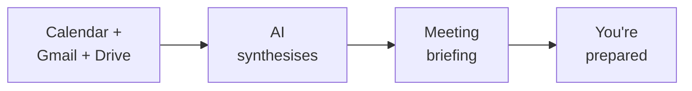

You've built a real productivity workflow — AI reads your calendar, emails, and documents so you walk into every meeting fully prepared. Let's look at what you achieved and where to go next.

## What you built



- Connected AI to three Google services at once — Calendar, Gmail, and Drive
- Pulled meeting details, related emails, and shared documents with natural language
- Combined multiple data sources into a single, structured briefing
- Read spreadsheet data to review numbers before a meeting
- Saved your briefing as a file or Google Doc for easy reference
- All for free, in under 30 minutes

## Make it a daily habit

The real power of meeting prep isn't a one-time briefing — it's using it before every meeting so you're always the most prepared person in the room.

<CardGroup cols={2}>
  <Card title="Morning meeting scan" icon="sun">
    Start each workday by saying "Prep me for all my meetings today." Get a briefing for every meeting on your calendar in one go.
  </Card>
  <Card title="Pre-meeting ritual" icon="clock">
    15 minutes before any meeting, run a quick meeting prep. One prompt, one briefing — walk in knowing the context, the people, and the key points.
  </Card>
  <Card title="Post-meeting notes" icon="pen">
    After a meeting, say "Save my meeting notes to a Google Doc." Capture decisions, action items, and follow-ups while they're fresh.
  </Card>
  <Card title="Weekly review" icon="calendar-week">
    Every Friday, say "Summarise all my meetings this week and list any follow-ups I still need to do." Stay on top of everything.
  </Card>
</CardGroup>

## Try more prompts

Now that you're comfortable with meeting prep, try these more creative prompts. Say them with Wispr Flow, type them, or paste them — they all work the same way.

```text title="Say this or copy this prompt"
Prep me for all my meetings today in one go. For each meeting, give me the attendees, key context from recent emails, and one talking point.
```

```text title="Say this or copy this prompt"
Find the last 3 documents that Sarah Chen shared with me. Summarise what each one is about.
```

```text title="Say this or copy this prompt"
What are the key decisions from my meetings this week? List the decision, who made it, and any follow-up actions.
```

```text title="Say this or copy this prompt"
Draft an agenda for my meeting with Marcus Lee based on our recent email thread. Include discussion topics and time estimates.
```

```text title="Say this or copy this prompt"
I have a meeting with a new client tomorrow. Search my email and Drive for anything related to their company and give me a background briefing.
```

<Tip>
**The more you use this, the faster it gets.** You will develop your own go-to prompts — the ones that match how you work and what meetings you have. Save your favourite prompts in a note so you can reuse them.
</Tip>

## Level up: From Gemini CLI to Claude Code

You have been using Gemini CLI in your terminal — speaking prompts, approving tool calls, and getting structured results. These are exactly the same skills used by professional developers with **Claude Code**, a more powerful CLI tool from Anthropic.

| | Gemini CLI | Claude Code |
|---|---|---|
| **What is the same** | Speak or type in the terminal. AI reads data, processes it, gives you results. You approve actions. | Same workflow, same skills. |
| **What is different** | Free, great for everyday tasks | Smarter, can write and edit code, handles complex multi-step projects |

Keep building with Gemini CLI — it is free and you are learning fast. When you are ready for the next level, the [Vibe Coding tutorial](/tutorial/vibe-coding/overview) introduces Claude Code — and everything you have learned so far will transfer directly.

## Try another tutorial

Ready for your next AI-powered workflow? Try one of these:

<CardGroup cols={2}>
  <Card title="AI Morning Briefing" icon="sun" href="/tutorial/morning-briefing/overview">
    Start your day with a complete briefing — today's meetings, urgent emails, and a standup summary, all from one command.
  </Card>
  <Card title="Email to Action Items" icon="list-check" href="/tutorial/email-to-action/overview">
    Turn a messy inbox into a clean to-do list — AI extracts action items, deadlines, and follow-ups from your emails.
  </Card>
  <Card title="Summarise Gmail with AI" icon="envelope" href="/tutorial/gmail-summary/overview">
    Tame your inbox in seconds — AI reads and summarises your unread emails so you can catch up instantly.
  </Card>
  <Card title="Summarise Slack Channels" icon="slack" href="/tutorial/slack-summary/overview">
    Same concept, different tool — catch up on any Slack channel in seconds using AI.
  </Card>
</CardGroup>

## Reflect

<AccordionGroup>
  <Accordion title="What surprised you about AI pulling from multiple sources?">
  Most people are surprised at how seamlessly AI combines Calendar, Gmail, and Drive into one briefing. Instead of opening three tabs and piecing together context manually, you get a complete picture from a single prompt. The ability to cross-reference data from different services is where AI really shines.
  </Accordion>
  <Accordion title="How could meeting prep change the way you show up at work?">
  Think about the difference between walking into a meeting cold and walking in with a briefing. You know the agenda, the recent discussions, the shared documents, and the key points. That preparation builds confidence and helps you contribute more effectively — whether you're presenting, listening, or making decisions.
  </Accordion>
  <Accordion title="How would you use AI as a research assistant beyond meetings?">
  The same approach — gather data, synthesise, and brief — works for client research, project updates, weekly reports, and more. Once you know how to prompt AI to pull from multiple sources, you can apply this skill to any situation where you need to get up to speed quickly.
  </Accordion>
  <Accordion title="What other Google Workspace data would be useful to include?">
  Think about Google Docs with meeting notes, Sheets with project data, Slides with presentations, or even Google Chat messages. The `gws` tool can access all of these. The more data sources you connect, the more complete your briefings become.
  </Accordion>
</AccordionGroup>

## Resources

| Resource | Description | Link |
|----------|-------------|------|
| Gemini CLI | Google's AI assistant for the terminal | [github.com/google-gemini/gemini-cli](https://github.com/google-gemini/gemini-cli) |
| gws (Google Workspace CLI) | Command-line tool for Google Workspace | [github.com/googleworkspace/cli](https://github.com/googleworkspace/cli) |
| Claude Code | Professional AI CLI tool (your next step) | [docs.anthropic.com](https://docs.anthropic.com/en/docs/claude-code) |
| Wispr Flow | Voice input for any application | [wisprflow.ai](https://wisprflow.ai/r?CHAN115) |
| Google Calendar | Manage your schedule | [calendar.google.com](https://calendar.google.com) |
| Manage Google permissions | Revoke app access to your Google data | [myaccount.google.com/permissions](https://myaccount.google.com/permissions) |

<Note>
Thank you for completing this tutorial! You went from frantically searching for meeting context to getting a complete briefing in 60 seconds. The ability to gather information from multiple sources and synthesise it with AI is a skill that makes you more effective in every meeting — take it with you.
</Note>
