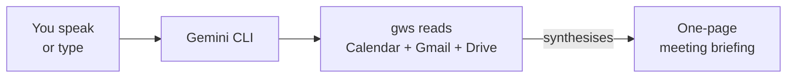

<Tip>
**Difficulty: ★★☆☆☆ Easy** · Estimated time: ~25 to 30 minutes
</Tip>

Your client meeting starts in 30 minutes. You vaguely remember emails about the project, but you can't find them. There was a shared doc somewhere — maybe in Drive, maybe attached to an email thread you archived weeks ago. You could spend 20 minutes frantically searching Gmail and Drive, or you could ask AI to prep you in 60 seconds.

**That's what we're building.** A workflow that reads your Google Calendar, pulls related emails from Gmail, finds shared documents in Drive, and delivers a complete meeting briefing — all from a single prompt.

<Info>
**Tutorial led by [Chan Meng](https://chanmeng.org/)** — Senior AI/ML Engineer, open-source contributor, and former ByteDance developer. Chan has built 30+ live applications and specialises in AI-powered solutions. She is also a panel speaker at this event and the developer behind this website.
</Info>

## What you will build

<CardGroup cols={3}>
  <Card title="Gather" icon="magnifying-glass">
    AI finds your meeting details, related emails, and shared documents across Calendar, Gmail, and Drive
  </Card>
  <Card title="Synthesise" icon="sparkles">
    Combines everything into a one-page briefing — no more switching between tabs
  </Card>
  <Card title="Prepare" icon="clipboard-list">
    Key points, attendee list, and talking suggestions ready to go before you walk in
  </Card>
</CardGroup>

## How it works

You speak (or type) a single prompt. Gemini CLI uses the Google Workspace CLI (`gws`) to pull your calendar events, search your emails, and find shared documents. AI combines everything into a clear, structured briefing you can read in 60 seconds.

## What you will learn

- Connect AI to your Google Calendar, Gmail, and Drive using `gws`
- Pull meeting details — time, attendees, agenda — with a natural language prompt
- Search Gmail for emails related to a specific meeting or attendee
- Find shared documents in Google Drive by topic or file name
- Combine multiple data sources into a single AI-powered briefing
- Save your briefing as a file or Google Doc for easy reference

<Note>
**No coding required.** The AI handles everything — your job is to describe what meeting you need to prepare for. If you can explain what you need to a colleague, you can do this.
</Note>

## Tools

<CardGroup cols={2}>
  <Card title="Gemini CLI" icon="terminal">
    Google's free AI assistant that runs in your terminal. Supports extensions for Google Workspace — reads your calendar, email, and drive on command.
  </Card>
  <Card title="gws (Google Workspace CLI)" icon="google">
    A command-line tool that controls Gmail, Calendar, Drive, and more from your terminal. It's what lets AI access your Google data.
  </Card>
  <Card title="Wispr Flow (optional)" icon="microphone">
    Optional voice input tool — speak instead of type. Works in any application, including your terminal. Hands-free meeting prep.
  </Card>
  <Card title="Node.js" icon="node-js">
    Required to install Gemini CLI and gws. A one-time setup step.
  </Card>
</CardGroup>

## Cost

| Tool | Cost |
|------|------|
| Gemini CLI | Free (1,000 requests/day) |
| gws | Free and open-source |
| Wispr Flow | Free trial ([invite link for a free month of Pro](https://wisprflow.ai/r?CHAN115)) |
| Node.js | Free |
| **Total** | **$0** |

## Prerequisites

<CardGroup cols={3}>
  <Card title="A laptop with internet" icon="laptop">
    Windows or macOS. No special hardware needed.
  </Card>
  <Card title="25 to 30 minutes" icon="clock">
    Most of that is one-time setup. Take your time — there's no rush.
  </Card>
  <Card title="A Google account" icon="envelope">
    Any personal or work Google account with Calendar, Gmail, and Drive enabled.
  </Card>
</CardGroup>

<Note>
Ready to get started? Head to [Set up your tools](/tutorial/meeting-prep/setup) to get everything connected.
</Note>
