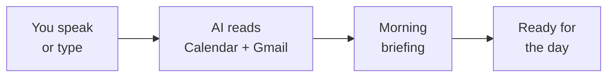

You've built a real morning routine — AI reads your calendar and inbox so you can start your day prepared. Let's look at what you achieved and where to go next.

## What you built



- Connected AI to your Google Calendar and Gmail — using real credentials
- Pulled today's meetings with times and attendees
- Triaged your inbox by urgency — needs reply, informational, can ignore
- Generated a standup summary from your real data
- Combined everything into a single morning briefing
- All for free, in under 20 minutes

## Make it a daily habit

The real power of this tool isn't a one-time briefing — it's using it every day to start your mornings focused. Try these routines:

<CardGroup cols={2}>
  <Card title="Monday planning" icon="calendar-week">
    Start the week by saying "Show me all my meetings for this week and flag any scheduling conflicts." Get the full picture before Monday morning.
  </Card>
  <Card title="Pre-meeting check" icon="users">
    15 minutes before a meeting, say: "Summarise all emails about [topic] from the last week and show me who's attending the meeting at [time]." Walk in fully prepared.
  </Card>
  <Card title="End-of-day review" icon="moon">
    Before logging off, say: "What's on my calendar tomorrow and are there any emails I still need to reply to?" Never be surprised by an early morning meeting.
  </Card>
  <Card title="Friday wrap-up" icon="flag-checkered">
    Every Friday, say: "Give me a summary of this week's meetings and a preview of next week." Great for planning ahead and winding down.
  </Card>
</CardGroup>

## Try more prompts

Now that you're comfortable with the basics, try these more sophisticated prompts. Say them with Wispr Flow, type them, or paste them — they all work the same way.

```text title="Say this or copy this prompt"
Compare my schedule this week to last week. Am I spending more or less time in meetings?
```

```text title="Say this or copy this prompt"
Look at my meetings for this week — which ones could probably be emails instead?
```

```text title="Say this or copy this prompt"
Draft a message to [person's name] about rescheduling our meeting on [day] to [new time].
```

```text title="Say this or copy this prompt"
Check my emails and calendar for the last 5 days and write a weekly status update I can send to my team.
```

```text title="Say this or copy this prompt"
What are the 3 most important things I need to do today based on my calendar and emails?
```

```text title="Say this or copy this prompt"
Find any meeting invitations I haven't responded to and list them with the date, time, and organiser.
```

## Level up: From Gemini CLI to Claude Code

You have been using Gemini CLI in your terminal — speaking prompts, approving tool calls, and getting structured results. These are exactly the same skills used by professional developers with **Claude Code**, a more powerful CLI tool from Anthropic.

| | Gemini CLI | Claude Code |
|---|---|---|
| **What is the same** | Speak or type in the terminal. AI reads data, processes it, gives you results. You approve actions. | Same workflow, same skills. |
| **What is different** | Free, great for everyday tasks | Smarter, can write and edit code, handles complex multi-step projects |

Keep building with Gemini CLI — it is free and you are learning fast. When you are ready for the next level, the [Vibe Coding tutorial](/tutorial/vibe-coding/overview) introduces Claude Code — and everything you have learned so far will transfer directly.

## Try another tutorial

Ready for your next AI-powered workflow? Try one of these:

<CardGroup cols={2}>
  <Card title="Turn Emails into Action Items" icon="list-check" href="/tutorial/email-to-action/overview">
    Go beyond triage — extract action items from your inbox and turn them into a task list automatically.
  </Card>
  <Card title="AI Meeting Prep" icon="users" href="/tutorial/meeting-prep/overview">
    Prepare for any meeting in 60 seconds — pull attendee emails, past notes, and agenda items with one prompt.
  </Card>
  <Card title="Summarise Gmail with AI" icon="envelope" href="/tutorial/gmail-summary/overview">
    Tame your inbox — use AI to read and summarise your unread emails, catch up on messages, and find what matters.
  </Card>
  <Card title="Summarise Slack Channels" icon="slack" href="/tutorial/slack-summary/overview">
    Same concept, different tool — catch up on any Slack channel in seconds using AI.
  </Card>
</CardGroup>

## Reflect

<AccordionGroup>
  <Accordion title="What surprised you about getting a morning briefing from AI?">
  Many people are surprised at how natural it feels. Instead of opening three apps and piecing information together, you ask one question and get a complete picture. The AI does the context-switching for you.
  </Accordion>
  <Accordion title="How could a daily AI briefing change your mornings?">
  Think about the difference between starting your day by scrolling through tabs and starting with a clear summary of what matters. A morning briefing removes the anxiety of "what am I forgetting?" and lets you focus on the work that actually matters.
  </Accordion>
  <Accordion title="What other data would you add to your morning briefing?">
  The same approach works for Slack messages, project management tools, news feeds, and more. Once you know how to connect AI to one data source, you can connect it to many — and combine them into a single briefing tailored to your role.
  </Accordion>
  <Accordion title="How could this workflow help your team?">
  Imagine if everyone on your team started their day with a briefing. Standups would be faster because everyone already knows what's on the agenda. You could share your briefing in a team channel as a quick FYI. The less time people spend gathering context, the more time they spend doing meaningful work.
  </Accordion>
</AccordionGroup>

## Resources

| Resource | Description | Link |
|----------|-------------|------|
| Gemini CLI | Google's AI assistant for the terminal | [github.com/google-gemini/gemini-cli](https://github.com/google-gemini/gemini-cli) |
| gws (Google Workspace CLI) | CLI tool for Gmail, Calendar, Drive, and more | [github.com/googleworkspace/cli](https://github.com/googleworkspace/cli) |
| Claude Code | Professional AI CLI tool (your next step) | [docs.anthropic.com](https://docs.anthropic.com/en/docs/claude-code) |
| Wispr Flow | Voice input for any application | [wisprflow.ai](https://wisprflow.ai/r?CHAN115) |
| Manage Google permissions | Revoke app access to your Google account | [myaccount.google.com/permissions](https://myaccount.google.com/permissions) |

<Note>
Thank you for completing this tutorial! You went from zero to a complete AI-powered morning briefing. The ability to connect tools, pull live data, and have AI synthesise it for you is valuable in any role — take this skill with you.
</Note>
