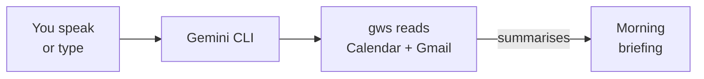

<Tip>
**Difficulty: ★★☆☆☆ Easy** · Estimated time: ~15 to 20 minutes
</Tip>

It's 8 AM. You have meetings, unread emails, deadlines — but no clear picture of what's urgent. You could open three tabs, scroll through your calendar, skim your inbox, and piece it together yourself. Or you could ask AI for a morning briefing and get the full picture in 30 seconds.

**That's what we're building.** A workflow that reads your Google Calendar and Gmail, then gives you a complete morning briefing — today's agenda, urgent emails, and a standup summary — all from one command.

<Info>
**Tutorial led by [Chan Meng](https://chanmeng.org/)** — Senior AI/ML Engineer, open-source contributor, and former ByteDance developer. Chan has built 30+ live applications and specialises in AI-powered solutions. She is also a panel speaker at this event and the developer behind this website.
</Info>

## What you will build

<CardGroup cols={3}>
  <Card title="Today's Agenda" icon="calendar">
    Pull your meetings for the day — times, titles, and who's attending
  </Card>
  <Card title="Email Triage" icon="envelope">
    AI reads your inbox and groups emails by urgency — what needs a reply, what's informational, and what you can ignore
  </Card>
  <Card title="Standup Summary" icon="clipboard-list">
    Get a ready-to-paste standup update — what you did yesterday, what's on today, and any blockers
  </Card>
</CardGroup>

## How it works

You speak (or type) a single prompt. Gemini CLI uses the Google Workspace CLI (`gws`) to pull your calendar events and emails. AI combines everything into a clear, structured briefing you can read in 30 seconds or paste into Slack.

## What you will learn

- Connect AI to your Google Calendar and Gmail using `gws`
- Use natural language prompts to pull today's meetings and urgent emails
- Get AI to triage your inbox by urgency — no manual sorting required
- Generate a standup summary from your real calendar and email data
- Combine multiple data sources into one AI-powered briefing
- Build a daily habit that saves you 15+ minutes every morning

<Note>
**No coding required.** The AI handles everything — your job is to describe what kind of briefing you want. If you can explain what you need to a colleague, you can do this.
</Note>

## Tools

<CardGroup cols={2}>
  <Card title="Gemini CLI" icon="terminal">
    Google's free AI assistant that runs in your terminal. Supports extensions for Google Workspace — reads your calendar and email on command.
  </Card>
  <Card title="gws (Google Workspace CLI)" icon="google">
    A command-line tool that controls Gmail, Calendar, Drive, and more from your terminal. It's what lets AI access your Google data.
  </Card>
  <Card title="Wispr Flow (optional)" icon="microphone">
    Optional voice input tool — speak instead of type. Works in any application, including your terminal. Hands-free morning briefings.
  </Card>
  <Card title="Node.js" icon="node-js">
    Required to install Gemini CLI and gws. A one-time setup step.
  </Card>
</CardGroup>

## Cost

| Tool | Cost |
|------|------|
| Gemini CLI | Free (1,000 requests/day) |
| gws | Free and open-source |
| Wispr Flow | Free trial ([invite link for a free month of Pro](https://wisprflow.ai/r?CHAN115)) |
| Node.js | Free |
| **Total** | **$0** |

## Prerequisites

<CardGroup cols={3}>
  <Card title="A laptop with internet" icon="laptop">
    Windows or macOS. No special hardware needed.
  </Card>
  <Card title="15 to 20 minutes" icon="clock">
    Most of that is one-time setup. Take your time — there's no rush.
  </Card>
  <Card title="A Google account" icon="envelope">
    Any personal or work Google account with Gmail and Google Calendar enabled.
  </Card>
</CardGroup>

<Note>
Ready to get started? Head to [Set up your tools](/tutorial/morning-briefing/setup) to get everything connected.
</Note>
