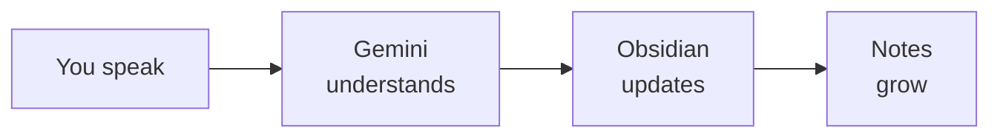

You built a voice-first workflow for capturing, tracking, and reviewing your day — powered by natural language and AI. Let's look at what you achieved and where to go next.

## What you built



- Captured thoughts, ideas, and notes by speaking or typing naturally
- Added tasks with checkboxes and marked them as done using plain language
- Reviewed your daily note and searched across your entire vault
- Controlled Obsidian without memorising a single command
- All for free, in under 30 minutes

## What you learned

<Tip>
**The skill that matters most is learning to talk to your tools.** You discovered that AI can bridge the gap between what you want and how software works. Instead of learning command syntax, you just described what you needed. That is a transferable skill you can use with any AI-powered tool.
</Tip>

- How to use Gemini CLI as a natural language interface for Obsidian
- How to capture thoughts instantly by speaking or typing a request
- How to manage tasks without knowing any command syntax
- How to search across all your notes by simply asking
- How to use voice input with Wispr Flow for a hands-free workflow
- How AI translates natural language into precise tool commands

## Make it a daily habit

The real power of daily notes comes from using them consistently. Here are three voice-first routines to try:

**Morning:** Start your day with a quick review.

```text title="Say this or copy this prompt"
Open my daily note and show me yesterday's unfinished tasks
```

Check what carried over from yesterday. Move any unfinished tasks to today's note by asking Gemini to do it for you.

**During the day:** Capture thoughts as they come — without leaving what you are doing.

```text title="Say this or copy this prompt"
Add to my daily note: [whatever you're thinking right now]
```

Replace the text after the colon with whatever you want to remember. It takes seconds — especially by voice.

**Evening:** Review and wrap up your day.

```text title="Say this or copy this prompt"
Show me today's tasks and mark anything about groceries as done
```

See what you accomplished. Mark tasks as done. Add a quick reflection if you like.

## Try these prompts

<CardGroup cols={2}>
  <Card title="Morning planning" icon="sun">
    Set up your day with goals and structure:

    ```text title="Say this or copy this prompt"
    Add a heading called 'Today's Priorities' to my daily note with three empty checkboxes for my top tasks
    ```
  </Card>
  <Card title="Meeting capture" icon="users">
    Capture notes from a meeting without switching apps:

    ```text title="Say this or copy this prompt"
    Create a new note in Obsidian called 'Standup Notes' and add today's date as a heading, then add bullet points for what I did yesterday, what I'm doing today, and blockers
    ```
  </Card>
  <Card title="End-of-day review" icon="moon">
    Get a summary of everything you captured:

    ```text title="Say this or copy this prompt"
    Read my daily note and summarise what I did today in 3 bullet points
    ```
  </Card>
  <Card title="Weekly reflection" icon="calendar-week">
    Look back across the whole week:

    ```text title="Say this or copy this prompt"
    Search my Obsidian vault for all notes from this week and tell me what topics came up most often
    ```
  </Card>
</CardGroup>

<AccordionGroup>
  <Accordion title="Create a note from a template">
    ```text title="Say this or copy this prompt"
    Create a note called Weekly Review from my Review template in Obsidian
    ```
  </Accordion>
  <Accordion title="Count words in your note">
    ```text title="Say this or copy this prompt"
    Count the words in my current Obsidian daily note
    ```
  </Accordion>
  <Accordion title="Show your bookmarks">
    ```text title="Say this or copy this prompt"
    Show me all my bookmarks in Obsidian
    ```
  </Accordion>
</AccordionGroup>

## Try another tutorial

<CardGroup cols={2}>
  <Card title="Organise Notes by Talking to AI" icon="comments" href="/tutorial/obsidian-organise/overview">
    Search, audit, and tidy up your Obsidian vault by describing what you want — AI finds issues and fixes them.
  </Card>
  <Card title="Summarise Gmail" icon="envelope" href="/tutorial/gmail-summary/overview">
    Use AI to read and summarise your unread emails — catch up on your inbox in seconds.
  </Card>
  <Card title="Summarise Slack" icon="hashtag" href="/tutorial/slack-summary/overview">
    Connect AI to your Slack workspace and get instant channel summaries.
  </Card>
  <Card title="Build Your Personal Website" icon="globe" href="/tutorial/personal-website/overview">
    Create and deploy your own personal website to showcase your skills and projects.
  </Card>
</CardGroup>

## Reflect

<AccordionGroup>
  <Accordion title="How did it feel to control software by speaking to it?">
  Many people are surprised by how natural it feels. Instead of learning menus, buttons, and command syntax, you just said what you wanted. This is how AI is changing the way we interact with tools — by removing the need to learn each tool's specific interface.
  </Accordion>
  <Accordion title="How could voice-powered note-taking help your work or study?">
  Think about: capturing ideas during commutes, logging meeting notes without typing, tracking tasks while your hands are busy, recording reflections at the end of the day, or building a searchable personal knowledge base over time. The lower the friction, the more you capture.
  </Accordion>
  <Accordion title="What other tools would you like to control with natural language?">
  The same approach works for email, calendars, file management, web searches, and more. Once you are comfortable describing what you want to an AI assistant, you can apply that skill to any tool that has a command-line interface or API.
  </Accordion>
</AccordionGroup>

## Resources

| Resource | Description | Link |
|----------|-------------|------|
| Gemini CLI | Google's free AI assistant for the terminal | [github.com/google-gemini/gemini-cli](https://github.com/google-gemini/gemini-cli) |
| Wispr Flow | Voice-to-text tool for hands-free input | [wisprflow.ai](https://wisprflow.ai/r?CHAN115) |
| Obsidian | Free note-taking app with local storage | [obsidian.md](https://obsidian.md) |
| Obsidian CLI docs | Official documentation for Obsidian's command-line interface | [obsidian.md/cli](https://obsidian.md/cli) |
| Obsidian community | Forum for questions, tips, and community support | [forum.obsidian.md](https://forum.obsidian.md) |

<Note>
Thank you for completing this tutorial! You went from zero to a fully working voice-first daily notes workflow — capturing thoughts, tracking tasks, and searching your notes, all by speaking naturally. Take this habit with you and watch how it transforms your productivity.
</Note>
