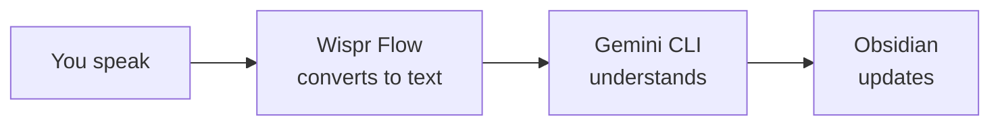

<Tip>
**Difficulty: ★☆☆☆☆ Getting Started** · Estimated time: ~30 minutes
</Tip>

You're in a meeting and an idea strikes. Instead of opening an app, switching windows, finding the right note, and typing it all out… you just say:

> "Add to my daily note: Sarah mentioned a job opening at Xero"

And it appears in Obsidian. No typing, no clicking, no context switching.

**That's what we're building.** A voice-first daily notes workflow where you speak naturally and AI handles the rest — capturing thoughts, tracking tasks, and searching your vault.

<Info>
**Tutorial led by [Chan Meng](https://chanmeng.org/)** — Senior AI/ML Engineer, open-source contributor, and former ByteDance developer. Chan has built 30+ live applications and specialises in AI-powered solutions. She is also a panel speaker at this event and the developer behind this website.
</Info>

## What you will build

<CardGroup cols={3}>
  <Card title="Speak" icon="microphone">
    Capture thoughts by voice — say what you want to remember and it lands in your daily note
  </Card>
  <Card title="Command" icon="message">
    Manage tasks with natural language — add them, check them off, review what is left
  </Card>
  <Card title="Find" icon="magnifying-glass">
    Search your notes by asking — no need to remember file names or folder structures
  </Card>
</CardGroup>

## How it works

You speak naturally (or type, if you prefer). Wispr Flow converts your voice to text. Gemini CLI understands what you want and runs the right Obsidian commands behind the scenes. Your notes update instantly — you never need to learn or type a single command.

<Tip>
**You can either speak your prompts using Wispr Flow, or type/paste them into Gemini CLI. Both work exactly the same way.** Wispr Flow is optional — it just makes the experience hands-free. Every prompt in this tutorial works whether you speak it or type it.
</Tip>

## What you will learn

- How to control Obsidian using natural language through Gemini CLI
- How to capture thoughts instantly by speaking or typing a request
- How to add and manage tasks without memorising any commands
- How to search across all your notes by simply asking
- How to use voice input with Wispr Flow for a hands-free workflow
- How to build a simple daily productivity habit with AI

<Note>
**No coding required.** Every step uses natural language you can say out loud or copy and paste. If you can describe what you want, you can do this.
</Note>

## Tools

<CardGroup cols={3}>
  <Card title="Gemini CLI" icon="terminal">
    Google's free AI assistant that runs in your terminal. It understands your natural language requests and translates them into actions.
  </Card>
  <Card title="Wispr Flow" icon="microphone">
    Optional voice input tool — speak instead of type. Works in any application, including your terminal.
  </Card>
  <Card title="Obsidian" icon="notebook">
    A free note-taking app that stores your notes as plain text files on your computer. Your data stays with you — no cloud account required.
  </Card>
  <Card title="Node.js" icon="node-js">
    A free tool needed to install Gemini CLI. One-time setup.
  </Card>
  <Card title="Terminal" icon="square-terminal">
    The command-line app built into your computer. On macOS it is called Terminal; on Windows it is called PowerShell or Command Prompt.
  </Card>
</CardGroup>

## Cost

| Tool | Cost |
|------|------|
| Gemini CLI | Free (1,000 requests/day) |
| Wispr Flow | Free trial ([invite link for a free month of Pro](https://wisprflow.ai/r?CHAN115)) |
| Obsidian | Free |
| Node.js | Free |
| Terminal | Free (built into your computer) |
| **Total** | **$0** |

## Prerequisites

<CardGroup cols={3}>
  <Card title="A laptop" icon="laptop">
    Windows or macOS. No special hardware needed.
  </Card>
  <Card title="30 minutes" icon="clock">
    Take your time — there is no rush.
  </Card>
  <Card title="Curiosity" icon="lightbulb">
    No prior experience needed. Just a willingness to try something new.
  </Card>
</CardGroup>

<Note>
Ready to get started? Head to [Set up your tools](/tutorial/obsidian-daily/setup) to install everything you need.
</Note>
