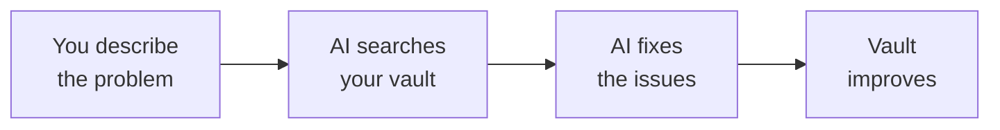

You searched, audited, and organised your Obsidian vault by talking to Gemini CLI. Let's look at what you achieved and where to go next.

## What you built



- Searched your entire vault instantly by asking in plain language
- Audited tags and spotted inconsistencies without memorising commands
- Found orphan notes, broken links, and dead ends by describing what you wanted
- Renamed and moved files by telling AI what to do
- Built a cleaner, more connected vault — all for free

## What you learned

<Tip>
**The key insight: vault maintenance is not a one-time event — it is a habit.** Just like tidying your desk or clearing your inbox, a quick monthly review keeps your vault useful and findable. With Gemini CLI, that review is as easy as having a conversation.
</Tip>

- How to search your vault by describing what you are looking for
- How to audit tags, orphan notes, and broken links in plain language
- How to move and rename files by telling AI what to do
- How to check backlinks and understand your vault's connections
- How to use voice input with Wispr Flow for a hands-free experience
- How to use Gemini CLI as a vault maintenance tool

## Monthly vault review

Build a habit of reviewing your vault once a month. Open Gemini CLI and work through these prompts:

1. **Find orphan notes** — connect or archive forgotten notes
   ```text title="Say this or copy this prompt"
   Show me all orphan notes in my vault
   ```

2. **Fix broken links** — repair links that point to notes that no longer exist
   ```text title="Say this or copy this prompt"
   Are there any broken links in my vault?
   ```

3. **Clean up tags** — spot and fix tag inconsistencies
   ```text title="Say this or copy this prompt"
   List all my tags with counts — are there any that look like duplicates?
   ```

4. **Track your vault growth** — see how your vault is evolving
   ```text title="Say this or copy this prompt"
   How many files are in my vault now?
   ```

5. **Archive old notes** — move notes you no longer need to an Archive folder
   ```text title="Say this or copy this prompt"
   Move the note called Old Meeting Notes to my Archive folder
   ```

This takes about 10 minutes and keeps your vault clean and useful.

## Try these prompts

<CardGroup cols={2}>
  <Card title="Find untagged notes" icon="tag">
    Discover notes that might need better organisation.

    ```text title="Say this or copy this prompt"
    Find all notes in my vault that have no tags
    ```
  </Card>
  <Card title="Word count comparison" icon="chart-bar">
    See which notes are the longest and shortest.

    ```text title="Say this or copy this prompt"
    Show me a word count comparison of all my notes
    ```
  </Card>
  <Card title="Summarise a topic" icon="sparkles">
    Get an overview of everything you have written about a subject.

    ```text title="Say this or copy this prompt"
    Search my vault for anything about productivity and summarise it
    ```
  </Card>
  <Card title="Find recent notes" icon="calendar">
    See what you have been working on lately.

    ```text title="Say this or copy this prompt"
    Show me all notes I created or modified this month
    ```
  </Card>
</CardGroup>

<AccordionGroup>
  <Accordion title="Find your most-connected notes">
    Discover the hubs of your vault — notes with the most backlinks:

    ```text title="Say this or copy this prompt"
    Which notes in my vault have the most backlinks? Show me the top 10
    ```

    Notes with many backlinks are often your most important or most referenced notes. Consider giving them clear names and keeping them well-structured.
  </Accordion>
  <Accordion title="Bulk organise by topic">
    Ask Gemini CLI to help you sort a whole category of notes at once:

    ```text title="Say this or copy this prompt"
    Find all notes in my vault related to recipes and move them into a folder called Recipes
    ```

    Gemini CLI will identify the relevant notes and move them one by one, updating links as it goes.
  </Accordion>
  <Accordion title="Create a note with metadata">
    Ask Gemini CLI to create a structured note with properties already attached:

    ```text title="Say this or copy this prompt"
    Create a new note called Weekly Review with headings for What Went Well, What Could Improve, and Next Week's Goals. Add tags for review and reflection.
    ```

    Properties and tags help you filter and organise notes later.
  </Accordion>
</AccordionGroup>

## Try another tutorial

<CardGroup cols={2}>
  <Card title="Voice-Control Your Notes" icon="microphone" href="/tutorial/obsidian-daily/overview">
    Build a voice-first daily workflow with Gemini CLI and Obsidian — capture thoughts, track tasks, and search your vault by speaking naturally.
  </Card>
  <Card title="Summarise Gmail" icon="envelope" href="/tutorial/gmail-summary/overview">
    Use AI to read and summarise your unread emails. Catch up on your inbox in seconds.
  </Card>
  <Card title="Create Professional PDFs" icon="file-pdf" href="/tutorial/professional-pdf/overview">
    Turn your ideas into beautifully formatted PDF documents using the terminal.
  </Card>
  <Card title="Build Your Personal Website" icon="globe" href="/tutorial/personal-website/overview">
    Create and deploy your own personal website — no web development experience needed.
  </Card>
</CardGroup>

## Reflect

<AccordionGroup>
  <Accordion title="What did you discover about your vault that surprised you?">
    Many people are surprised by how many orphan notes they have, or by tag inconsistencies they never noticed. Asking AI to audit your vault gives you a bird's-eye view that is hard to get just by browsing folders in the app.
  </Accordion>
  <Accordion title="How did using natural language change the experience?">
    Instead of memorising commands and flags, you described what you wanted and AI figured out how to do it. This is a different way of working with tools — one where the barrier to entry is just being able to explain what you need.
  </Accordion>
  <Accordion title="What other tools or workflows would benefit from this approach?">
    Think about your email inbox, your file system, your bookmarks, your project management tool. The same principles apply — regular review, consistent naming, and cleaning up what you no longer need. The natural language approach you practised here transfers to any system where information accumulates.
  </Accordion>
</AccordionGroup>

## Resources

| Resource | Description | Link |
|----------|-------------|------|
| Gemini CLI | Google's free AI assistant for the terminal | [github.com/google-gemini/gemini-cli](https://github.com/google-gemini/gemini-cli) |
| Wispr Flow | Voice-to-text tool for hands-free input | [wisprflow.ai](https://wisprflow.ai/r?CHAN115) |
| Obsidian | Free note-taking app with local storage | [obsidian.md](https://obsidian.md) |
| Obsidian CLI docs | Documentation for the Obsidian CLI plugin | [obsidian.md/cli](https://obsidian.md/cli) |
| Obsidian Forum | Community forum for questions and tips | [forum.obsidian.md](https://forum.obsidian.md) |

<Note>
Thank you for completing this tutorial! You went from a messy vault to a cleaner, more connected one — and you did it all by talking to AI. Take this skill with you and enjoy a vault that actually works for you.
</Note>
