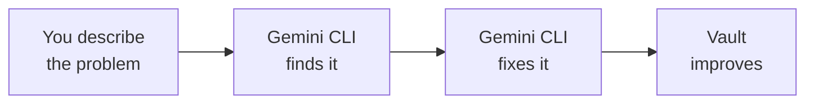

<Tip>
**Difficulty: ★★☆☆☆ Easy** · Estimated time: ~30 to 45 minutes
</Tip>

You have 50+ notes in your vault but you cannot find anything. Your tags are inconsistent, half your notes are in the wrong folder, and you know there is a recipe somewhere but scrolling through folders is not going to find it.

Instead of opening notes one by one, you just say **"Find all my notes about meetings"** or **"Show me notes that nothing links to"** — and AI does the rest.

**That is what we are building.** A natural language workflow where you describe what you want and Gemini CLI searches, audits, and organises your vault for you — no commands to memorise.

<Info>
**Tutorial led by [Chan Meng](https://chanmeng.org/)** — Senior AI/ML Engineer, open-source contributor, and former ByteDance developer. Chan has built 30+ live applications and specialises in AI-powered solutions. She is also a panel speaker at this event and the developer behind this website.
</Info>

## What you will build

<CardGroup cols={3}>
  <Card title="Search" icon="magnifying-glass">
    Ask for anything — notes about a topic, files with a certain tag, or content matching a phrase
  </Card>
  <Card title="Audit" icon="clipboard-check">
    Discover hidden issues — orphan notes, broken links, inconsistent tags, and forgotten files
  </Card>
  <Card title="Organise" icon="folder-open">
    Tell AI to move, rename, and tidy your vault — it handles the details
  </Card>
</CardGroup>

## How it works

You describe what you want in plain language (by speaking or typing). Gemini CLI understands your request, runs the right Obsidian commands behind the scenes, and your vault gets cleaner. You never need to learn or type a single raw command.

<Tip>
**You can either speak your prompts using Wispr Flow, or type/paste them into Gemini CLI. Both work exactly the same way.** Wispr Flow is optional — it just makes the experience hands-free. Every prompt in this tutorial works whether you speak it or type it.
</Tip>

## What you will learn

- How to search your entire vault instantly by asking in plain language
- How to audit tags, orphan notes, and broken links by describing what you want to find
- How to move and rename files by telling AI what to do
- How to check backlinks and understand how your notes are connected
- How to use voice input with Wispr Flow for a hands-free workflow
- How to build a vault maintenance habit you can repeat monthly

<Note>
**No coding required.** Every prompt in this tutorial is something you say or copy. If you can describe what you want, you can do this.
</Note>

## Tools

<CardGroup cols={2}>
  <Card title="Gemini CLI" icon="terminal">
    Google's free AI assistant that runs in your terminal. It understands your natural language requests and translates them into Obsidian actions.
  </Card>
  <Card title="Wispr Flow" icon="microphone">
    Optional voice input tool — speak instead of type. Works in any application, including your terminal.
  </Card>
  <Card title="Obsidian" icon="notebook">
    A free note-taking app that stores your notes as plain text files on your computer. Your data stays with you.
  </Card>
  <Card title="Node.js" icon="node-js">
    Required to install Gemini CLI. Free and quick to set up.
  </Card>
</CardGroup>

## Cost

| Tool | Cost |
|------|------|
| Gemini CLI | Free (1,000 requests/day) |
| Wispr Flow | Free trial ([invite link for a free month of Pro](https://wisprflow.ai/r?CHAN115)) |
| Obsidian | Free |
| Node.js | Free |
| Terminal | Free (built into your computer) |
| **Total** | **$0** |

## Prerequisites

<CardGroup cols={3}>
  <Card title="A laptop" icon="laptop">
    Windows or macOS. No special hardware needed.
  </Card>
  <Card title="30 to 45 minutes" icon="clock">
    Take your time — there is no rush. You can pause and come back.
  </Card>
  <Card title="Obsidian with CLI enabled" icon="notebook">
    If you completed the [Voice-Control Your Notes](/tutorial/obsidian-daily/overview) tutorial, you are already set up. Otherwise, we will walk you through it.
  </Card>
</CardGroup>

<Note>
Ready to get started? Head to [Set up your tools](/tutorial/obsidian-organise/setup) to get everything ready.
</Note>
