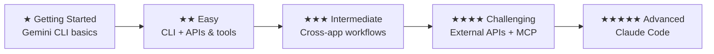

Learn by building real projects. These self-paced tutorials teach you how to work with AI tools — by speaking naturally or typing prompts. No prior coding experience required.

<Tip>
**All tutorials support voice input.** Use [Wispr Flow](https://wisprflow.ai/r?CHAN115) to speak your prompts instead of typing them. It is optional — every prompt works whether you speak it or type it.
</Tip>

## Why CLI tools?

These tutorials use **Gemini CLI** as the main AI tool because it is completely free and teaches you how to work with AI in the terminal — a skill that transfers directly to professional tools like **Claude Code**.

CLI (command-line) tools are better for **delegation** — you describe what you want, and AI does the work autonomously. GUI (click-based) tools are better for **suggestion** — they help you while you do the work yourself. In these tutorials, we want AI to do the heavy lifting, so CLI is the right choice.

<Info>
**Your learning path:** Learn the fundamentals with Gemini CLI (free), then graduate to Claude Code (professional, same workflow). By the time you reach the Vibe Coding tutorial, you will already know how to speak to an AI in the terminal, approve tool calls, and work with extensions — because you learned it all with Gemini CLI.
</Info>

## ★ Getting Started

The quickest tutorials — minimal setup, immediate results.

<CardGroup cols={2}>
  <Card title="Summarise Gmail with AI" icon="envelope" href="/tutorial/gmail-summary/overview" color="#c846ab">
    **★☆☆☆☆ · ~5–20 minutes**

    Say "summarise my unread emails" and AI reads your Gmail inbox and tells you what matters — in seconds.
  </Card>
  <Card title="Voice-Control Your Notes" icon="microphone" href="/tutorial/obsidian-daily/overview" color="#c846ab">
    **★☆☆☆☆ · ~30 minutes**

    Capture thoughts, track tasks, and review your day by speaking naturally — Gemini CLI + Wispr Flow control Obsidian for you.
  </Card>
</CardGroup>

## ★★ Easy

A bit more setup, but still straightforward and beginner-friendly.

<CardGroup cols={2}>
  <Card title="Build Your Personal Website" icon="globe" href="/tutorial/personal-website/overview" color="#9b2e83">
    **★★☆☆☆ · ~1 hour**

    Describe what you want your website to look like — by speaking or typing — and Gemini CLI builds and deploys it for you.
  </Card>
  <Card title="Smart Commute: Auckland Transport" icon="bus" href="/tutorial/auckland-commute/overview" color="#9b2e83">
    **★★☆☆☆ · ~30–45 minutes**

    Ask "is my bus running late?" and AI checks real-time Auckland Transport data and gives you plain English advice.
  </Card>
  <Card title="Organise Notes by Talking to AI" icon="comments" href="/tutorial/obsidian-organise/overview" color="#9b2e83">
    **★★☆☆☆ · ~30–45 minutes**

    Say "find my orphan notes" or "move this note to Archive" — AI searches, audits, and tidies your Obsidian vault.
  </Card>
  <Card title="Meeting Prep with AI" icon="users" href="/tutorial/meeting-prep/overview" color="#9b2e83">
    **★★☆☆☆ · ~25–30 minutes**

    AI gathers your calendar agenda, related emails, and shared documents into a single briefing — never walk into a meeting unprepared.
  </Card>
  <Card title="AI Morning Briefing" icon="sun" href="/tutorial/morning-briefing/overview" color="#9b2e83">
    **★★☆☆☆ · ~15–20 minutes**

    One command gives you today's meetings, urgent emails, and a standup-ready summary — powered by Gemini CLI + Google Workspace CLI.
  </Card>
</CardGroup>

## ★★★ Intermediate

More tools to install and configure, but the AI still does the heavy lifting.

<CardGroup cols={2}>
  <Card title="Create Professional PDFs" icon="file-pdf" href="/tutorial/professional-pdf/overview" color="#9b2e83">
    **★★★☆☆ · ~1.5 hours**

    Describe your ideal cover letter, invoice, or report — Gemini CLI + Typst turns your words into a polished PDF.
  </Card>
  <Card title="Email to Action: Cross-App Workflows" icon="arrows-rotate" href="/tutorial/email-to-action/overview" color="#9b2e83">
    **★★★☆☆ · ~30 minutes**

    Tell AI to read an email, create a calendar event, and write notes to Google Docs — all in one command, powered by Google Workspace CLI.
  </Card>
</CardGroup>

## ★★★★ Challenging

External API tokens, MCP configuration, and more complex setup — building confidence for advanced projects.

<CardGroup cols={2}>
  <Card title="Summarise Slack Channels" icon="slack" href="/tutorial/slack-summary/overview" color="#9b2e83">
    **★★★★☆ · ~45 minutes**

    Say "summarise #general for this week" and AI reads your Slack messages and gives you a clear, useful summary.
  </Card>
  <Card title="Create AI Promo Videos" icon="video" href="/tutorial/promo-video/overview" color="#9b2e83">
    **★★★★☆ · ~1.5–2 hours**

    Describe the video you want — AI creates it with animated text, professional voiceover, and sound effects. Export as MP4 for LinkedIn, Instagram, or anywhere.
  </Card>
</CardGroup>

## ★★★★★ Advanced

Multiple tools, APIs, and deployment — a real engineering project guided by AI.

<CardGroup cols={2}>
  <Card title="Vibe Coding: Daily Report Bot" icon="robot" href="/tutorial/vibe-coding/overview">
    **★★★★★ · ~2 hours**

    Describe the bot you want to build — by speaking or typing — and Claude Code writes all the code, tests, and deployment for you.
  </Card>
</CardGroup>

## Your progression

Each tutorial builds your CLI skills. By the time you reach Vibe Coding, speaking to an AI in the terminal will feel natural — because you have been doing it since your first tutorial.

<Tip>
**New to AI tools?** Start with Summarise Gmail or Voice-Control Your Notes — they are the quickest to set up and deliver instant results. All tutorials support voice input with Wispr Flow.
</Tip>
