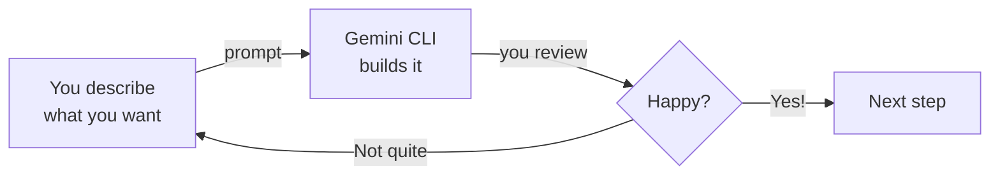

# Build Your Website

This is the fun part. You'll describe what you want, and Gemini CLI will build it for you. No coding required — just clear descriptions.

## The Vibe Coding Loop

Every step follows the same pattern:



You describe. Gemini CLI builds. You review. Repeat until it's right, then move on.

---

<Steps>
  <Step title="Create a project folder">
    <Tabs>
      <Tab title="Windows">
        1. Open **File Explorer**
        2. Go to your **Documents** folder
        3. Right-click in an empty space → **New** → **Folder**
        4. Name it `my-website`
      </Tab>
      <Tab title="macOS">
        1. Open **Finder**
        2. Go to your **Documents** folder
        3. Right-click in an empty space → **New Folder**
        4. Name it `my-website`
      </Tab>
    </Tabs>

    <Tip>
    Name it something simple like `my-website`. Use lowercase letters with no spaces — this will become part of your website URL later.
    </Tip>
  </Step>

  <Step title="Open terminal in your project folder">
    <Tabs>
      <Tab title="Windows">
        Open your `my-website` folder in File Explorer. Click the **address bar** at the top, type `powershell`, and press **Enter**.
      </Tab>
      <Tab title="macOS">
        Right-click the `my-website` folder in Finder and select **"Open Terminal at Folder"**. If you don't see this option, open Terminal and type:
        ```bash
        cd ~/Documents/my-website
        ```
      </Tab>
    </Tabs>
  </Step>

  <Step title="Start Gemini CLI">
    In your terminal, type:

    ```bash
    gemini
    ```

    Press Enter. You should see Gemini CLI start up with a prompt ready for your input.
  </Step>

  <Step title="Describe your website">
    Pick the style that appeals to you and copy the entire prompt into Gemini CLI. Replace `[Your Name]` and `[your field]` with your real information before pasting!

    <Tabs>
      <Tab title="Simple">
        ```text title="Copy this prompt — Simple personal website"
        Create a simple personal website for me. My name is [Your Name].
        I want a clean, modern design with:
        - A hero section with my name and a short tagline
        - An "About Me" section where I can introduce myself
        - A "Contact" section with links to my email and LinkedIn
        Use a single index.html file with inline CSS. Make it responsive
        so it looks good on both desktop and mobile phones.
        Use a professional color scheme. Make it look polished and modern.
        ```
      </Tab>
      <Tab title="Creative">
        ```text title="Copy this prompt — Creative portfolio website"
        Create a personal portfolio website for me. My name is [Your Name].
        I want a modern, eye-catching design with:
        - A bold hero section with a gradient background and my name
        - An "About Me" section with a circular photo placeholder
        - A "Skills" section showing my top skills with visual indicators
        - A "Projects" section with 3 placeholder project cards
        - A footer with social media icon links
        Use HTML and CSS. Make it fully responsive for mobile devices.
        Add smooth scroll behavior and subtle hover animations on buttons
        and cards. Use a vibrant but professional color palette.
        ```
      </Tab>
      <Tab title="Professional">
        ```text title="Copy this prompt — Professional resume website"
        Create a professional resume-style website. My name is [Your Name].
        I am looking for work in [your field]. Include these sections:
        - Professional header with my name, job title, and a brief summary
        - Work Experience section (use placeholder content for 2-3 roles)
        - Education section (use placeholder content)
        - Skills section organized by category
        - Contact section with email, LinkedIn, and phone placeholder
        Use HTML and CSS. Make it clean, minimal, and employer-friendly.
        Use a neutral, professional color scheme (navy blue or dark gray).
        Make it responsive and print-friendly so it can be saved as a PDF.
        ```
      </Tab>
    </Tabs>

    <Tip>
    **Remember to replace `[Your Name]` and `[your field]`** with your actual information before pasting the prompt!
    </Tip>

    <Info>
    Don't like the result? Just tell Gemini what to change — see Step 6 for ready-to-copy follow-up prompts.
    </Info>
  </Step>

  <Step title="Preview your website">
    Ask Gemini CLI to help you preview your website:

    ```text title="Copy this prompt to preview your website"
    Can you help me open this website in my browser so I can preview it?
    Please start a local server or just open the index.html file directly.
    ```

    **Or do it yourself:** find `index.html` in your `my-website` folder and double-click it. It will open in your browser.

    <Tip>
    Your website is only on your computer right now — not on the internet yet. We'll publish it in the next section.
    </Tip>
  </Step>

  <Step title="Iterate and improve">
    Not happy with the result? That's normal — and that's the whole point of vibe coding! Copy any of these follow-up prompts into Gemini CLI:

    ```text title="Change colors"
    Change the color scheme to blue and white. Keep the overall layout the same.
    ```

    ```text title="Add a photo"
    Add a profile photo section with a round border at the top of the page.
    Use a placeholder image for now.
    ```

    ```text title="Add navigation"
    Add a sticky navigation bar at the top with links to each section
    of the page. It should stay visible when I scroll down.
    ```

    ```text title="Add dark mode"
    Add a dark mode toggle button in the top-right corner. When clicked,
    it should switch the entire website between light and dark themes.
    Save the user's preference so it persists when they refresh the page.
    ```

    <Tip>
    **The vibe coding loop:** describe → review → refine. Keep going until you love it! You can send as many prompts to Gemini CLI as you want — there's no limit on iterations.
    </Tip>
  </Step>
</Steps>

## Troubleshooting

<AccordionGroup>
  <Accordion title="The page is blank when I open it">
    Make sure you're opening the `index.html` file, not a folder. If the file is empty, ask Gemini CLI: "The index.html file appears to be empty. Can you check and regenerate it?"
  </Accordion>
  <Accordion title="The layout looks broken">
    Ask Gemini CLI to fix it:
    ```text
    The layout looks broken — things are overlapping or not aligned properly.
    Can you fix the CSS so everything displays correctly?
    ```
  </Accordion>
  <Accordion title="I want to start over completely">
    Tell Gemini CLI:
    ```text
    I want to start completely fresh. Delete the current files and create
    a new website from scratch. [Then describe what you want]
    ```
  </Accordion>
</AccordionGroup>

<Note>
Happy with your website? Head to [Deploy your website](/tutorial/personal-website/deploy) to put it on the internet for free!
</Note>
