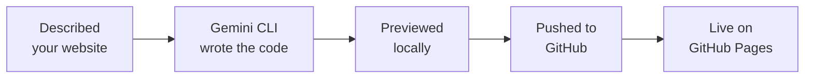
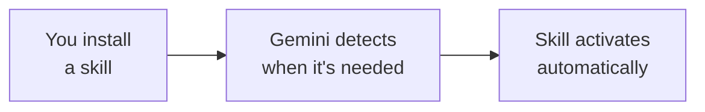

Congratulations — you built and deployed your own website without writing a single line of code! Let's look at what you achieved, how to keep improving, and where to go next.

## What You Built



A personal website that:
- Was designed by you and built by AI
- Is live on the internet for anyone to visit
- Can be updated anytime with a single prompt
- Cost you absolutely nothing

## What You Learned

<Tip>
**The skill that matters most isn't coding — it's communication.** You learned to describe what you want clearly, review the result, and iterate until it's right. These are the same skills that work with any AI tool, in any field.
</Tip>

Here's what you practised:
- **Using the terminal** — running commands and navigating folders
- **Talking to AI** — writing clear prompts that get the result you want
- **Iterating** — refining your website step by step
- **Using git and GitHub** — storing code and deploying a website
- **Problem solving** — describing issues and letting AI help fix them

---

## How to Update Your Website

Whenever you want to make changes to your website:

<Steps>
  <Step title="Open your terminal in the project folder">
    Navigate to your `my-website` folder and open a terminal there (just like you did before).
  </Step>
  <Step title="Start Gemini CLI">
    ```bash
    gemini
    ```
  </Step>
  <Step title="Describe what you want to change">
    Tell Gemini CLI what to update — just like you did when building.
  </Step>
  <Step title="Push your changes">
    ```text title="Copy this prompt to push updates to your live website"
    I've made changes to my website. Please:
    1. Add all changed files to git
    2. Create a commit with a descriptive message
    3. Push the changes to GitHub
    My website should automatically update on GitHub Pages in 1-2 minutes.
    ```
  </Step>
</Steps>

---

## Ideas to Try

<CardGroup cols={2}>
  <Card title="Add a blog" icon="pen-to-square">
    Create a blog section with posts you can update over time.
  </Card>
  <Card title="Custom domain" icon="globe">
    Use your own domain name (like `yourname.com`) instead of `github.io`.
  </Card>
  <Card title="Animations" icon="wand-magic-sparkles">
    Add scroll animations and transitions to make your site feel alive.
  </Card>
  <Card title="Dark mode" icon="moon">
    Let visitors switch between light and dark themes.
  </Card>
</CardGroup>

Here are ready-to-copy prompts for each idea:

<AccordionGroup>
  <Accordion title="Add a blog section">
    ```text title="Copy this prompt to add a blog section"
    Add a blog section to my website. I want:
    - A "Blog" page linked from the navigation
    - A list of blog posts with titles, dates, and short previews
    - Create 2 sample blog posts with placeholder content
    - Each blog post should have its own page with full content
    - Add a "Back to blog" link on each post page
    Make it match the existing design of my website.
    ```
  </Accordion>
  <Accordion title="Set up a custom domain">
    ```text title="Copy this prompt to set up a custom domain"
    I want to use a custom domain for my GitHub Pages website.
    My domain is [your-domain.com]. Please:
    1. Create a CNAME file in my repository with my domain
    2. Tell me what DNS records I need to set up with my domain provider
    3. Explain how to verify it's working
    ```
  </Accordion>
  <Accordion title="Add scroll animations">
    ```text title="Copy this prompt to add animations"
    Add smooth scroll animations to my website. I want sections to
    fade in and slide up as the user scrolls down the page. Use CSS
    animations with a JavaScript Intersection Observer — no external
    libraries. Keep it subtle and professional.
    ```
  </Accordion>
  <Accordion title="Add a dark mode toggle">
    ```text title="Copy this prompt to add dark mode"
    Add a dark mode toggle button in the top-right corner of my website.
    When clicked, it should switch the entire website between light and
    dark themes. Save the user's preference in localStorage so it
    persists when they refresh the page. Make sure all text remains
    readable in both modes.
    ```
  </Accordion>
</AccordionGroup>

---

## Supercharge Your AI: Agent Skills

Think of skills as superpowers you can install to make Gemini CLI even smarter at specific tasks.

<Info>
Skills are based on the open [Agent Skills](https://agentskills.io) standard. Gemini automatically detects when a skill is relevant and activates it.
</Info>

### How Skills Work



### Installing Skills

<Steps>
  <Step title="Browse available skills">
    ```text title="Copy this prompt to browse available skills"
    Show me how to list and manage Agent Skills in Gemini CLI.
    Run the command to list all currently installed skills.
    ```
  </Step>
  <Step title="Install a skill from a Git repository">
    ```text title="Copy this prompt to install a skill"
    I want to install an Agent Skill for Gemini CLI. Please help me
    install a skill from this repository: [paste skill repo URL here]

    Use the "gemini skills install" command.
    ```
  </Step>
  <Step title="Install a skill from a local directory">
    ```text title="Copy this prompt to install a local skill"
    I have a skill directory on my computer at [path]. Please help me
    install it as a Gemini CLI Agent Skill using "gemini skills install".
    ```
  </Step>
</Steps>

### Try It: Install the Frontend Design Skill

Now let's install a real skill that will make a noticeable difference in your projects. The **frontend-design** skill teaches Gemini CLI to create distinctive, polished web interfaces instead of generic-looking output. It comes from Anthropic's open-source [skills library](https://github.com/anthropics/skills).

<Steps>
  <Step title="Install the frontend-design skill">
    Run this command in your terminal:
    ```bash
    gemini skills install https://github.com/anthropics/skills.git --path skills/frontend-design
    ```
  </Step>
  <Step title="Try it out on your website">
    Now ask Gemini to redesign your personal website using its new skill:
    ```text title="Copy this prompt to try the skill"
    Redesign my personal website with a more polished, distinctive look.
    Use thoughtful typography, a cohesive color palette, subtle animations,
    and creative spatial composition. Avoid generic or cookie-cutter AI aesthetics.
    ```
  </Step>
</Steps>

<Tip>
The frontend-design skill focuses on **typography** choices, **color** themes, **motion and animation**, **spatial composition**, and **backgrounds** — guiding Gemini to produce designs that feel intentional and crafted rather than template-driven.
</Tip>

<Accordion title="What does this skill teach Gemini?">
  Behind the scenes, the skill provides Gemini with design guidelines including:

  - **Typography** — Use distinctive font pairings instead of defaults; vary weight, size, and spacing for visual hierarchy
  - **Color** — Build cohesive color themes with purposeful contrast and accent colors, not generic palettes
  - **Motion & animation** — Add subtle transitions and micro-interactions that feel natural and enhance usability
  - **Spatial composition** — Use asymmetric layouts, intentional whitespace, and layered depth instead of rigid grids
  - **Backgrounds & texture** — Incorporate gradients, patterns, or subtle textures to add richness and depth

  These guidelines activate automatically whenever Gemini detects a frontend task.
</Accordion>

<Info>
This skill comes from Anthropic's open-source [Agent Skills repository](https://github.com/anthropics/skills) and follows the [Agent Skills open standard](https://agentskills.io). You can browse the repository for more skills or even create your own!
</Info>

### Managing Skills

<AccordionGroup>
  <Accordion title="List all skills">
    ```bash
    gemini skills list
    ```
  </Accordion>
  <Accordion title="Install from Git">
    ```bash
    gemini skills install https://github.com/user/repo.git
    ```
  </Accordion>
  <Accordion title="Install from subdirectory">
    ```bash
    gemini skills install https://github.com/org/repo.git --path skills/frontend-design
    ```
  </Accordion>
  <Accordion title="Install a .skill file">
    ```bash
    gemini skills install /path/to/my-expertise.skill
    ```
  </Accordion>
  <Accordion title="Enable or disable a skill">
    ```bash
    gemini skills enable my-skill
    ```
    ```bash
    gemini skills disable my-skill
    ```
  </Accordion>
  <Accordion title="Uninstall a skill">
    ```bash
    gemini skills uninstall my-skill
    ```
  </Accordion>
</AccordionGroup>

<Tip>
**In-session commands:** While chatting with Gemini CLI, you can type `/skills list` to see all available skills, `/skills enable <name>` to enable one, or `/skills disable <name>` to turn one off.
</Tip>

### Key Concepts

<CardGroup cols={3}>
  <Card title="Workspace Skills" icon="folder">
    `.gemini/skills/` — shared with your team via git
  </Card>
  <Card title="User Skills" icon="user">
    `~/.gemini/skills/` — personal skills across all projects
  </Card>
  <Card title="Extension Skills" icon="puzzle-piece">
    Bundled with installed extensions
  </Card>
</CardGroup>

<Note>
Skills are like apps for your AI. The more relevant skills you install, the smarter Gemini CLI becomes for your specific needs. Explore [agentskills.io](https://agentskills.io) for community-shared skills.
</Note>

---

## Reflect

Take a few minutes to think about your experience:

<AccordionGroup>
  <Accordion title="What surprised you about working with AI?">
    Many people are surprised by how much can be accomplished just by describing what they want clearly. Was there a moment where Gemini CLI's output exceeded your expectations? What about a moment where you had to refine your prompt?
  </Accordion>
  <Accordion title="How could AI tools help your career?">
    Think about your job or job search. Could you use a personal website as an online portfolio? Could you automate parts of your workflow with AI tools? What other projects could you build?
  </Accordion>
  <Accordion title="What would you build next?">
    Now that you know the workflow — describe, build, review, iterate — what else could you create? A portfolio for your work? A website for a small business? A tool that helps with your daily tasks?
  </Accordion>
</AccordionGroup>

---

## Resources

| Resource | Description | Link |
|----------|-------------|------|
| Gemini CLI docs | Official documentation for Gemini CLI | [github.com/google-gemini/gemini-cli](https://github.com/google-gemini/gemini-cli) |
| GitHub Pages docs | Learn more about hosting websites on GitHub | [docs.github.com/pages](https://docs.github.com/en/pages) |
| Agent Skills | Open standard for AI agent skills | [agentskills.io](https://agentskills.io) |
| Unsplash | Free high-quality photos for your website | [unsplash.com](https://unsplash.com) |
| Google Fonts | Free fonts to customize your website typography | [fonts.google.com](https://fonts.google.com) |
| Coolors | Generate beautiful color schemes | [coolors.co](https://coolors.co) |

<Note>
Thank you for completing this tutorial! You've gone from zero to a live personal website — and more importantly, you've learned how to work with AI to build real things. Take these skills with you into your next project.
</Note>
