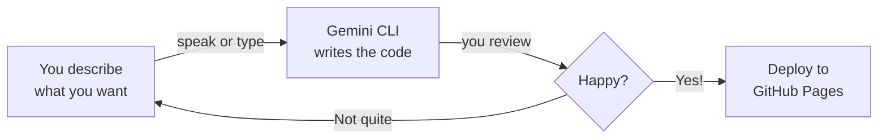

<Tip>
**Difficulty: ★★☆☆☆ Easy** · Estimated time: ~1 hour
</Tip>

Imagine having your own website, live on the internet, that you built yourself — without learning to code. Just describe what you want your website to look like — by speaking or typing — and AI builds it for you.

<Info>
**Tutorial led by [Chan Meng](https://chanmeng.org/)** — Senior AI/ML Engineer, open-source contributor, and former ByteDance developer. Chan has built 30+ live applications and specialises in AI-powered solutions. She is also a panel speaker at this event and the developer behind this website.
</Info>

## What You Will Build

<CardGroup cols={3}>
  <Card title="Describe" icon="microphone">
    Say or type what your dream website should look like — in plain language
  </Card>
  <Card title="Build" icon="terminal">
    Gemini CLI writes all the HTML and CSS for you
  </Card>
  <Card title="Deploy" icon="rocket">
    Publish it for free on GitHub Pages
  </Card>
</CardGroup>

## How It Works

You describe what you want in plain language — by speaking with Wispr Flow or typing into the terminal. Gemini CLI writes the code. You review the result and refine until you love it. Then you deploy it to the internet — for free.

<Tip>
**You can either speak your prompts using Wispr Flow, or type/paste them into Gemini CLI. Both work exactly the same way.** Wispr Flow is optional — it just makes the experience hands-free. Every prompt in this tutorial works whether you speak it or type it.
</Tip>

## What You Will Learn

This tutorial focuses on **communication skills with AI**, not coding knowledge. You will learn how to:

- Describe what you want clearly so AI can build it — by voice or text
- Use the terminal to run commands (it's easier than you think)
- Preview a website on your computer before publishing
- Use GitHub to store your code and host your website
- Iterate and refine — the core skill of working with AI

<Note>
**No coding required.** Gemini CLI writes the code — your job is to describe what you want. If you can explain an idea to a friend, you can build a website.
</Note>

## Tools

<CardGroup cols={3}>
  <Card title="Gemini CLI" icon="terminal">
    Google's free AI assistant that runs in your terminal. It understands your natural language requests and translates them into code.
  </Card>
  <Card title="Wispr Flow" icon="microphone">
    Optional voice input tool — speak instead of type. Works in any application, including your terminal.
  </Card>
  <Card title="Node.js" icon="node-js">
    A free tool needed to install Gemini CLI. One-time setup.
  </Card>
</CardGroup>

## Cost

| Tool | Cost |
|------|------|
| Gemini CLI | Free (1,000 requests/day) |
| Node.js | Free |
| GitHub Pages | Free (public repos) |
| Wispr Flow (optional) | Free trial ([invite link for a free month of Pro](https://wisprflow.ai/r?CHAN115)) |
| **Total** | **$0** |

## Prerequisites

<CardGroup cols={2}>
  <Card title="A laptop with internet" icon="laptop">
    Windows or macOS. No special hardware needed.
  </Card>
  <Card title="About 1 hour" icon="clock">
    Take your time — there's no rush. You can pause and come back anytime.
  </Card>
</CardGroup>

<Note>
Ready to get started? Head to [Set up your tools](/tutorial/personal-website/setup-tools) to install everything you need.
</Note>
