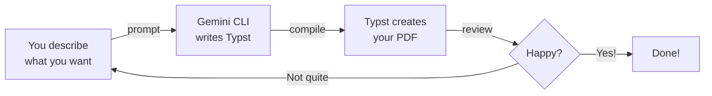

This is the fun part. You'll describe the cover letter you want, Gemini CLI will write the Typst code, and you'll compile it into a polished PDF. No coding required — just clear descriptions.

## The Vibe Coding Loop

Every step follows the same pattern:



You describe. Gemini CLI writes Typst code. You compile to PDF. Review and repeat until it's perfect.

---

<Steps>
  <Step title="Create a project folder">
    <Tabs>
      <Tab title="Windows">
        1. Open **File Explorer**
        2. Go to your **Documents** folder
        3. Right-click in an empty space → **New** → **Folder**
        4. Name it `my-pdfs`
      </Tab>
      <Tab title="macOS">
        1. Open **Finder**
        2. Go to your **Documents** folder
        3. Right-click in an empty space → **New Folder**
        4. Name it `my-pdfs`
      </Tab>
    </Tabs>

    <Tip>
    Name it something simple like `my-pdfs`. Use lowercase letters with no spaces.
    </Tip>
  </Step>

  <Step title="Open terminal in your project folder">
    <Tabs>
      <Tab title="Windows">
        Open your `my-pdfs` folder in File Explorer. Click the **address bar** at the top, type `powershell`, and press **Enter**.
      </Tab>
      <Tab title="macOS">
        Right-click the `my-pdfs` folder in Finder and select **"Open Terminal at Folder"**. If you don't see this option, open Terminal and type:
        ```bash
        cd ~/Documents/my-pdfs
        ```
      </Tab>
    </Tabs>
  </Step>

  <Step title="Start Gemini CLI">
    In your terminal, type:

    ```bash
    gemini
    ```

    Press Enter. You should see Gemini CLI start up with a prompt ready for your input.
  </Step>

  <Step title="Create your cover letter">
    Pick the style that appeals to you and copy the entire prompt into Gemini CLI. The prompts use placeholder content — you'll personalise it later.

    <Tabs>
      <Tab title="Simple">
        ```text title="Copy this prompt — Clean cover letter"
        Create a professional cover letter as a Typst file called cover-letter.typ.
        Use a clean, modern layout with:
        - My name and contact details at the top
        - Today's date in NZ format (e.g. 19 March 2026)
        - A greeting, 3 short paragraphs, and a sign-off
        - Professional sans-serif font
        - Generous margins and clean spacing
        Use placeholder content for the name, address, company, and role.
        Use NZ English spelling throughout.
        ```
      </Tab>
      <Tab title="Creative">
        ```text title="Copy this prompt — Bold creative cover letter"
        Create a bold, creative cover letter as a Typst file called cover-letter.typ.
        Use an eye-catching design with:
        - A coloured accent bar or header strip
        - My name in a large, bold font with contact details below
        - Today's date in NZ format (e.g. 19 March 2026)
        - A greeting, 3 short paragraphs, and a sign-off
        - Thoughtful use of colour — suitable for creative industries
        - Modern typography with contrasting font weights
        Use placeholder content for the name, address, company, and role.
        Use NZ English spelling throughout. This is for a creative or design role.
        ```
      </Tab>
      <Tab title="Formal">
        ```text title="Copy this prompt — Traditional formal cover letter"
        Create a traditional, formal cover letter as a Typst file called cover-letter.typ.
        Use a conservative layout with:
        - My name and contact details at the top, right-aligned
        - Recipient's details left-aligned below
        - Today's date in NZ format (e.g. 19 March 2026)
        - "Dear Hiring Manager" greeting
        - 3 formal paragraphs and "Yours sincerely" sign-off
        - Serif font (like New Computer Modern or similar)
        - Traditional spacing and margins
        Use placeholder content for the name, address, company, and role.
        Use NZ English spelling throughout. This is for a corporate or government role.
        ```
      </Tab>
    </Tabs>

    <Tip>
    **Don't worry about getting it perfect on the first try.** You'll refine the design in the next steps — that's the whole point of vibe coding!
    </Tip>
  </Step>

  <Step title="Compile your PDF">
    Now turn your Typst file into a PDF.

    <Tabs>
      <Tab title="Ask Gemini">
        ```text title="Copy this prompt to compile your PDF"
        Please compile cover-letter.typ into a PDF using the typst compile command.
        ```
      </Tab>
      <Tab title="Do it yourself">
        Exit Gemini CLI (type `/quit` or press Ctrl+C), then run:

        ```bash
        typst compile cover-letter.typ
        ```

        This creates `cover-letter.pdf` in the same folder. Open it to see your document!

        Then restart Gemini CLI:
        ```bash
        gemini
        ```
      </Tab>
    </Tabs>

    <Info>
    Open `cover-letter.pdf` by double-clicking it in your file explorer. It will open in your default PDF viewer.
    </Info>
  </Step>

  <Step title="Iterate and improve">
    Not happy with the result? That's normal — and that's the whole point! Copy any of these follow-up prompts into Gemini CLI:

    ```text title="Change the font"
    Change the font to a modern sans-serif font. Keep everything else the same.
    ```

    ```text title="Add colour"
    Add a subtle colour accent — use a dark teal or navy blue for headings
    and a thin coloured line under my name. Keep the overall design professional.
    ```

    ```text title="Adjust margins and spacing"
    The margins feel too wide. Reduce the margins to 2cm on all sides
    and tighten the line spacing slightly so the letter feels more compact.
    ```

    ```text title="Add a footer"
    Add a small footer at the bottom of the page with "Page 1 of 1" centred
    and my email address on the right side.
    ```

    ```text title="Compile again"
    Compile the updated cover-letter.typ to PDF so I can see the changes.
    ```

    <Tip>
    **The vibe coding loop:** describe → compile → review → refine. Keep going until you love it! You can send as many prompts to Gemini CLI as you want.
    </Tip>
  </Step>

  <Step title="Personalise for a real job">
    Ready to create a real cover letter? Copy this template prompt and fill in your details:

    ```text title="Copy this prompt and fill in the [brackets]"
    Update my cover letter for a real application:
    - My name: [Your Name]
    - My email: [your.email@example.com]
    - My phone: [your phone number]
    - I'm applying for: [Job Title] at [Company Name]
    - My key skills: [skill 1, skill 2, skill 3]
    - Why I'm interested: [one sentence about why you want this role]
    - My relevant experience: [brief description of relevant experience]

    Write the cover letter content in a professional but warm tone.
    Keep it to one page. Use NZ English spelling.
    Then compile it to PDF.
    ```

    <Tip>
    **Save your prompts!** Keep a text file with your personal details so you can quickly generate cover letters for different jobs. Change the company name, role, and key skills each time.
    </Tip>
  </Step>
</Steps>

## What Just Happened?

Here's what you did, step by step:

1. **You described** a cover letter in plain language
2. **Gemini CLI wrote** Typst code — a simple text file that defines your document's layout and content
3. **Typst compiled** that code into a pixel-perfect PDF
4. **You iterated** — asking for design changes, recompiling, and reviewing until it looked right

The key insight: you never had to learn Typst syntax. You described what you wanted, and AI handled the technical details. The `.typ` file is just a text file — you can open it in any text editor to see what Gemini wrote.

## Troubleshooting

<AccordionGroup>
  <Accordion title="The PDF is blank">
    The `.typ` file might be empty or have an error. Ask Gemini CLI:
    ```text
    The PDF is blank. Can you check cover-letter.typ for errors and fix them?
    Then recompile it to PDF.
    ```
  </Accordion>
  <Accordion title="Typst compile error">
    If you see an error when compiling, paste the error message into Gemini CLI:
    ```text
    I got this error when compiling: [paste the error message here]
    Can you fix the Typst code and recompile?
    ```
    Typst error messages are clear and specific — they tell you exactly which line has the problem.
  </Accordion>
  <Accordion title="The layout looks wrong">
    Ask Gemini CLI to fix the layout:
    ```text
    The layout doesn't look right — [describe what's wrong, e.g. "the text
    is too close to the edges" or "the spacing between paragraphs is too large"].
    Can you fix it and recompile?
    ```
  </Accordion>
  <Accordion title="I want to start over completely">
    Tell Gemini CLI:
    ```text
    I want to start fresh. Delete cover-letter.typ and create a new cover
    letter from scratch. [Then describe what you want]
    ```
  </Accordion>
</AccordionGroup>

<Note>
Happy with your cover letter? Head to [Explore templates](/tutorial/professional-pdf/explore-templates) to discover more document types you can create — invoices, reports, checklists, and more.
</Note>
