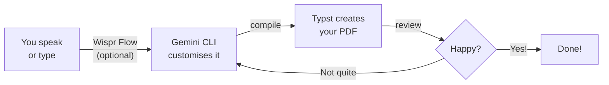

This is the fun part. You'll start from a professionally designed template, use Gemini CLI to customise it, and compile it into a polished PDF. No coding required — just clear descriptions, spoken or typed.

<Tip>
**You can either speak your prompts using Wispr Flow, or type/paste them into Gemini CLI. Both work exactly the same way.** Wispr Flow is optional — it just makes the experience hands-free. Every prompt in this tutorial works whether you speak it or type it.
</Tip>

## The Vibe Coding Loop

Every step follows the same pattern:



Describe what you want. Gemini CLI customises the template. Typst compiles it to PDF. Review and repeat until it's perfect.

---

<Steps>
  <Step title="Create a project folder">
    <Tabs>
      <Tab title="Windows">
        1. Open **File Explorer**
        2. Go to your **Documents** folder
        3. Right-click in an empty space → **New** → **Folder**
        4. Name it `my-pdfs`
      </Tab>
      <Tab title="macOS">
        1. Open **Finder**
        2. Go to your **Documents** folder
        3. Right-click in an empty space → **New Folder**
        4. Name it `my-pdfs`
      </Tab>
    </Tabs>

    <Tip>
    Name it something simple like `my-pdfs`. Use lowercase letters with no spaces.
    </Tip>
  </Step>

  <Step title="Open terminal in your project folder">
    <Tabs>
      <Tab title="Windows">
        Open your `my-pdfs` folder in File Explorer. Click the **address bar** at the top, type `powershell`, and press **Enter**.
      </Tab>
      <Tab title="macOS">
        Right-click the `my-pdfs` folder in Finder and select **"Open Terminal at Folder"**. If you don't see this option, open Terminal and type:
        ```bash
        cd ~/Documents/my-pdfs
        ```
      </Tab>
    </Tabs>
  </Step>

  <Step title="Initialise a cover letter template">
    Typst has a library of free, community-made templates called [Typst Universe](https://typst.app/universe). We'll start with **fireside** — a clean, modern cover letter template.

    In your terminal, run:

    ```bash title="Copy this command"
    typst init @preview/fireside:1.0.0
    ```

    This downloads the template and creates a ready-to-use project folder with a `.typ` file inside.

    <Info>
    **What just happened?** The `typst init` command pulled a professionally designed template from Typst Universe and set up a project folder for you. The template already has a polished layout — you just need to fill in your details.
    </Info>

    <Accordion title="'typst init' not working?">
    If you see an error, try these fixes:

    - **"typst: command not found"** — Go back to the [setup page](/tutorial/professional-pdf/setup) and install Typst CLI
    - **Network error** — Check your internet connection; `typst init` downloads the template from the web
    - **Permission error** — On Windows, try running PowerShell as Administrator. On macOS, try adding `sudo` before the command
    </Accordion>
  </Step>

  <Step title="Start Gemini CLI">
    Navigate into the template folder and start Gemini CLI:

    ```bash title="Copy this command"
    gemini
    ```

    Press Enter. You should see Gemini CLI start up with a prompt ready for your input. If you have Wispr Flow running, you can speak your prompts directly — otherwise, type or paste them.
  </Step>

  <Step title="Customise with Gemini CLI">
    Now tell Gemini CLI what you want. Pick the style that appeals to you — say it out loud or copy and paste:

    <Tabs>
      <Tab title="Simple">
        ```text title="Say this or copy this prompt"
        I have a Typst cover letter template (fireside) in this folder.
        Please customise it with:
        - Placeholder name and contact details at the top
        - Today's date in NZ format (e.g. 19 March 2026)
        - A greeting, 3 short paragraphs of placeholder content, and a sign-off
        - Clean, professional sans-serif font
        Use NZ English spelling throughout. Keep the template's existing layout
        but update the content and styling.
        Then compile it to PDF using typst compile.
        ```
      </Tab>
      <Tab title="Creative">
        ```text title="Say this or copy this prompt"
        I have a Typst cover letter template (fireside) in this folder.
        Please customise it with:
        - Placeholder name and contact details
        - Today's date in NZ format (e.g. 19 March 2026)
        - A greeting, 3 short paragraphs of placeholder content, and a sign-off
        - Bold colour accents — suitable for creative industries
        - Modern typography with contrasting font weights
        Use NZ English spelling throughout. Make it eye-catching while keeping
        the template's professional structure.
        Then compile it to PDF using typst compile.
        ```
      </Tab>
      <Tab title="Formal">
        ```text title="Say this or copy this prompt"
        I have a Typst cover letter template (fireside) in this folder.
        Please customise it with:
        - Placeholder name and contact details, right-aligned at the top
        - Recipient's details left-aligned below
        - Today's date in NZ format (e.g. 19 March 2026)
        - "Dear Hiring Manager" greeting
        - 3 formal paragraphs of placeholder content and "Yours sincerely" sign-off
        - Traditional serif font and conservative styling
        Use NZ English spelling throughout. This is for a corporate or government role.
        Then compile it to PDF using typst compile.
        ```
      </Tab>
    </Tabs>

    <Tip>
    **Don't worry about getting it perfect on the first try.** You'll refine the design in the next steps — that's the whole point of vibe coding!
    </Tip>
  </Step>

  <Step title="Review your PDF">
    Open the compiled PDF by double-clicking it in your file explorer. It will open in your default PDF viewer.

    <Info>
    **Starting from a template means your first result already looks professional.** The template handles layout, typography, and spacing — Gemini CLI just customises the content and styling to your taste.
    </Info>
  </Step>

  <Step title="Iterate and improve">
    Not happy with the result? That's normal — and that's the whole point! Say or copy any of these follow-up prompts into Gemini CLI:

    ```text title="Say this or copy this prompt"
    Change the font to a modern sans-serif font. Keep everything else the same.
    Then recompile to PDF.
    ```

    ```text title="Say this or copy this prompt"
    Add a subtle colour accent — use a dark teal or navy blue for headings
    and a thin coloured line under my name. Keep the overall design professional.
    Then recompile to PDF.
    ```

    ```text title="Say this or copy this prompt"
    The margins feel too wide. Reduce the margins to 2cm on all sides
    and tighten the line spacing slightly so the letter feels more compact.
    Then recompile to PDF.
    ```

    ```text title="Say this or copy this prompt"
    Add a small footer at the bottom of the page with "Page 1 of 1" centred
    and my email address on the right side.
    Then recompile to PDF.
    ```

    <Tip>
    **The vibe coding loop:** describe → compile → review → refine. Keep going until you love it! You can send as many prompts to Gemini CLI as you want — speak them or type them.
    </Tip>
  </Step>

  <Step title="Personalise for a real job">
    Ready to create a real cover letter? Say or copy this template prompt and fill in your details:

    ```text title="Say this or copy this prompt"
    Update my cover letter for a real application:
    - My name: [Your Name]
    - My email: [your.email@example.com]
    - My phone: [your phone number]
    - I'm applying for: [Job Title] at [Company Name]
    - My key skills: [skill 1, skill 2, skill 3]
    - Why I'm interested: [one sentence about why you want this role]
    - My relevant experience: [brief description of relevant experience]

    Write the cover letter content in a professional but warm tone.
    Keep it to one page. Use NZ English spelling.
    Then compile it to PDF.
    ```

    <Tip>
    **Save your prompts!** Keep a text file with your personal details so you can quickly generate cover letters for different jobs. Change the company name, role, and key skills each time.
    </Tip>
  </Step>
</Steps>

## What Just Happened?

Here's what you did, step by step:

1. **You initialised** a professional template from Typst Universe with `typst init`
2. **You described** what you wanted — by speaking or typing — and Gemini CLI customised the template
3. **Typst compiled** the code into a pixel-perfect PDF
4. **You iterated** — asking for design changes, recompiling, and reviewing until it looked right

The key insight: you started from a professionally designed template instead of a blank page. The template gave you a solid foundation, and AI handled the customisation. You never had to learn Typst syntax — you described what you wanted, and Gemini CLI made it happen.

## Troubleshooting

<AccordionGroup>
  <Accordion title="The PDF is blank">
    The `.typ` file might be empty or have an error. Say or type this in Gemini CLI:
    ```text title="Say this or copy this prompt"
    The PDF is blank. Can you check the .typ file for errors and fix them?
    Then recompile it to PDF.
    ```
  </Accordion>
  <Accordion title="Typst compile error">
    If you see an error when compiling, paste the error message into Gemini CLI:
    ```text title="Say this or copy this prompt"
    I got this error when compiling: [paste the error message here]
    Can you fix the Typst code and recompile?
    ```
    Typst error messages are clear and specific — they tell you exactly which line has the problem.
  </Accordion>
  <Accordion title="The layout looks wrong">
    Say or type this in Gemini CLI:
    ```text title="Say this or copy this prompt"
    The layout doesn't look right — [describe what's wrong, e.g. "the text
    is too close to the edges" or "the spacing between paragraphs is too large"].
    Can you fix it and recompile?
    ```
  </Accordion>
  <Accordion title="I want to start over completely">
    You can re-initialise the template:
    ```bash title="Copy this command"
    typst init @preview/fireside:1.0.0
    ```
    Or tell Gemini CLI to start from scratch:
    ```text title="Say this or copy this prompt"
    I want to start fresh. Create a new cover letter from scratch as a .typ
    file — don't use the template. [Then describe what you want]
    ```
  </Accordion>
  <Accordion title="My voice input has errors">
    Wispr Flow may occasionally mishear technical terms or proper nouns. You can review and correct the text in Gemini CLI before pressing Enter. If voice input is causing too many errors, switch to typing or pasting prompts instead.
  </Accordion>
</AccordionGroup>

<Note>
Happy with your cover letter? Head to [Explore templates](/tutorial/professional-pdf/explore-templates) to discover more document types you can create — invoices, reports, checklists, and more.
</Note>
