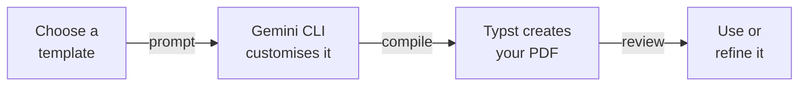

Now that you know the workflow — describe, build, compile, review — let's explore what else you can create. This page showcases 7 document templates, ordered from simplest to most complex, with ready-to-copy prompts for each.



Pick any template below, copy the prompt into Gemini CLI, and compile. Each template can be customised further with follow-up prompts.

---

<AccordionGroup>
  <Accordion title="1. Cover Letter — Advanced (Simplest)">
    **Use case:** Take your cover letter further with multi-page or styled variants.

    You already built a cover letter — here's how to level it up.

    ```text title="Copy this prompt — Advanced cover letter"
    Create an advanced cover letter as a Typst file called cover-letter-v2.typ.
    Include:
    - A professional header with my name, email, phone, and LinkedIn URL
    - A sidebar or accent column with a personal brand colour
    - Today's date in NZ format (e.g. 19 March 2026)
    - A well-structured body with clear paragraphs
    - A professional sign-off
    Use placeholder content. Use NZ English spelling.
    Make it visually distinctive — something that stands out from a standard letter.
    Then compile it to PDF.
    ```

    **Follow-up customisations:**

    ```text title="Add a matching header/footer"
    Add a matching header and footer with a thin coloured line. Put my name
    in the header and page number in the footer.
    ```

    ```text title="Create a two-page version"
    Extend this into a two-page version with an additional section for
    "Key Achievements" with 3-4 bullet points. Keep the same design style.
    ```

    <Tip>
    **NZ job market tip:** Many NZ employers still appreciate a well-formatted cover letter. A visually distinctive design can help your application stand out — especially for roles in marketing, design, or communications.
    </Tip>
  </Accordion>

  <Accordion title="2. Interview Prep Checklist">
    **Use case:** Prepare for job interviews with a structured, printable checklist.

    ```text title="Copy this prompt — Interview prep checklist"
    Create an interview preparation checklist as a Typst file called interview-prep.typ.
    Include three sections with checkboxes:
    - "Before the Interview" (research company, prepare questions, plan outfit, etc.)
    - "During the Interview" (body language tips, STAR method reminder, questions to ask)
    - "After the Interview" (send thank-you email, reflect on answers, follow up)
    Each section should have 5-6 checklist items with empty checkboxes.
    Use a clean, professional layout with clear section headings.
    Use NZ English spelling. Make it one page that's easy to print.
    Then compile it to PDF.
    ```

    **Follow-up customisations:**

    ```text title="Add a notes section"
    Add a "Notes" section at the bottom with lined space for handwritten notes.
    ```

    ```text title="Customise for a specific role"
    Customise this checklist for a [job title] interview at [company name].
    Add role-specific preparation items.
    ```

    <Tip>
    **Print it out!** This checklist is designed to be printed and used by hand. Review it the night before your interview and tick off each item as you prepare.
    </Tip>
  </Accordion>

  <Accordion title="3. Freelance Invoice">
    **Use case:** Bill clients professionally with NZ-compliant invoices.

    ```text title="Copy this prompt — NZ freelance invoice"
    Create a professional freelance invoice as a Typst file called invoice.typ.
    Include:
    - My business name, address, and contact details at the top
    - Invoice number, date (NZ format), and due date
    - Client's name and address
    - A table of services with columns: Description, Hours, Rate, Amount
    - 3 placeholder line items
    - Subtotal, GST (15%), and Total in NZD
    - Payment details section with NZ bank account format (XX-XXXX-XXXXXXX-XXX)
    - Payment terms: "Due within 14 days"
    Use a clean, professional layout. Use NZ English spelling.
    Then compile it to PDF.
    ```

    **Follow-up customisations:**

    ```text title="Add GST number"
    Add my GST number (placeholder: 123-456-789) below my business name.
    Add a note: "GST inclusive" next to the total.
    ```

    ```text title="Add terms and conditions"
    Add a small "Terms & Conditions" section at the bottom with standard
    freelance payment terms.
    ```

    <Tip>
    **GST tip:** If you earn over $60,000/year as a freelancer in NZ, you must register for GST. This invoice template includes 15% GST by default — adjust if you're not GST-registered.
    </Tip>
  </Accordion>

  <Accordion title="4. Team Newsletter">
    **Use case:** Create a personal update, client newsletter, or team report.

    ```text title="Copy this prompt — Newsletter"
    Create a one-page newsletter as a Typst file called newsletter.typ.
    Use a two-column layout with:
    - A bold header with the newsletter title and date (NZ format)
    - A main article with a heading and 2-3 paragraphs
    - A sidebar with "Quick Updates" — 3-4 short bullet points
    - A "Coming Up" section with 2-3 upcoming dates/events
    - A footer with contact information
    Use placeholder content. Use NZ English spelling.
    Make it visually engaging with colour accents and clear hierarchy.
    Then compile it to PDF.
    ```

    **Follow-up customisations:**

    ```text title="Add a photo placeholder"
    Add a placeholder image area in the main article section. Use a grey
    rectangle with the text "Photo" centred inside it.
    ```

    ```text title="Change to personal branding"
    Update this newsletter with my personal brand. Use [your colour] as the
    accent colour and add my name and tagline in the header.
    ```

    <Tip>
    **Stand out in your job search:** Send a monthly "personal newsletter" to your network summarising what you've been learning, projects you've worked on, and what roles you're looking for. It keeps you top of mind.
    </Tip>
  </Accordion>

  <Accordion title="5. Service Catalogue">
    **Use case:** Showcase freelance services or create an event programme.

    ```text title="Copy this prompt — Service catalogue"
    Create a service catalogue as a Typst file called services.typ.
    Use a clean, menu-style layout with:
    - A professional header with a business name and tagline
    - 4-5 service categories, each with:
      - Service name and brief description (1-2 lines)
      - Price or "From $X" pricing
    - A "Get in Touch" section at the bottom with contact details
    Use placeholder content for a freelance [web design / photography / consulting] business.
    Use NZ English spelling and NZD currency.
    Make it look polished — like a menu at a nice restaurant.
    Then compile it to PDF.
    ```

    **Follow-up customisations:**

    ```text title="Add package deals"
    Add a "Packages" section with 3 bundled offerings (Basic, Standard, Premium)
    presented in a comparison format with what's included in each.
    ```

    ```text title="Make it an event programme"
    Convert this into an event programme for [event name]. Replace services
    with a schedule of sessions, speakers, and times.
    ```

    <Tip>
    **Freelancers:** A polished service catalogue PDF attached to your emails looks far more professional than describing your services in plain text. It signals that you take your business seriously.
    </Tip>
  </Accordion>

  <Accordion title="6. Professional Report">
    **Use case:** Create structured reports with a table of contents, figures, and references.

    ```text title="Copy this prompt — Professional report"
    Create a professional report as a Typst file called report.typ.
    Include:
    - A title page with report title, author, date (NZ format), and organisation
    - An auto-generated table of contents
    - 3 chapters with headings and subheadings:
      1. Introduction (background and objectives)
      2. Findings (with a placeholder table and a placeholder figure)
      3. Recommendations (numbered list of 4-5 recommendations)
    - Page numbers in the footer
    - A references section at the end with 3 placeholder references
    Use placeholder content throughout. Use NZ English spelling.
    Use a professional serif font and clean academic layout.
    Then compile it to PDF.
    ```

    **Follow-up customisations:**

    ```text title="Add an executive summary"
    Add an executive summary after the title page and before the table of
    contents. It should be a half-page overview of the key findings and
    recommendations.
    ```

    ```text title="Add charts or graphs"
    Add a simple bar chart or graph in the Findings chapter using Typst's
    built-in drawing capabilities. Use placeholder data.
    ```

    <Tip>
    **Useful for:** Project proposals, research summaries, business cases, or any situation where you need to present structured information professionally.
    </Tip>
  </Accordion>

  <Accordion title="7. Academic Thesis (Stretch Goal — Most Complex)">
    **Use case:** Create a multi-chapter thesis or dissertation.

    ```text title="Copy this prompt — Academic thesis"
    Create an academic thesis template as a Typst file called thesis.typ.
    Include:
    - A title page with thesis title, author name, degree, university, and date
    - An abstract page
    - An auto-generated table of contents
    - 4 chapters:
      1. Introduction
      2. Literature Review
      3. Methodology
      4. Results and Discussion
    - Each chapter should have 2-3 subsections with placeholder text
    - A bibliography/references section with 5 placeholder references
    - Page numbers, chapter headers in the running head
    - Use academic formatting conventions (numbered headings, 12pt font, 1.5 line spacing)
    Use placeholder content. Use NZ English spelling.
    Then compile it to PDF.
    ```

    **Follow-up customisations:**

    ```text title="Add appendices"
    Add an appendix section after the references with 2 placeholder appendices
    (Appendix A: Survey Questions, Appendix B: Raw Data Table).
    ```

    ```text title="Add list of figures and tables"
    Add a "List of Figures" and "List of Tables" after the table of contents.
    Add 2 placeholder figures and 1 placeholder table in the Results chapter.
    ```

    <Tip>
    **This is a stretch goal** — academic formatting can be complex. If it doesn't look perfect on the first try, use follow-up prompts to refine the layout section by section.
    </Tip>
  </Accordion>
</AccordionGroup>

---

## Find More Templates

The [Typst Universe](https://typst.app/universe) is a community library with hundreds of free templates. Browse it for inspiration, then ask Gemini CLI to recreate or adapt any design you find.

<Tip>
**Mix and match!** You can combine elements from different templates. For example: "Take the header style from my cover letter and use it on my invoice" — Gemini CLI can handle this because all your `.typ` files are in the same folder.
</Tip>

<Note>
Ready to wrap up? Head to [Keep going](/tutorial/professional-pdf/keep-going) for next steps, reflection questions, and resources.
</Note>
