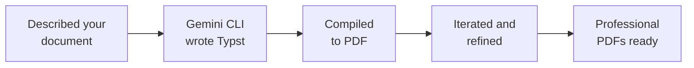

Congratulations — you created professional PDFs without writing a single line of code! Let's look at what you achieved, how to keep building, and where to go next.

## What You Built



Professional documents that:
- Were designed by you and built by AI
- Are pixel-perfect PDFs you can send, print, or share
- Can be updated anytime with a single prompt
- Cost you absolutely nothing

## What You Learned

<Tip>
**The skill that matters most isn't coding — it's communication.** You learned to describe what you want clearly, review the result, and iterate until it's right. These are the same skills that work with any AI tool, in any field.
</Tip>

Here's what you practised:
- **Using the terminal** — running commands and navigating folders
- **Talking to AI** — writing clear prompts that get the result you want
- **Iterating** — refining your documents step by step
- **Compiling documents** — turning text files into polished PDFs
- **Adapting templates** — customising designs for different purposes

---

## Ideas to Try

<CardGroup cols={2}>
  <Card title="Build your CV" icon="file-user">
    Create a complete CV/resume as a PDF — tailored for each job you apply to.
  </Card>
  <Card title="Create a portfolio booklet" icon="book">
    Combine your best work into a multi-page portfolio PDF to share with employers.
  </Card>
  <Card title="Automate with scripts" icon="code">
    Ask Gemini to create a script that generates personalised cover letters from a template.
  </Card>
  <Card title="Contribute a template" icon="heart">
    Design a Typst template and share it on Typst Universe for others to use.
  </Card>
</CardGroup>

Here are ready-to-copy prompts for each idea:

<AccordionGroup>
  <Accordion title="Build your CV">
    ```text title="Copy this prompt to create a CV"
    Create a professional CV/resume as a Typst file called cv.typ.
    Include:
    - My name and contact details (email, phone, LinkedIn) in a clean header
    - A brief professional summary (2-3 sentences)
    - Work Experience section with 2-3 roles (use placeholder content)
    - Education section
    - Skills section organised by category
    - Keep it to 1-2 pages maximum
    Use a modern, clean layout. Use NZ English spelling.
    Then compile it to PDF.
    ```
  </Accordion>
  <Accordion title="Create a portfolio booklet">
    ```text title="Copy this prompt to create a portfolio"
    Create a portfolio booklet as a Typst file called portfolio.typ.
    Include:
    - A cover page with my name and "Portfolio" as the title
    - A brief introduction page about me
    - 4 project showcase pages, each with:
      - Project title and date
      - A brief description (2-3 sentences)
      - A placeholder image area
      - Key skills or tools used
    - A contact page at the end
    Use placeholder content. Use NZ English spelling.
    Make it visually polished with consistent branding throughout.
    Then compile it to PDF.
    ```
  </Accordion>
  <Accordion title="Automate cover letter generation">
    ```text title="Copy this prompt to create an automation script"
    I want to automate cover letter generation. Please:
    1. Create a Typst template file called cover-template.typ with variables
       for: name, email, phone, company, role, and key skills
    2. Create a simple script that takes these variables and compiles the
       template into a PDF
    3. Show me how to run it to generate a cover letter for a specific job

    Use NZ English spelling and NZ date format.
    ```
  </Accordion>
  <Accordion title="Share a template on Typst Universe">
    ```text title="Copy this prompt to prepare a template for sharing"
    Help me prepare my [cover letter / invoice / report] Typst template
    for sharing on Typst Universe. Please:
    1. Clean up the code and add comments explaining each section
    2. Replace all personal information with clear placeholder variables
    3. Create a README.md describing the template and how to use it
    4. Show me how to submit it to typst.app/universe
    ```
  </Accordion>
</AccordionGroup>

---

## Reflect

Take a few minutes to think about your experience:

<AccordionGroup>
  <Accordion title="What surprised you about creating documents with AI?">
    Many people are surprised by how quickly they can produce professional-looking documents. Was there a moment where the output exceeded your expectations? What about a moment where you had to refine your description?
  </Accordion>
  <Accordion title="How could PDF creation help your career?">
    Think about your job search or work. Could you create tailored cover letters for each application? Could you produce professional invoices for freelance work? What other documents could save you time?
  </Accordion>
  <Accordion title="What would you create next?">
    Now that you know the workflow — describe, build, compile, iterate — what other documents could you create? A CV? A business proposal? A training manual? A personal brand kit?
  </Accordion>
</AccordionGroup>

---

## Resources

| Resource | Description | Link |
|----------|-------------|------|
| Typst documentation | Official docs for the Typst language | [typst.app/docs](https://typst.app/docs) |
| Typst Universe | Community templates and packages | [typst.app/universe](https://typst.app/universe) |
| Gemini CLI docs | Official documentation for Gemini CLI | [github.com/google-gemini/gemini-cli](https://github.com/google-gemini/gemini-cli) |
| Careers NZ | Career planning and job search resources | [careers.govt.nz](https://www.careers.govt.nz) |

<Note>
Thank you for completing this tutorial! You've gone from zero to professional PDFs — and more importantly, you've learned how to communicate with AI to build real things. Take these skills with you into your next project.
</Note>
