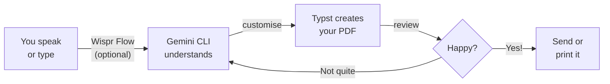

<Tip>
**Difficulty: ★★☆☆☆ Beginner** · Estimated time: ~1.5 hours
</Tip>

Imagine creating a polished, professional cover letter — perfectly formatted, ready to send — just by describing what you want. Speak it out loud or type it in. No Word templates, no fighting with margins, no design skills needed.

<Info>
**Tutorial led by [Chan Meng](https://chanmeng.org/)** — Senior AI/ML Engineer, open-source contributor, and former ByteDance developer. Chan has built 30+ live applications and specialises in AI-powered solutions. She is also a panel speaker at this event and the developer behind this website.
</Info>

## What You Will Build

<CardGroup cols={3}>
  <Card title="Describe" icon="microphone">
    Tell AI what document you need — speak it or type it in plain language
  </Card>
  <Card title="Build" icon="terminal">
    Gemini CLI writes Typst code that defines your document
  </Card>
  <Card title="Export" icon="file-pdf">
    Compile to a pixel-perfect PDF you can send or print
  </Card>
</CardGroup>

## How It Works

You describe what you want — by speaking with Wispr Flow or typing directly. Gemini CLI understands your request and writes Typst code. Typst compiles it into a beautiful PDF. Review, refine, and repeat until it's perfect.

<Tip>
**You can either speak your prompts using Wispr Flow, or type/paste them into Gemini CLI. Both work exactly the same way.** Wispr Flow is optional — it just makes the experience hands-free. Every prompt in this tutorial works whether you speak it or type it.
</Tip>

## Why Typst?

| Feature | Word | LaTeX | Markdown | Typst |
|---------|------|-------|----------|-------|
| AI-friendly | Poor — binary format | OK — verbose syntax | Good — simple | **Excellent** — clean, concise |
| Typography quality | Basic | Excellent | Basic | **Excellent** |
| Easy to learn | Yes | No | Yes | **Yes** |
| Fast compile | N/A | Slow | Fast | **Instant** |
| Token-efficient | N/A | Poor | Good | **Excellent** |

Typst is ideal for AI-generated documents because its syntax is clean and concise — AI models produce fewer errors and use fewer tokens compared to LaTeX. Compile times are instant, and error messages are clear and actionable.

Unlike Word, Typst files are plain text — so AI can read, write, and modify them directly. Unlike LaTeX, Typst is easy to learn and compiles in milliseconds.

## What You Will Learn

This tutorial focuses on **communication skills with AI**, not coding knowledge. You will learn how to:

- Describe a professional document clearly — by speaking or typing — so AI can build it
- Use Typst to compile documents into polished PDFs
- Iterate on design — adjust fonts, colours, layout, and content through conversation
- Adapt templates for different purposes (cover letters, invoices, reports)
- Work with the describe → build → compile → review loop
- Use voice input with Wispr Flow for a hands-free workflow

<Note>
**No coding required.** Gemini CLI writes the Typst code — your job is to describe what you want. If you can explain what a document should look like, you can create professional PDFs.
</Note>

## Tools

<CardGroup cols={3}>
  <Card title="Gemini CLI" icon="terminal">
    Google's free AI assistant that runs in your terminal. It understands your natural language requests and translates them into actions.
  </Card>
  <Card title="Wispr Flow" icon="microphone">
    Optional voice input tool — speak instead of type. Works in any application, including your terminal.
  </Card>
  <Card title="Typst CLI" icon="file-pdf">
    A free, open-source typesetting system that turns simple text files into beautiful PDFs. Instant compilation and clear error messages.
  </Card>
  <Card title="Node.js" icon="node-js">
    A free tool needed to install Gemini CLI. One-time setup.
  </Card>
  <Card title="Terminal" icon="square-terminal">
    The command-line app built into your computer. On macOS it is called Terminal; on Windows it is called PowerShell or Command Prompt.
  </Card>
</CardGroup>

## Cost

| Tool | Cost |
|------|------|
| Gemini CLI | Free (1,000 requests/day) |
| Node.js | Free |
| Typst CLI | Free and open source |
| Wispr Flow (optional) | Free trial ([invite link for a free month of Pro](https://wisprflow.ai/r?CHAN115)) |
| **Total** | **$0** |

## Prerequisites

<CardGroup cols={3}>
  <Card title="A laptop with internet" icon="laptop">
    Windows or macOS. No special hardware needed.
  </Card>
  <Card title="About 1.5 hours" icon="clock">
    Take your time — there's no rush. You can pause and come back anytime.
  </Card>
  <Card title="Curiosity" icon="lightbulb">
    No prior experience needed. Just a willingness to try something new.
  </Card>
</CardGroup>

<Note>
Ready to get started? Head to [Set up your tools](/tutorial/professional-pdf/setup) to install everything you need.
</Note>
