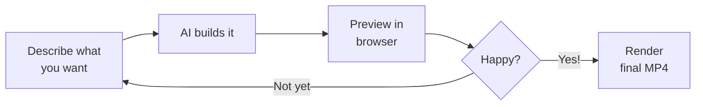

Your tools are ready — preview running in one terminal, AI assistant in the other. Now let's create a real promotional video, step by step.

We will build a **30-second personal brand intro** — but the same workflow works for any type of video. You will generate voiceover audio, create a sound effect, build the video composition, and render the final MP4.

<Tip>
**Voice or typing — both work.** If you have Wispr Flow running, just start speaking your prompts. Otherwise, copy and paste them or type your own version. Your AI assistant understands natural language either way.
</Tip>

## The vibe coding loop

This is how you will work throughout this tutorial:



Describe. Preview. Refine. Repeat until you love it — then render.

<Steps>
  <Step title="Generate your voiceover audio">
    Before building the video, let's create the voiceover. You will tell your AI assistant to call the ElevenLabs API and generate an audio file from your script.

    <Tabs>
      <Tab title="Personal Brand Intro">
        <Tabs>
          <Tab title="Gemini CLI (Free)">
            In your Gemini CLI terminal, say or type this prompt:

            ```text title="Say this or copy this prompt"
            I need you to generate a voiceover audio file using the ElevenLabs API.

            My ElevenLabs API key is: [paste your API key here]

            Please write a Node.js script that:
            1. Sends this text to the ElevenLabs text-to-speech API:
               "Hi, I'm [Your Name]. I'm a creative problem-solver transitioning
               into tech, and I'm passionate about building tools that help people.
               Let's connect."
            2. Uses the voice ID "21m00Tcm4TlvDq8ikWAM" (Rachel voice)
            3. Saves the audio output as public/voiceover.mp3

            Then run the script.
            ```
          </Tab>

          <Tab title="Claude Code (Paid)">
            In your Claude Code terminal, say or type this prompt:

            ```text title="Say this or copy this prompt"
            I need you to generate a voiceover audio file using the ElevenLabs API.

            My ElevenLabs API key is: [paste your API key here]

            Please write a Node.js script that:
            1. Sends this text to the ElevenLabs text-to-speech API:
               "Hi, I'm [Your Name]. I'm a creative problem-solver transitioning
               into tech, and I'm passionate about building tools that help people.
               Let's connect."
            2. Uses the voice ID "21m00Tcm4TlvDq8ikWAM" (Rachel voice)
            3. Saves the audio output as public/voiceover.mp3

            Then run the script.
            ```
          </Tab>
        </Tabs>

        <Tip>
        **Replace `[Your Name]`** with your actual name. Feel free to change the voiceover text to something that sounds like you — this is your personal brand intro.
        </Tip>
      </Tab>

      <Tab title="Event Invitation">
        ```text title="Say this or copy this prompt"
        I need you to generate a voiceover audio file using the ElevenLabs API.

        My ElevenLabs API key is: [paste your API key here]

        Please write a Node.js script that:
        1. Sends this text to the ElevenLabs text-to-speech API:
           "Join us for SheSharp's next workshop on the future of AI in the
           workplace. Saturday, April 12th, at GridAKL in Auckland.
           Free entry — all skill levels welcome. Register now."
        2. Uses the voice ID "21m00Tcm4TlvDq8ikWAM" (Rachel voice)
        3. Saves the audio output as public/voiceover.mp3

        Then run the script.
        ```
      </Tab>

      <Tab title="Portfolio Showcase">
        ```text title="Say this or copy this prompt"
        I need you to generate a voiceover audio file using the ElevenLabs API.

        My ElevenLabs API key is: [paste your API key here]

        Please write a Node.js script that:
        1. Sends this text to the ElevenLabs text-to-speech API:
           "I built a personal portfolio website using AI — from scratch,
           in under an hour. It includes my projects, skills, and contact
           info. Here's how I did it."
        2. Uses the voice ID "21m00Tcm4TlvDq8ikWAM" (Rachel voice)
        3. Saves the audio output as public/voiceover.mp3

        Then run the script.
        ```
      </Tab>
    </Tabs>

    Your AI assistant will write a small Node.js script, run it, and save the voiceover audio as `public/voiceover.mp3`.

    <Tip>
    **The AI asks for permission?** If your AI assistant asks to approve running a script or creating a file, type `y` and press **Enter**. This is normal — it is asking your permission before taking action.
    </Tip>

    <AccordionGroup>
      <Accordion title="What just happened?">
      Your AI assistant wrote a small Node.js script that:
      1. Sent your voiceover text to ElevenLabs' text-to-speech API
      2. Received audio data back from ElevenLabs' servers
      3. Saved it as an MP3 file in your project's `public/` folder

      The entire process happens in a few seconds. You described what you wanted in plain English, and AI handled all the technical details.
      </Accordion>

      <Accordion title="I want to use a different voice">
      The free tier includes these built-in voices. Replace the voice ID in your prompt:

      | Voice | ID | Style |
      |-------|----|-------|
      | Rachel | `21m00Tcm4TlvDq8ikWAM` | Calm, professional (default) |
      | Bella | `EXAVITQu4vr4xnSDxMaL` | Warm, friendly |
      | Antoni | `ErXwobaYiN019PkySvjV` | Conversational, male |
      | Elli | `MF3mGyEYCl7XYWbV9V6O` | Young, energetic |
      | Josh | `TxGEqnHWrfWFTfGW9XjX` | Deep, authoritative |
      | Adam | `pNInz6obpgDQGcFmaJgB` | Clear, neutral, male |
      | Sam | `yoZ06aMxZJJ28mfd3POQ` | Warm, narrative |
      | Domi | `AZnzlk1XvdvUeBnXmlld` | Confident, bold |

      **Want more options?** Browse all voices at [elevenlabs.io/voice-library](https://elevenlabs.io/voice-library) to hear previews. The built-in voices above work on the free API tier.
      </Accordion>

      <Accordion title="ElevenLabs API returns an error">
      Common causes:
      - **Invalid API key:** Double-check that you copied the full key with no extra spaces.
      - **Free tier limit reached:** Check your usage at [elevenlabs.io](https://elevenlabs.io) under Profile. The free tier is 10,000 characters per month.
      - **Network error:** Make sure you have an internet connection. Try again in a few seconds.

      If the error message is confusing, paste it into your AI assistant and ask: "What does this error mean and how do I fix it?"
      </Accordion>
    </AccordionGroup>
  </Step>

  <Step title="Generate a sound effect">
    Now let's create a sound effect to use in your video transitions.

    <Tabs>
      <Tab title="Gemini CLI (Free)">
        ```text title="Say this or copy this prompt"
        Now generate a sound effect using the ElevenLabs sound effects API.
        Use my same ElevenLabs API key.

        Create a short, subtle whoosh transition sound — about 1.5 seconds long.
        Save it as public/swoosh.mp3
        ```
      </Tab>

      <Tab title="Claude Code (Paid)">
        ```text title="Say this or copy this prompt"
        Now generate a sound effect using the ElevenLabs sound effects API.
        Use my same ElevenLabs API key.

        Create a short, subtle whoosh transition sound — about 1.5 seconds long.
        Save it as public/swoosh.mp3
        ```
      </Tab>
    </Tabs>

    <Info>
    **ElevenLabs can create any sound from a text description.** Try "gentle bell chime," "keyboard typing sounds," "crowd applause," or "ocean waves." Experiment with different descriptions — the more specific you are, the better the result.
    </Info>

    <Accordion title="Sound effect ideas for different video types">
    | Video Type | Sound Effect Prompt |
    |------------|-------------------|
    | Personal brand | "subtle whoosh transition, professional" |
    | Event invitation | "gentle bell chime notification" |
    | Portfolio showcase | "soft keyboard typing sounds" |
    | Social media tip | "upbeat pop notification sound" |
    | Freelance pitch | "confident drum hit accent" |
    | Thank-you video | "warm, soft chime" |

    You can generate multiple sound effects and use different ones at different points in your video.
    </Accordion>
  </Step>

  <Step title="Create your video composition">
    Now for the main event — describe your video and let AI build it. This is where everything comes together.

    <Tabs>
      <Tab title="Gemini CLI (Free)">
        ```text title="Say this or copy this prompt"
        Create a Remotion video composition for a 30-second personal brand intro.

        The video should have:
        - A dark gradient background (dark purple to dark blue)
        - My name "[Your Name]" appearing with a smooth fade-in animation at 1 second
        - Below it, my tagline "Transitioning into Tech" sliding in from the left at 2 seconds
        - Three bullet points appearing one by one at 3, 4, and 5 seconds:
          • Creative problem-solver
          • Quick learner
          • Passionate about helping people
        - A "Let's connect" call-to-action fading in at 7 seconds
        - Use the voiceover audio from public/voiceover.mp3 starting at 0.5 seconds
        - Play the swoosh sound from public/swoosh.mp3 on each text transition
        - Use TailwindCSS for all styling
        - Make it 1080x1920 (vertical, for social media)
        - The video should be 15 seconds long at 30fps

        Create this as a new composition in the Remotion project and
        register it in src/Root.tsx.
        ```
      </Tab>

      <Tab title="Claude Code (Paid)">
        ```text title="Say this or copy this prompt"
        Create a Remotion video composition for a 30-second personal brand intro.

        The video should have:
        - A dark gradient background (dark purple to dark blue)
        - My name "[Your Name]" appearing with a smooth fade-in animation at 1 second
        - Below it, my tagline "Transitioning into Tech" sliding in from the left at 2 seconds
        - Three bullet points appearing one by one at 3, 4, and 5 seconds:
          • Creative problem-solver
          • Quick learner
          • Passionate about helping people
        - A "Let's connect" call-to-action fading in at 7 seconds
        - Use the voiceover audio from public/voiceover.mp3 starting at 0.5 seconds
        - Play the swoosh sound from public/swoosh.mp3 on each text transition
        - Use TailwindCSS for all styling
        - Make it 1080x1920 (vertical, for social media)
        - The video should be 15 seconds long at 30fps

        Create this as a new composition in the Remotion project and
        register it in src/Root.tsx.
        ```
      </Tab>
    </Tabs>

    <Tip>
    **Check the preview!** After the AI finishes creating files, switch to your browser at `http://localhost:3000`. You should see your video playing with the animations and audio. If the preview is not updating, try refreshing the browser.
    </Tip>

    <Tip>
    **Replace `[Your Name]`** with your actual name. Feel free to change the tagline, bullet points, and colours to match your personal brand.
    </Tip>

    <Accordion title="What did the AI just create?">
    Your AI assistant created several files in the `src/` folder:
    - A **React component** (`.tsx` file) that defines the video's visual layout — text, colours, animations
    - Uses Remotion's `<Audio>` component to include your voiceover and sound effects
    - Uses Remotion's animation utilities (`useCurrentFrame`, `interpolate`, `spring`) for smooth transitions
    - Registered the new composition in `src/Root.tsx` so Remotion knows about it

    You never need to understand or edit these files. The AI reads and writes them for you.
    </Accordion>
  </Step>

  <Step title="Review and refine">
    Watch the preview in your browser. It probably will not be perfect on the first try — that is expected and part of the process. Here are some refinement prompts to try:

    **Adjust sizing and layout:**
    ```text title="Say this or copy this prompt"
    The text is too small on mobile. Make the name 80px and the tagline 48px.
    Also add a subtle glow effect behind the name text. Keep everything else the same.
    ```

    **Change the colour scheme:**
    ```text title="Say this or copy this prompt"
    Change the background gradient from purple-blue to dark teal to navy blue.
    Make the text white with a slight drop shadow for better readability.
    ```

    **Fix audio timing:**
    ```text title="Say this or copy this prompt"
    The voiceover timing is off — the speech starts before the name appears.
    Move the voiceover start to 1.5 seconds so it plays after the name fades in.
    ```

    **Add visual flair:**
    ```text title="Say this or copy this prompt"
    Add a subtle animated particle effect in the background — small dots slowly
    floating upward, very low opacity. Keep it elegant, not distracting.
    ```

    <Tip>
    **The vibe coding loop: Describe → Preview → Refine.** Each time you give a prompt, the AI updates the code and the preview refreshes. Keep refining until you love the result. There is no limit on how many times you can iterate.
    </Tip>

    <Info>
    **Be specific in your feedback.** Instead of "make it look better," try "make the name text larger, change the background to dark blue, and slow down the fade-in animation." The more specific you are, the better the AI can help.
    </Info>
  </Step>

  <Step title="Render your final video">
    Happy with the preview? Let's render the final MP4 file.

    <Tabs>
      <Tab title="Gemini CLI (Free)">
        ```text title="Say this or copy this prompt"
        Render this video composition to an MP4 file. Use the Remotion render
        command and output it as out/my-promo-video.mp4
        ```
      </Tab>

      <Tab title="Claude Code (Paid)">
        ```text title="Say this or copy this prompt"
        Render this video composition to an MP4 file. Use the Remotion render
        command and output it as out/my-promo-video.mp4
        ```
      </Tab>
    </Tabs>

    <Info>
    **Rendering takes 1 to 3 minutes** depending on your computer and the video length. You will see a progress bar in the terminal. The final MP4 file will be saved in the `out/` folder inside your project.
    </Info>
  </Step>

  <Step title="Watch your video">
    Open the rendered video and see the final result:

    <Tabs>
      <Tab title="Windows">
        Open File Explorer and navigate to your project's `out/` folder, then double-click `my-promo-video.mp4`. Or run:

        ```bash title="Copy this command"
        start out/my-promo-video.mp4
        ```
      </Tab>

      <Tab title="macOS">
        ```bash title="Copy this command"
        open out/my-promo-video.mp4
        ```
      </Tab>
    </Tabs>

    You should see your finished promotional video — with animated text, professional voiceover, and sound effects.
  </Step>
</Steps>

## What just happened?

Let's recap what you did:

1. **Generated a voiceover** — AI called the ElevenLabs API to turn your script into professional audio
2. **Created a sound effect** — AI generated a custom swoosh transition from a text description
3. **Built a video composition** — AI created animated text, backgrounds, and integrated your audio files
4. **Refined the design** — You described changes and AI updated the video in real time
5. **Rendered to MP4** — AI ran the render command and produced a video file you can share anywhere

The key insight: you described everything in plain English. You never opened video editing software, never wrote code, never touched a timeline. AI handled all the technical work — your job was to be the creative director.

## Troubleshooting

<AccordionGroup>
  <Accordion title="The preview is blank or shows an error">
  The AI may have created a file with a syntax error. Ask your AI assistant:
  ```text
  The preview is showing an error. Can you check the console output and fix any issues?
  ```
  You can also try refreshing the browser. If the issue persists, check that Terminal 1 (the preview server) is still running.
  </Accordion>

  <Accordion title="Audio is not playing in the preview">
  Remotion's preview may not autoplay audio. Try clicking the play button in the Remotion preview controls. Also verify that the audio files exist:
  ```text
  Check if public/voiceover.mp3 and public/swoosh.mp3 exist and are valid audio files.
  ```
  </Accordion>

  <Accordion title="ElevenLabs API returns an error">
  Common causes:
  - **Invalid API key:** Double-check your key — no extra spaces or missing characters.
  - **Free tier limit:** You may have used your monthly quota. Check usage at elevenlabs.io.
  - **Rate limit:** Wait a few seconds and try again.

  Paste the error message into your AI assistant and ask it to explain and fix the issue.
  </Accordion>

  <Accordion title="Render fails or produces a broken video">
  Ask your AI assistant:
  ```text
  The render command failed. Can you check what went wrong and try again?
  ```
  Common causes: missing audio files, composition not registered in Root.tsx, or a code error. The AI will usually identify and fix the issue.
  </Accordion>

  <Accordion title="The video is too long or too short">
  Tell your AI assistant the exact duration you want:
  ```text
  Change the video duration to exactly 20 seconds at 30fps. Adjust the animation
  timing so everything fits within 20 seconds.
  ```
  </Accordion>

  <Accordion title="My voice input has errors">
  Wispr Flow may occasionally mishear technical terms. You can review and correct the text before pressing Enter. If voice input is causing too many errors, switch to copying and pasting the prompts instead.
  </Accordion>
</AccordionGroup>

<Note>
Congratulations — you created a real promotional video using only natural language! Head to [Keep going](/tutorial/promo-video/keep-going) for more video ideas, advanced techniques, and ready-to-use prompts.
</Note>
