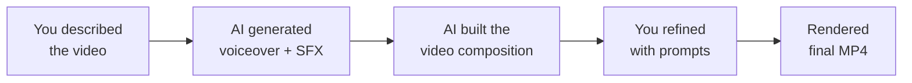

You have built a real promotional video — with animated text, AI voiceover, and sound effects — all by describing what you wanted in plain English. Let's look at what you achieved and where to go next.

## What you built



- Generated professional voiceover audio from a text script using ElevenLabs
- Created custom sound effects from text descriptions
- Built an animated video composition with Remotion — using only natural language prompts
- Iterated on the design through the describe-preview-refine loop
- Rendered a final MP4 file ready to share on LinkedIn, Instagram, or anywhere
- Learned to use an API key — a transferable skill used across the tech industry

<Tip>
**The skill you just learned is bigger than video creation.** You used an API key, called external services, and orchestrated multiple tools through natural language. This is the same pattern used in professional software development — you just did it without writing a single line of code.
</Tip>

## Try more video types

You built a personal brand intro. Now try these other scenarios — each prompt below is ready to use. Just paste it into your AI assistant.

<AccordionGroup>
  <Accordion title="Community Event Invitation">
  ```text title="Say this or copy this prompt"
  First, generate a voiceover using the ElevenLabs API with my API key [paste key]:
  "Join us for SheSharp's next workshop on AI and the future of work.
  Saturday, April 12th at GridAKL, Auckland. Free entry, all skill levels
  welcome. Scan the QR code or visit shesharp.co to register."

  Use the Rachel voice and save as public/voiceover.mp3

  Then generate a gentle bell chime sound effect, about 1 second long,
  and save it as public/chime.mp3

  Then create a Remotion composition:
  - Bright gradient background (coral to warm orange)
  - "SheSharp Workshop" title fading in at 1 second
  - Event details appearing line by line: date, time, venue
  - Chime sound effect on each new line
  - Voiceover starting at 0.5 seconds
  - "Register Now" call-to-action at the end with a pulse animation
  - 1080x1920 vertical format, 20 seconds at 30fps
  ```
  </Accordion>

  <Accordion title="Portfolio Project Showcase">
  ```text title="Say this or copy this prompt"
  First, generate a voiceover using the ElevenLabs API with my API key [paste key]:
  "I built a personal portfolio website using AI — from idea to live site in
  under an hour. It showcases my projects, skills, and contact information.
  No coding experience needed — I described what I wanted, and AI built it."

  Use the Bella voice (voice ID EXAVITQu4vr4xnSDxMaL) and save as
  public/voiceover.mp3

  Then generate soft keyboard typing sounds, 2 seconds, save as public/typing.mp3

  Then create a Remotion composition:
  - Dark background with a subtle code-editor aesthetic
  - Project title "My Portfolio Website" sliding in from the left
  - Three feature cards appearing one by one: "Built with AI", "Deployed in minutes", "Fully responsive"
  - Each card appears with the typing sound effect
  - Voiceover playing throughout
  - Website URL at the bottom fading in at the end
  - 1080x1920 vertical, 20 seconds at 30fps
  ```
  </Accordion>

  <Accordion title="Social Media Tip Reel">
  ```text title="Say this or copy this prompt"
  First, generate a voiceover using the ElevenLabs API with my API key [paste key]:
  "Here's a tip: you don't need to learn to code to work in tech. AI tools
  can build websites, create videos, and automate your workflow — all from
  natural language. The most important skill? Knowing how to describe what
  you want clearly. Start experimenting today."

  Use the Elli voice (voice ID MF3mGyEYCl7XYWbV9V6O) and save as
  public/voiceover.mp3

  Then generate an upbeat pop notification sound, 0.5 seconds, save as
  public/pop.mp3

  Then create a Remotion composition:
  - Bold, high-contrast background (black with neon accents)
  - Large "TECH TIP" title with a pop sound and bounce animation
  - Key phrases from the voiceover appearing as bold text overlays, timed to the speech
  - Pop sound on each new text appearance
  - Fast, punchy transitions
  - 1080x1920 vertical, 15 seconds at 30fps
  ```
  </Accordion>

  <Accordion title="Freelance Service Pitch">
  ```text title="Say this or copy this prompt"
  First, generate a voiceover using the ElevenLabs API with my API key [paste key]:
  "Need a professional website or digital presence? I design and build modern
  websites using the latest AI tools — fast, affordable, and tailored to your
  brand. Let's talk about what you need."

  Use the Josh voice (voice ID TxGEqnHWrfWFTfGW9XjX) and save as
  public/voiceover.mp3

  Then generate a confident, short drum hit accent sound, 1 second, save as
  public/accent.mp3

  Then create a Remotion composition:
  - Clean, professional gradient (dark slate to charcoal)
  - Service title "Web Design & AI Solutions" with elegant fade-in
  - Three service offerings appearing with the accent sound: "Custom Websites", "AI Automation", "Digital Strategy"
  - Contact email and website URL at the bottom
  - Voiceover throughout
  - 1080x1920 vertical, 20 seconds at 30fps
  ```
  </Accordion>

  <Accordion title="Post-Interview Thank-You Video">
  ```text title="Say this or copy this prompt"
  First, generate a voiceover using the ElevenLabs API with my API key [paste key]:
  "Hi [Interviewer Name], thank you so much for taking the time to meet with
  me today. I really enjoyed learning about your team and the work you're
  doing. I'm excited about the opportunity and look forward to hearing from
  you. Thanks again!"

  Use the Bella voice (voice ID EXAVITQu4vr4xnSDxMaL) and save as
  public/voiceover.mp3

  Then generate a warm, soft chime sound, 1 second, save as public/chime.mp3

  Then create a Remotion composition:
  - Warm, soft gradient background (light peach to soft lavender)
  - "Thank You, [Interviewer Name]!" text with a gentle fade-in
  - Your name and contact details appearing below
  - Soft chime at the start and end
  - Voiceover playing throughout
  - Professional but personal feel
  - 1920x1080 landscape (for email attachment), 15 seconds at 30fps
  ```
  </Accordion>
</AccordionGroup>

## Ideas to explore

<CardGroup cols={2}>
  <Card title="Build a video portfolio reel" icon="photo-film">
    Combine multiple short compositions into one longer video — your personal brand intro, a project showcase, and a skills summary. Ask AI to stitch them together with transitions.
  </Card>
  <Card title="Create videos in other languages" icon="globe">
    ElevenLabs supports 32 languages. Try generating a voiceover in Mandarin, Spanish, or Maori. Same workflow — just change the voiceover text and tell the AI which language to use.
  </Card>
  <Card title="Add background music" icon="music">
    Use [Suno AI](https://suno.com) to generate custom background music from a text description (e.g., "upbeat corporate background music, 30 seconds"). Download the MP3 and add it to your Remotion composition alongside the voiceover.
  </Card>
  <Card title="Build a reusable template" icon="clone">
    Ask your AI assistant to refactor your video into a template with variables — name, tagline, colours, voiceover file. Then you can create new videos by just changing the variables, without redesigning from scratch.
  </Card>
</CardGroup>

## Advanced prompts to try

```text title="Say this or copy this prompt"
Make the video responsive — create two versions of the composition: one vertical
(1080x1920 for social media) and one horizontal (1920x1080 for presentations).
Both should use the same voiceover and animations but with different layouts.
```

```text title="Say this or copy this prompt"
Add animated captions that appear in sync with the voiceover. Each phrase should
fade in as it is spoken and fade out when the next phrase begins. Use white text
with a dark semi-transparent background bar.
```

```text title="Say this or copy this prompt"
Create a 3-second animated intro logo for my name with a professional motion
graphics feel — think smooth scaling, rotation, and a light streak effect.
Add a subtle bass hit sound effect when the logo fully appears.
```

```text title="Say this or copy this prompt"
Set up an environment variable for my ElevenLabs API key so I don't have to
paste it into every prompt. Store it as ELEVENLABS_API_KEY and update the
voiceover generation script to read from it.
```

## Level up: From Gemini CLI to Claude Code

If you used Gemini CLI for this tutorial, you have already learned the core workflow. Claude Code offers a more capable experience — especially for complex video compositions:

| | Gemini CLI | Claude Code |
|---|---|---|
| **What is the same** | Describe what you want in the terminal. AI reads project files, writes code, generates videos. | Same workflow, same prompts. |
| **What is different** | Free, great for getting started | More capable, handles complex compositions better, officially recommended by Remotion |
| **Cost** | Free (1,000 requests/day) | Requires Max or Pro subscription |

If you used Claude Code already — you are using the tool that professional developers use for this exact workflow.

## Try another tutorial

<CardGroup cols={2}>
  <Card title="Build Your Personal Website" icon="globe" href="/tutorial/personal-website/overview">
    Create a portfolio website to host your new promo video — describe what you want and AI builds and deploys it.
  </Card>
  <Card title="Create Professional PDFs" icon="file-pdf" href="/tutorial/professional-pdf/overview">
    Same vibe coding workflow, different output — create beautiful resumes, cover letters, and reports from prompts.
  </Card>
  <Card title="Vibe Coding: Daily Report Bot" icon="robot" href="/tutorial/vibe-coding/overview">
    Ready for the next level? Build a full application using Claude Code — the same tool, more ambitious projects.
  </Card>
  <Card title="AI Morning Briefing" icon="sun" href="/tutorial/morning-briefing/overview">
    A lighter tutorial — connect AI to your Google Calendar and Gmail for a daily morning briefing.
  </Card>
</CardGroup>

## Reflect

<AccordionGroup>
  <Accordion title="What surprised you about creating videos with AI?">
  Most people are surprised at how natural the workflow feels. Instead of learning timeline editors and keyframe animations, you describe what you want in plain English. The AI handles all the technical work — your job is to be the creative director.
  </Accordion>
  <Accordion title="How could promotional videos help your career?">
  A short personal brand video makes your LinkedIn profile stand out. A portfolio showcase turns your projects into something shareable. A thank-you video after an interview makes you memorable. In a competitive job market, these small differentiators add up.
  </Accordion>
  <Accordion title="What would you create next?">
  Think about what you want to promote — yourself, an event, a project, a service. The same workflow works for all of them. You could even create videos for friends, community groups, or small businesses as a way to practice and build your portfolio.
  </Accordion>
  <Accordion title="How does this compare to traditional video editing?">
  Traditional video editing requires learning complex software (Premiere Pro, Final Cut, DaVinci Resolve), understanding timelines, keyframes, audio tracks, and export settings. The AI approach lets you focus on the creative vision while the technical execution is handled for you. Both approaches have their strengths — but for quick promotional content, the AI workflow is dramatically faster.
  </Accordion>
</AccordionGroup>

## Resources

| Resource | Description | Link |
|----------|-------------|------|
| Remotion | Programmatic video framework | [remotion.dev](https://remotion.dev) |
| Remotion + AI Guide | Official guide for AI-powered video creation | [remotion.dev/docs/ai](https://www.remotion.dev/docs/ai) |
| ElevenLabs | AI voice and sound effects platform | [elevenlabs.io](https://elevenlabs.io) |
| ElevenLabs Voice Library | Browse 3,000+ voices | [elevenlabs.io/voice-library](https://elevenlabs.io/voice-library) |
| Gemini CLI | Google's free AI terminal assistant | [github.com/google-gemini/gemini-cli](https://github.com/google-gemini/gemini-cli) |
| Claude Code | Anthropic's AI coding assistant | [docs.anthropic.com](https://docs.anthropic.com/en/docs/claude-code) |
| Suno AI | AI music generation | [suno.com](https://suno.com) |
| Wispr Flow | Voice input for any application | [wisprflow.ai](https://wisprflow.ai/r?CHAN115) |

<Note>
Thank you for completing this tutorial! You went from zero to a professional promotional video — with voiceover and sound effects — all created through natural language. The ability to describe what you want and have AI build it is a powerful skill. Take it with you.
</Note>
