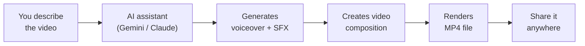

<Tip>
**Difficulty: ★★★★☆ Challenging** · Estimated time: ~1.5 to 2 hours
</Tip>

You need a 30-second video introducing yourself for LinkedIn. You could spend hours learning video editing software, watching tutorials about keyframes and timelines, and still end up with something that looks amateur. Or you could just describe what you want — "a dark gradient background, my name fading in, a professional voiceover, a swoosh sound on each transition" — and let AI build it for you.

**That's what we're building.** A workflow where you describe a video in plain English, and AI creates it — complete with animated text, professional voiceover, and sound effects. The result is a real MP4 file you can upload to LinkedIn, Instagram, or anywhere.

<Info>
**Tutorial led by [Chan Meng](https://chanmeng.org/)** — Senior AI/ML Engineer, open-source contributor, and former ByteDance developer. Chan has built 30+ live applications and specialises in AI-powered solutions. She is also a panel speaker at this event and the developer behind this website.
</Info>

## What you will build

<CardGroup cols={3}>
  <Card title="Describe Your Video" icon="microphone">
    Tell AI what you want — text, colours, animations, voiceover script — using natural language
  </Card>
  <Card title="AI Builds It" icon="wand-magic-sparkles">
    AI creates the video composition, generates professional voiceover audio and sound effects
  </Card>
  <Card title="Export to MP4" icon="film">
    Render the final video and share it on LinkedIn, Instagram, TikTok, or anywhere
  </Card>
</CardGroup>

## How it works

You describe what you want your video to look like. Your AI assistant (Gemini CLI or Claude Code) calls the ElevenLabs API to generate a voiceover and sound effects, then creates a Remotion video composition with animated text and audio. You preview it, refine it, and render the final MP4.

## What you will learn

- Describe a video in natural language and have AI build it for you
- Get and use an API key — a transferable professional skill used across the tech industry
- Generate AI voiceover audio from any text, in any of 32 supported languages
- Create sound effects from text descriptions (swooshes, chimes, typing sounds)
- Work with the describe-preview-refine loop — the same workflow professionals use
- Render a finished MP4 video you can share anywhere

<Note>
**No video editing skills required.** You will not open any video editing software. Your job is to describe what you want — the AI handles the rest. If you can describe a video to a friend, you can do this.
</Note>

## What kind of videos can you make?

Here are real examples — pick one for the tutorial, or come up with your own.

<CardGroup cols={3}>
  <Card title="Personal Brand Intro" icon="user">
    A 30-second "Hi, I'm [Name]" video for LinkedIn or your portfolio. Your name, tagline, key strengths, and a professional voiceover.
  </Card>
  <Card title="Event Invitation" icon="calendar">
    Promote a meetup, workshop, or community event. Animated date, venue, and call-to-action with a chime sound effect.
  </Card>
  <Card title="Portfolio Showcase" icon="briefcase">
    Walk through a completed project. Animated bullet points listing what you built, tools used, and the outcome — with narration.
  </Card>
  <Card title="Social Media Tip" icon="lightbulb">
    A short, punchy reel sharing a tech tip or motivational message. Bold animated text with voiceover — perfect for Instagram or TikTok.
  </Card>
  <Card title="Freelance Service Pitch" icon="handshake">
    Promote a freelance offering. Service name, what you do, and contact info with a professional voiceover.
  </Card>
  <Card title="Thank-You Video" icon="heart">
    A personalised follow-up after a job interview or networking event. Warm voiceover, your name, and contact details.
  </Card>
</CardGroup>

## Tools

<CardGroup cols={3}>
  <Card title="Gemini CLI or Claude Code" icon="terminal">
    Your AI assistant that runs in the terminal. Gemini CLI is free (1,000 requests/day). Claude Code is a paid alternative recommended by Remotion — more capable, same workflow.
  </Card>
  <Card title="Remotion" icon="video">
    A framework that creates videos from code. You never write the code yourself — AI does it. Free for personal use.
  </Card>
  <Card title="ElevenLabs" icon="volume-high">
    AI voice and sound effects. Turn any text into professional voiceover or generate sound effects from descriptions. Free tier included.
  </Card>
  <Card title="Node.js" icon="node-js">
    Required to run Gemini CLI, Remotion, and the ElevenLabs scripts. A one-time setup step.
  </Card>
  <Card title="Wispr Flow (optional)" icon="microphone">
    Speak your prompts instead of typing them. Works in any application, including your terminal.
  </Card>
</CardGroup>

## Cost

| Tool | Cost | Notes |
|------|------|-------|
| Gemini CLI | Free | 1,000 requests/day |
| Claude Code | Paid | Requires Max or Pro subscription. Optional alternative. |
| Node.js | Free | |
| Remotion | Free | Free for personal use |
| ElevenLabs | Free tier | 10,000 characters/month (~5–8 min of speech) |
| Wispr Flow (optional) | Free trial | [Invite link for a free month of Pro](https://wisprflow.ai/r?CHAN115) |
| **Total** | **$0** | Using Gemini CLI + free tiers |

## Prerequisites

<CardGroup cols={3}>
  <Card title="A laptop with internet" icon="laptop">
    Windows or macOS. No special hardware needed — rendering happens on your machine.
  </Card>
  <Card title="1.5 to 2 hours" icon="clock">
    Most of that is one-time setup. The actual video creation takes minutes. Take your time — there's no rush.
  </Card>
  <Card title="Curiosity" icon="sparkles">
    No coding or video editing experience needed. If you have completed any earlier tutorial in this series, you are well prepared.
  </Card>
</CardGroup>

<Note>
Ready to get started? Head to [Set up your tools](/tutorial/promo-video/setup) to install everything you need.
</Note>
