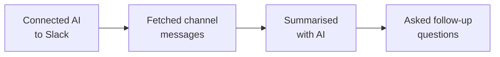

You built a real workflow for catching up on Slack channels using AI. Let's look at what you achieved and where to go next.

## What you built



- Connected an AI assistant to a live service (Slack) — using real credentials
- Fetched real messages from a real Slack channel
- Produced structured summaries in multiple formats
- Used follow-up questions to find specific information
- All for free, in under 45 minutes

## What you learned

<Tip>
**The skill that matters most isn't coding — it's knowing how to connect tools and ask the right questions.** You learned to link an AI assistant to a real service, fetch live data, and turn it into something useful. That is a transferable skill you can use in any job.
</Tip>

- How AI tools connect to external services (connectors and MCP)
- How to write prompts that produce useful, structured output
- How to customise summary formats for different audiences
- How to ask follow-up questions to explore data without reading it yourself
- How to work with AI as a productivity tool — not just a chatbot

## Ideas to try

<CardGroup cols={2}>
  <Card title="Summarise multiple channels" icon="layer-group">
    Fetch summaries from several channels and compare what is happening across your workspace. Try: "Summarise #general, #announcements, and #project-updates from the last week. What are the common themes?"
  </Card>
  <Card title="Weekly digest" icon="calendar-week">
    Create a weekly summary and share it with your team. Try: "Give me a weekly digest of #channel-name covering Monday to Friday. Format it as a newsletter I could paste into an email."
  </Card>
  <Card title="Summarise private channels" icon="lock">
    If you used Path B (Gemini CLI), you can add the `groups:history` and `groups:read` scopes to your Slack App to access private channels you are a member of. Go to your app settings at api.slack.com/apps to add these scopes.
  </Card>
  <Card title="Export as a PDF" icon="file-pdf">
    Combine this tutorial with the [Create Professional PDFs](/tutorial/professional-pdf/overview) tutorial — summarise a channel, then use Gemini CLI + Typst to create a beautifully formatted PDF report.
  </Card>
</CardGroup>

<AccordionGroup>
  <Accordion title="Prompt: compare multiple channels">
    ```text title="Copy this prompt — replace channel names"
    Summarise these three Slack channels from the last week:
    - #general
    - #announcements
    - #project-updates

    For each channel, give me 3-5 bullet points.
    Then tell me: what are the common themes across all three channels?
    ```
  </Accordion>
  <Accordion title="Prompt: weekly digest email">
    ```text title="Copy this prompt — replace #channel-name"
    Create a weekly digest for #channel-name covering the last 7 days.

    Format it as a short newsletter with:
    - A one-sentence overview at the top
    - Key updates (bullet points)
    - Action items
    - Links shared

    Make it professional enough to paste into an email to my team.
    ```
  </Accordion>
  <Accordion title="Prompt: find unanswered questions">
    ```text title="Copy this prompt — replace #channel-name"
    Read the recent messages in #channel-name and find any questions
    that were asked but never answered.

    List each unanswered question with:
    - Who asked it
    - When they asked it
    - The full question

    This will help me make sure nothing falls through the cracks.
    ```
  </Accordion>
</AccordionGroup>

## Reflect

<AccordionGroup>
  <Accordion title="What surprised you about connecting AI to Slack?">
  Many people are surprised how straightforward it is to connect AI to services they use every day. The technical barrier is much lower than most expect — especially with connectors (Path A) that require no setup at all.
  </Accordion>
  <Accordion title="How could this workflow help your work or job search?">
  Think about: catching up after time off, preparing for meetings by summarising relevant channels, creating weekly reports for your manager, or staying on top of community discussions in job-search groups. The ability to quickly extract information from conversations is valuable in any role.
  </Accordion>
  <Accordion title="What other information would you like AI to summarise?">
  The same approach works for emails, meeting transcripts, documents, news articles, and more. Once you know how to write effective prompts, you can apply this skill to any text-heavy task.
  </Accordion>
</AccordionGroup>

## Resources

| Resource | Description | Link |
|----------|-------------|------|
| Claude Desktop | Download Anthropic's AI assistant | [claude.ai/download](https://claude.ai/download) |
| Gemini CLI | Google's AI assistant for the terminal | [github.com/google-gemini/gemini-cli](https://github.com/google-gemini/gemini-cli) |
| Slack API docs | Official Slack API documentation | [api.slack.com](https://api.slack.com) |
| Slack MCP server | The MCP server used in Path B | [npmjs.com/package/@modelcontextprotocol/server-slack](https://www.npmjs.com/package/@modelcontextprotocol/server-slack) |
| Manage your Slack apps | Create and manage Slack Apps | [api.slack.com/apps](https://api.slack.com/apps) |

<Note>
Thank you for completing this tutorial! You went from zero to summarising real Slack conversations with AI. The ability to connect tools, fetch data, and extract meaning from it is valuable in any role — take this skill with you.
</Note>
