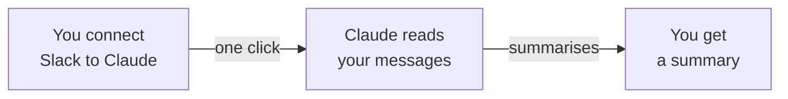
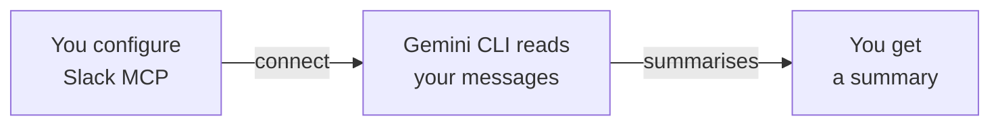

<Tip>
**Difficulty: ★★☆☆☆ Beginner** · Estimated time: ~45 minutes
</Tip>

You open Slack after a long weekend. There are 200 unread messages in #general, 80 in #project-updates, and a thread that somehow turned into 47 replies. You could spend 20 minutes scrolling through it all — or you could ask AI to summarise everything in 30 seconds.

**That's what we're building.** A workflow that reads your Slack messages and gives you a clear, useful summary — instantly.

<Info>
**Tutorial led by [Chan Meng](https://chanmeng.org/)** — Senior AI/ML Engineer, open-source contributor, and former ByteDance developer. Chan has built 30+ live applications and specialises in AI-powered solutions. She is also a panel speaker at this event and the developer behind this website.
</Info>

## What you will build

<CardGroup cols={3}>
  <Card title="Connect" icon="plug">
    Link an AI tool to your Slack workspace so it can read messages
  </Card>
  <Card title="Fetch" icon="download">
    Pull messages from any channel you choose
  </Card>
  <Card title="Summarise" icon="sparkles">
    AI reads the messages and gives you a clear, actionable summary
  </Card>
</CardGroup>

## Two paths to choose from

This tutorial offers two ways to achieve the same result. Pick the one that suits you best.

<CardGroup cols={2}>
  <Card title="Path A: Claude Desktop" icon="message-bot">
    **~10 minutes** · Easiest setup

    Download Claude Desktop, connect your Slack workspace with one click, and start asking for summaries. No terminal or coding involved.
  </Card>
  <Card title="Path B: Gemini CLI + MCP" icon="terminal">
    **~30 minutes** · More hands-on

    Install Gemini CLI, create a Slack App, and configure a Model Context Protocol (MCP) server. You will learn more about how AI tools connect to services.
  </Card>
</CardGroup>

<Tip>
**Which path should I choose?** If you are short on time or prefer clicking over typing, choose Path A. If you want to learn more about how AI tools work under the hood, choose Path B. Both paths produce the same result — a useful summary of your Slack messages.
</Tip>

## How it works

**Path A: Claude Desktop**

**Path B: Gemini CLI + MCP**

Both paths connect an AI assistant to your Slack workspace. The AI reads the messages from your chosen channel, analyses the conversation, and produces a structured summary — all in seconds.

## What you will learn

- Connect an AI tool to a real service (Slack) to access live data
- Write clear prompts that produce useful, structured summaries
- Customise summary formats for different needs (catch-up, meeting notes, highlights)
- Ask follow-up questions about conversations you haven't read
- Work with AI as a productivity tool for everyday tasks

<Note>
**No coding required.** The AI handles everything — your job is to describe what kind of summary you want. If you can explain what you need to a colleague, you can do this.
</Note>

## Tools

<CardGroup cols={2}>
  <Card title="Claude Desktop" icon="message-bot">
    Anthropic's free AI assistant app. Connect it to Slack and chat directly. Used in Path A.
  </Card>
  <Card title="Gemini CLI" icon="terminal">
    Google's free AI assistant that runs in your terminal. Supports MCP connections to external services. Used in Path B.
  </Card>
  <Card title="Slack API" icon="slack">
    Lets your tools read messages from Slack channels. You will create a simple Slack App with read-only access.
  </Card>
  <Card title="Node.js" icon="node-js">
    Required to install Gemini CLI and the Slack MCP server. Only needed for Path B.
  </Card>
</CardGroup>

## Cost

| Tool | Cost |
|------|------|
| Claude Desktop | Free |
| Gemini CLI | Free (1,000 requests/day) |
| Node.js | Free |
| Slack API | Free |
| **Total** | **$0** |

## Prerequisites

<CardGroup cols={3}>
  <Card title="A laptop with internet" icon="laptop">
    Windows or macOS. No special hardware needed.
  </Card>
  <Card title="About 45 minutes" icon="clock">
    Take your time — there's no rush. You can pause and come back anytime.
  </Card>
  <Card title="A Slack workspace" icon="slack">
    Any workspace where you are a member. This could be a work, community, or personal workspace.
  </Card>
</CardGroup>

<Note>
Ready to get started? Head to [Set up your tools](/tutorial/slack-summary/setup) to get everything ready.
</Note>
