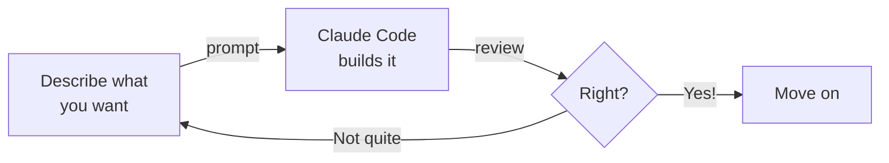
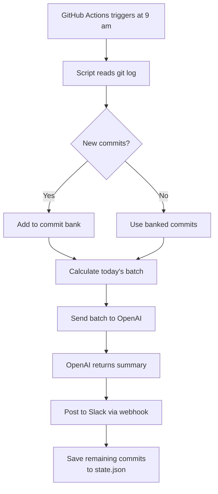

This is the heart of the tutorial. You will write six prompts to Claude Code, and by the end, you will have a fully working daily report bot. No coding required — just clear communication.

## How to Talk to Claude Code

<Tip>
Think of Claude Code as a brilliant colleague who can code anything, but needs you to explain the goal clearly. The better you describe what you want, the better the result.
</Tip>

The conversation loop is always the same:



Let's start building.

---

## Prompt 1: Describe the Whole Project

Before writing any code, give Claude Code the big picture. This helps it make better decisions at every step.

**Open your terminal, `cd` into your `daily-report-bot` folder, and type `claude` to start Claude Code. Then send this prompt:**

```text title="Your prompt to Claude Code"
I want to build a daily work report bot. Here's what it should do:

1. Run every weekday morning via GitHub Actions
2. Read my recent git commits from this repository
3. Use OpenAI's API to turn those commits into a friendly, human-readable daily standup update
4. Post the update to a Slack channel via a webhook

The bot should be written in Node.js. It should support a "dry run" mode
that prints the report to the console without posting to Slack.

I also want a "commit banking" feature: if I make 10 commits on Monday
but none on Tuesday, the bot should spread them across the week so every
day has something to report.

Can you start by creating a project structure with a package.json and
the main entry point? Don't write the full logic yet — just set up the
skeleton.
```

**What happens:** Claude Code creates a `package.json`, a main script file (e.g. `index.js` or `src/index.js`), and possibly a config file. It sets up the basic project structure without filling in the logic.

<Tip>
**Communication skill: Setting context.** Notice how the prompt starts with the big picture ("daily work report bot"), then lists specific requirements, then asks for a specific first step. This gives Claude Code enough context to make smart choices about project structure, naming, and dependencies.
</Tip>

<Accordion title="View the generated project structure">
Claude Code will typically create something like:

```
daily-report-bot/
  package.json
  src/
    index.js          # Main entry point
    commits.js        # Will collect git commits
    summarise.js      # Will call OpenAI
    slack.js          # Will post to Slack
    bank.js           # Will handle commit banking
  .env.example        # Template for environment variables
```

The exact structure may vary — that's fine. Claude Code is making reasonable decisions based on your description.
</Accordion>

---

## Prompt 2: Build the Commit Collector

Now let's build the first real piece — the script that reads your git commits.

```text title="Your prompt to Claude Code"
Now build the commit collector. It should:

1. Use git log to read commits from the last 24 hours (or a configurable time window)
2. Extract the commit message, author, and timestamp for each commit
3. Return them as a structured array
4. Handle the case where there are no commits gracefully
5. Use a separator that won't conflict with shell operators — not || or &&

Export the function so other parts of the project can use it.
```

**What happens:** Claude Code writes a function that runs `git log` with the right format string, parses the output, and returns a clean array of commit objects.

<Tip>
**Communication skill: Breaking work into steps.** Instead of asking Claude Code to build everything at once, we're doing one piece at a time. This makes each step easier to review, and if something goes wrong, you know exactly where.
</Tip>

<Accordion title="View the generated code">
```javascript
// src/commits.js
const { execSync } = require('child_process');

function getRecentCommits(hours = 24) {
  const since = new Date(Date.now() - hours * 60 * 60 * 1000).toISOString();

  try {
    const output = execSync(
      `git log --since="${since}" --pretty=format:"%H<SEP>%s<SEP>%an<SEP>%aI" --no-merges`,
      { encoding: 'utf-8' }
    );

    if (!output.trim()) {
      return [];
    }

    return output.trim().split('\n').map(line => {
      const [hash, message, author, date] = line.split('<SEP>');
      return { hash, message, author, date };
    });
  } catch (error) {
    console.error('Failed to read git log:', error.message);
    return [];
  }
}

module.exports = { getRecentCommits };
```
</Accordion>

---

## Prompt 3: Add the Smart Distribution (Commit Banking)

This is the cleverest part of the bot. If you do all your work on Monday, you don't want Tuesday through Friday to report "nothing done." Commit banking spreads your commits across the week.

```text title="Your prompt to Claude Code"
Now build the commit banking feature. Here's how it should work:

- Keep a "bank" of unposted commits in a local JSON file called state.json
- When new commits come in, add them to the bank
- Each day, calculate how many commits to include in today's report:
  divide the total banked commits by the remaining weekdays this week
  (including today), and round up
- Take that many commits from the bank for today's report
- Save the remaining commits back to state.json
- On Friday, use all remaining commits so the bank starts empty on Monday
- If there are no commits in the bank at all, return an empty array

Make sure state.json can be committed to git so GitHub Actions can
persist it between runs.
```

**What happens:** Claude Code creates the banking logic with functions to load, save, and distribute commits across weekdays.

<Tip>
**Communication skill: Describing business logic in plain language.** You didn't write any algorithm — you described the *behaviour* you wanted. "Divide by remaining weekdays, round up, empty on Friday." Claude Code translates this into working code.
</Tip>

<Accordion title="How commit banking works in practice">
Here's what happens in a real week:

| Day | New commits | Banked total | Today's batch | Remaining |
|-----|------------|--------------|---------------|-----------|
| Monday | 10 | 10 | 2 (10 / 5 days) | 8 |
| Tuesday | 0 | 8 | 2 (8 / 4 days) | 6 |
| Wednesday | 3 | 9 | 3 (9 / 3 days) | 6 |
| Thursday | 0 | 6 | 3 (6 / 2 days) | 3 |
| Friday | 2 | 5 | 5 (all remaining) | 0 |

Every day has something to report, even if you didn't commit that day.
</Accordion>

<Accordion title="View the generated code">
```javascript
// src/bank.js
const fs = require('fs');
const path = require('path');

const STATE_FILE = path.join(__dirname, '..', 'state.json');

function loadState() {
  try {
    return JSON.parse(fs.readFileSync(STATE_FILE, 'utf-8'));
  } catch {
    return { bankedCommits: [] };
  }
}

function saveState(state) {
  fs.writeFileSync(STATE_FILE, JSON.stringify(state, null, 2));
}

function getRemainingWeekdays() {
  const today = new Date().getDay(); // 0=Sun, 1=Mon, ..., 5=Fri
  if (today === 0 || today === 6) return 0;
  return 6 - today; // days remaining including today: Mon=5, Tue=4, ..., Fri=1
}

function getTodaysBatch(newCommits) {
  const state = loadState();
  state.bankedCommits.push(...newCommits);

  const remaining = getRemainingWeekdays();
  if (remaining <= 0) return [];

  const isFriday = new Date().getDay() === 5;
  const batchSize = isFriday
    ? state.bankedCommits.length
    : Math.ceil(state.bankedCommits.length / remaining);

  const batch = state.bankedCommits.splice(0, batchSize);
  saveState(state);

  return batch;
}

module.exports = { getTodaysBatch, loadState, saveState };
```
</Accordion>

---

## Prompt 4: Add the AI Summariser

Now we connect to OpenAI to turn raw commit messages into a friendly daily update.

```text title="Your prompt to Claude Code"
Now build the summariser. It should:

1. Take an array of commit objects (message, author, date)
2. Send them to OpenAI's chat completions API (use gpt-4o-mini to keep costs low)
3. Ask OpenAI to write a friendly daily standup update from these commits
4. The system prompt should tell the AI to:
   - Write in first person
   - Group related work together
   - Keep it concise (3-5 bullet points)
   - Use a warm, professional tone
   - End with any blockers (or "No blockers" if none)
5. Return the formatted text

Use the OPENAI_API_KEY environment variable for authentication.
```

**What happens:** Claude Code creates a function that formats commits into a prompt, calls the OpenAI API, and returns the summary text.

<Tabs>
  <Tab title="What you asked">
    You described the *behaviour* — take commits in, get a friendly summary out. You specified the model, tone, format, and how authentication works.
  </Tab>
  <Tab title="What Claude Code built">
    Claude Code wrote the API call, crafted the system prompt, handled errors, and returned clean text. It made decisions about temperature, token limits, and error handling that you didn't need to think about.
  </Tab>
</Tabs>

<Tip>
**Communication skill: Specifying integrations and output format.** When connecting to external services, tell Claude Code which API to use, what model, and what the output should look like. The more specific you are about the result, the less you'll need to iterate.
</Tip>

<Accordion title="View the generated code">
```javascript
// src/summarise.js
const OpenAI = require('openai');

const client = new OpenAI({ apiKey: process.env.OPENAI_API_KEY });

const SYSTEM_PROMPT = `You are a helpful assistant that writes daily standup updates.
Given a list of git commits, write a concise daily update in first person.
Group related work together. Use 3-5 bullet points.
Keep the tone warm and professional.
End with "Blockers: None" unless the commits suggest otherwise.
Do not include commit hashes or timestamps.`;

async function summariseCommits(commits) {
  if (commits.length === 0) {
    return "No updates today — no recent commits to report.";
  }

  const commitList = commits
    .map(c => `- ${c.message} (${c.date})`)
    .join('\n');

  const response = await client.chat.completions.create({
    model: 'gpt-4o-mini',
    messages: [
      { role: 'system', content: SYSTEM_PROMPT },
      { role: 'user', content: `Here are my recent commits:\n\n${commitList}\n\nWrite my daily standup update.` }
    ],
    temperature: 0.7,
    max_tokens: 500,
  });

  return response.choices[0].message.content;
}

module.exports = { summariseCommits };
```
</Accordion>

---

## Prompt 5: Add Slack Posting

Time to connect the output to Slack.

```text title="Your prompt to Claude Code"
Now build the Slack posting module. It should:

1. Take the summary text from the summariser
2. Post it to Slack using an incoming webhook URL
3. Use the SLACK_WEBHOOK_URL environment variable
4. Format the message nicely for Slack (use mrkdwn format)
5. Add a header like "Daily Update — [today's date]"
6. Handle errors gracefully — log the error but don't crash

Use the native https module or fetch — no need for a Slack SDK.
```

**What happens:** Claude Code creates a small function that sends a POST request to the Slack webhook with a formatted message.

<Tip>
**Communication skill: Building incrementally.** Notice we didn't try to build Slack posting in Prompt 1. By this point, Claude Code understands the whole project. It knows the summariser returns text, and it connects the pieces naturally.
</Tip>

<Accordion title="View the generated code">
```javascript
// src/slack.js
async function postToSlack(summary) {
  const webhookUrl = process.env.SLACK_WEBHOOK_URL;

  if (!webhookUrl) {
    throw new Error('SLACK_WEBHOOK_URL environment variable is not set');
  }

  const today = new Date().toLocaleDateString('en-NZ', {
    weekday: 'long',
    year: 'numeric',
    month: 'long',
    day: 'numeric',
  });

  const payload = {
    blocks: [
      {
        type: 'header',
        text: { type: 'plain_text', text: `Daily Update — ${today}` },
      },
      {
        type: 'section',
        text: { type: 'mrkdwn', text: summary },
      },
    ],
  };

  const response = await fetch(webhookUrl, {
    method: 'POST',
    headers: { 'Content-Type': 'application/json' },
    body: JSON.stringify(payload),
  });

  if (!response.ok) {
    const body = await response.text();
    throw new Error(`Slack webhook failed (${response.status}): ${body}`);
  }

  console.log('Posted to Slack successfully.');
}

module.exports = { postToSlack };
```
</Accordion>

---

## Prompt 6: Wire It All Together and Test Locally

The last build step — connect all the pieces and add a dry-run mode for safe testing.

```text title="Your prompt to Claude Code"
Now wire everything together in the main entry point. It should:

1. Collect recent commits using the commit collector
2. Pass them through the commit banking system
3. Send the batch to the OpenAI summariser
4. Post the summary to Slack

Add a --dry-run flag (or DRY_RUN=true environment variable) that:
- Skips the Slack posting step
- Prints the summary to the console instead
- Still updates state.json so we can test the banking logic

Also add a --channel flag or SLACK_CHANNEL environment variable that
defaults to "test". When set to "prod", use SLACK_WEBHOOK_PROD instead
of SLACK_WEBHOOK_TEST.

Add helpful console.log messages at each step so I can follow what's
happening when it runs.
```

**What happens:** Claude Code creates the main script that orchestrates all the pieces, with command-line flags and environment variable support.

<Warning>
**Keep your API keys safe.** Never commit `.env` files, API keys, or webhook URLs to git. We'll store them as GitHub secrets in the next section.
</Warning>

<Tip>
**Communication skill: Requesting integration and testing.** This prompt brings everything together and asks for testing support (dry-run mode). Always ask for a way to test safely before connecting to real services.
</Tip>

<Accordion title="View the generated code">
```javascript
// src/index.js
const { getRecentCommits } = require('./commits');
const { getTodaysBatch } = require('./bank');
const { summariseCommits } = require('./summarise');
const { postToSlack } = require('./slack');

async function main() {
  const isDryRun = process.argv.includes('--dry-run') || process.env.DRY_RUN === 'true';
  const channel = process.argv.includes('--channel')
    ? process.argv[process.argv.indexOf('--channel') + 1]
    : process.env.SLACK_CHANNEL || 'test';

  // Set the right webhook URL based on channel
  if (channel === 'prod') {
    process.env.SLACK_WEBHOOK_URL = process.env.SLACK_WEBHOOK_PROD;
  } else {
    process.env.SLACK_WEBHOOK_URL = process.env.SLACK_WEBHOOK_TEST;
  }

  console.log(`Running daily report (dry-run: ${isDryRun}, channel: ${channel})`);

  // Step 1: Collect commits
  console.log('Collecting recent commits...');
  const commits = getRecentCommits();
  console.log(`Found ${commits.length} new commit(s).`);

  // Step 2: Bank and batch
  console.log('Processing commit bank...');
  const batch = getTodaysBatch(commits);
  console.log(`Today's batch: ${batch.length} commit(s).`);

  if (batch.length === 0) {
    console.log('No commits to report today. Exiting.');
    return;
  }

  // Step 3: Summarise
  console.log('Generating summary with OpenAI...');
  const summary = await summariseCommits(batch);
  console.log('\n--- Daily Report ---');
  console.log(summary);
  console.log('-------------------\n');

  // Step 4: Post to Slack
  if (isDryRun) {
    console.log('Dry run — skipping Slack post.');
  } else {
    console.log('Posting to Slack...');
    await postToSlack(summary);
  }

  console.log('Done!');
}

main().catch(error => {
  console.error('Error:', error.message);
  process.exit(1);
});
```
</Accordion>

---

## Using Claude in Chrome to Research

Sometimes you need to look something up — Slack's webhook format, GitHub Actions syntax, or an error message. That's where Claude in Chrome comes in.

<Tabs>
  <Tab title="Research with Claude in Chrome">
    1. Open the Slack API docs or any documentation page in Chrome
    2. Click the Claude in Chrome extension icon
    3. Ask it to explain what you're reading, e.g.: *"What format does Slack expect for incoming webhook messages?"*
    4. Use the answer to refine your next prompt to Claude Code
  </Tab>
  <Tab title="Apply with Claude Code">
    Take what you learned from your research and feed it back to Claude Code:

    ```text title="Your prompt to Claude Code"
    I looked up the Slack webhook format. It supports blocks with
    "mrkdwn" type for rich formatting. Can you update the Slack
    module to use blocks instead of a plain text payload?
    ```

    Claude Code updates the code based on your research.
  </Tab>
</Tabs>

---

## Communication Tips Summary

<AccordionGroup>
  <Accordion title="Be specific about what you want">
    Instead of "build a Slack bot", say "build a function that sends a POST request to a Slack incoming webhook with a formatted message using blocks." The more specific, the fewer iterations.
  </Accordion>
  <Accordion title="Give context about your situation">
    Start with the big picture. Tell Claude Code what the project is, who it's for, and what tools you're using. Context helps it make better decisions about architecture, naming, and dependencies.
  </Accordion>
  <Accordion title="Ask Claude Code to explain what it did">
    If you don't understand the code, ask: *"Can you explain what this function does in plain language?"* Understanding the code helps you spot issues and write better follow-up prompts.
  </Accordion>
  <Accordion title="If something breaks, describe the error">
    Copy and paste the exact error message. Tell Claude Code what you expected to happen and what actually happened. Don't try to diagnose the problem yourself — let the AI help.
  </Accordion>
  <Accordion title="Iterate — refine your request step by step">
    Your first prompt rarely produces the perfect result. That's normal. Review what Claude Code built, identify what's not quite right, and send a follow-up prompt. Each iteration gets you closer.
  </Accordion>
</AccordionGroup>

---

## Full Data Flow

Here's how everything connects:



<Note>
Your bot is built! Head to [Deploy and test](/tutorial/vibe-coding/deploy-and-test) to set up GitHub Actions and see it run for real.
</Note>
