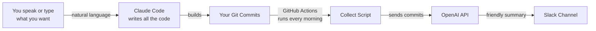
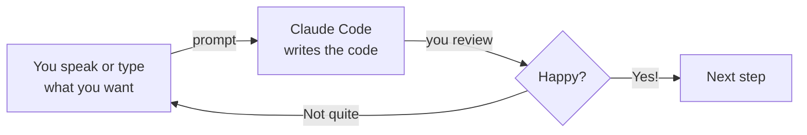

<Tip>
**Difficulty: ★★★★★ Advanced** · Estimated time: ~2 hours
</Tip>

<Info>
**Workshop led by [Chan Meng](https://chanmeng.org/)** — Senior AI/ML Engineer, open-source contributor, and former ByteDance developer. Chan has built 30+ live applications and specialises in AI-powered solutions. She is also a panel speaker at this event and the developer behind this website.
</Info>

## The Problem

You just joined a new team. Your manager posts in Slack: *"From now on, everyone posts a daily update — what you finished, what you're working on, any blockers."*

The first week, you do it diligently. By week two, you forget half the time. By week three, you're copy-pasting yesterday's message and changing a few words.

Sound familiar? You're not lazy — you're human. The information already exists in your git commits. You just need something to read those commits and turn them into a friendly daily update, automatically, every morning.

**That's what we're building.** And we're not writing a single line of code ourselves. Just describe what you want — by speaking or typing — and Claude Code builds it all.

## What Is Vibe Coding?

<Tip>
**Vibe coding** means describing what you want in plain language and letting AI write the code for you. You guide the direction, review the results, and iterate until it works. Think of it as directing a builder — you don't need to lay the bricks yourself, but you do need to explain what the house should look like. With voice input via Wispr Flow, you can literally speak your ideas into existence.
</Tip>

<Info>
**Built on your CLI skills.** If you completed earlier tutorials using Gemini CLI, you already know how to work with AI in the terminal — speaking prompts, approving tool calls, and reviewing results. Claude Code uses the same workflow, but can write, edit, and deploy real code. The difference is power, not process.
</Info>

## What You Will Build

<CardGroup cols={3}>
  <Card title="Collects" icon="code-branch">
    Gathers your recent git commits automatically
  </Card>
  <Card title="Summarises" icon="sparkles">
    Uses AI to write a friendly daily update from your commits
  </Card>
  <Card title="Posts" icon="comments">
    Sends it to your Slack channel every morning
  </Card>
</CardGroup>

## How It Works

You describe what you want — by speaking through Wispr Flow or typing in the terminal. Claude Code writes the code. Once deployed, the bot runs automatically every morning: it collects your git commits, sends them to an AI model to be rewritten as a human-friendly update, and posts the result straight to Slack.

## What You Will Learn

This tutorial focuses on **communication skills with AI**, not coding knowledge. You will learn how to:

- Write clear prompts that get the result you want on the first try
- Break a project into small, buildable steps
- Describe business logic in plain language so AI can implement it
- Iterate and refine when the first result isn't quite right
- Use multiple AI tools together (Claude Code for building, Claude in Chrome for research)
- Use voice input to speed up your workflow with Wispr Flow

<Note>
You do not need to know how to code. Claude Code writes the code — your job is to describe what you want clearly. If you can explain an idea to a colleague, you can vibe code. Speaking your ideas out loud through Wispr Flow makes this even more natural.
</Note>

## The Vibe Coding Workflow

Every step in this tutorial follows the same loop:

You describe. Claude Code builds. You review. Repeat until it's right, then move on.

<Tip>
**Voice or keyboard — your choice.** With Wispr Flow, you can speak your prompts naturally and your words appear as text in Claude Code. Every prompt in this tutorial works whether you speak it or type it. Voice is especially handy for describing complex features — just talk through what you want as if explaining to a colleague.
</Tip>

## Tools You Will Use

<CardGroup cols={2}>
  <Card title="Claude Code" icon="terminal">
    Your AI coding partner. You describe what you want in plain language, and it writes the code. Runs in your terminal.
  </Card>
  <Card title="Wispr Flow" icon="microphone">
    Optional voice input tool — speak instead of type. Works in any application, including your terminal. Your words flow directly into Claude Code as text.
  </Card>
  <Card title="Claude in Chrome" icon="chrome">
    A browser extension that helps you research documentation, understand error messages, and find answers — without leaving your browser.
  </Card>
  <Card title="OpenAI API" icon="brain">
    The AI service that reads your git commits and writes a human-friendly daily update. We use this as the summariser inside the bot.
  </Card>
  <Card title="GitHub Actions" icon="clock">
    GitHub's built-in automation. It runs your bot every morning on a schedule — no server needed.
  </Card>
  <Card title="Node.js" icon="node-js">
    A free tool needed to install Claude Code and run your bot. One-time setup.
  </Card>
</CardGroup>

## Cost

| Tool | Cost |
|------|------|
| Claude Code | Free tier available |
| Wispr Flow | Free trial ([invite link for a free month of Pro](https://wisprflow.ai/r?CHAN115)) |
| Claude in Chrome | Free |
| OpenAI API | ~$0.01/day (a few cents per month) |
| GitHub Actions | Free for public repos (2,000 mins/month for private) |
| Slack | Free |
| **Total** | **~$0/month** |

<Note>
Ready to get started? Head to [Set up your tools](/tutorial/vibe-coding/setup) to get everything ready.
</Note>
