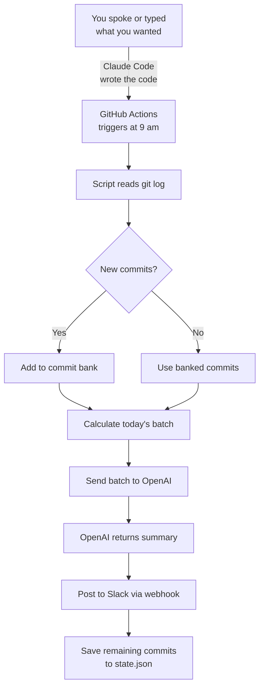

Congratulations — you built a working Slack bot without writing a single line of code yourself. You described what you wanted — by speaking or typing — and Claude Code turned your words into a fully automated daily report bot. Let's recap what you achieved, explore where to take it next, and reflect on the experience.

## What You Built



A daily report bot that:
- Collects your git commits automatically
- Distributes them across the working week using commit banking
- Summarises them into a friendly daily update using AI
- Posts the update to your Slack channel every morning

---

## What You Actually Learned

The code is useful, but the real skills you practised are transferable to any project:

<Tip>
**The skill that matters most isn't coding — it's communication.** You learned to break a problem into steps, describe each step clearly, and iterate until the result is right. Whether you spoke your prompts through Wispr Flow or typed them, the core skill is the same: explaining what you want so an AI can build it. These are the same skills that make someone effective working with any AI tool, in any field.
</Tip>

Here's what you practised:

- **Setting context** — giving Claude Code the big picture before diving into details
- **Breaking work into steps** — tackling one piece at a time instead of everything at once
- **Describing business logic** — explaining what you want in plain language, not code
- **Specifying integrations** — being clear about which APIs, formats, and tools to use
- **Building incrementally** — each step builds on the previous one
- **Requesting testing** — always asking for a safe way to verify before going live
- **Debugging with AI** — describing errors clearly and letting the AI help diagnose
- **Using voice as input** — speaking naturally to describe features and requirements

---

## The Commit Banking Algorithm

For those curious about the maths behind commit banking:

<Accordion title="Deep dive: How commit banking distributes commits">
The algorithm is simple but effective:

**Rule:** Each day, divide the total banked commits by the number of remaining weekdays (including today), and round up. On Friday, use everything.

Here's a full week example with 15 commits made on Monday:

| Day | Banked | Remaining days | Batch size | Sent | Left |
|-----|--------|---------------|------------|------|------|
| Monday | 15 | 5 | ceil(15/5) = 3 | 3 | 12 |
| Tuesday | 12 | 4 | ceil(12/4) = 3 | 3 | 9 |
| Wednesday | 9 | 3 | ceil(9/3) = 3 | 3 | 6 |
| Thursday | 6 | 2 | ceil(6/2) = 3 | 3 | 3 |
| Friday | 3 | 1 | 3 (all) | 3 | 0 |

Another example — commits arrive throughout the week:

| Day | New | Banked | Batch | Sent | Left |
|-----|-----|--------|-------|------|------|
| Monday | 4 | 4 | ceil(4/5) = 1 | 1 | 3 |
| Tuesday | 0 | 3 | ceil(3/4) = 1 | 1 | 2 |
| Wednesday | 6 | 8 | ceil(8/3) = 3 | 3 | 5 |
| Thursday | 0 | 5 | ceil(5/2) = 3 | 3 | 2 |
| Friday | 1 | 3 | 3 (all) | 3 | 0 |

The bank always empties by Friday, so Monday starts fresh.
</Accordion>

---

## Ideas to Try Next

Use the same approach — speak or type what you want, and let Claude Code build it:

<CardGroup cols={2}>
  <Card title="Add a weekly summary" icon="calendar-week">
    Ask Claude Code to create a separate workflow that runs on Friday and posts a summary of the entire week's work — a "weekly digest" instead of a daily update.
  </Card>
  <Card title="Post to Microsoft Teams" icon="users">
    Replace the Slack webhook with a Teams incoming webhook. The message format is slightly different, but Claude Code can handle the conversion.
  </Card>
  <Card title="Include Jira or Trello tasks" icon="list-check">
    Extend the bot to pull in your recent Jira tickets or Trello card movements alongside git commits, giving a fuller picture of your day.
  </Card>
  <Card title="Add a motivational quote" icon="quote-left">
    Ask Claude Code to add a random motivational quote at the end of each report. A small touch that makes daily updates more fun.
  </Card>
</CardGroup>

Here's a prompt to get you started on any of these — say it or paste it into Claude Code:

```text title="Say this or copy this prompt"
I want to add a weekly summary feature. Every Friday, after the daily
report, generate a second message that summarises everything posted
Monday through Friday. Post it to Slack with the header
"Weekly Summary — [date range]".
```

---

## Pitfalls and Lessons Learned

<AccordionGroup>
  <Accordion title="Shell interprets || as an OR operator">
    If you use `||` as a separator in `git log --pretty=format`, the shell will treat it as a logical OR. Use a safe separator like `<SEP>` instead. This is a classic gotcha that trips up even experienced developers.
  </Accordion>
  <Accordion title="GitHub Actions cron is not precise">
    Scheduled workflows can be delayed by up to 15 minutes during periods of high demand. Don't rely on exact timing — design your bot to work regardless of when it runs.
  </Accordion>
  <Accordion title="state.json must be committed">
    The commit bank state needs to persist between runs. Since GitHub Actions starts fresh each time, `state.json` must be committed to the repository. That's why the workflow includes a step to commit and push it after each run.
  </Accordion>
  <Accordion title="fetch-depth: 0 is required">
    By default, `actions/checkout` only fetches the latest commit (shallow clone). Your bot needs the full git history to find recent commits. Always set `fetch-depth: 0`.
  </Accordion>
  <Accordion title="Never commit webhook URLs or API keys">
    Store all secrets in GitHub Secrets, not in your code. If you accidentally commit a secret, revoke it immediately and generate a new one. Git history keeps deleted content — removing a secret from the latest commit doesn't remove it from history.
  </Accordion>
</AccordionGroup>

---

## Reflect

Take a few minutes to think about your experience:

<AccordionGroup>
  <Accordion title="What surprised you about working with Claude Code?">
    Many people are surprised by how much can be accomplished just by describing what they want clearly. Was there a moment where Claude Code's output exceeded your expectations? What about a moment where you had to refine your prompt?
  </Accordion>
  <Accordion title="Did speaking your prompts feel different from typing them?">
    If you used Wispr Flow, you may have noticed that speaking encourages you to explain things more naturally — the way you'd describe something to a colleague. Did voice input change how you communicated with Claude Code? Did it make the process faster or more intuitive?
  </Accordion>
  <Accordion title="How could you use this approach at work?">
    Vibe coding isn't just for building bots. Think about repetitive tasks in your job — reports, data formatting, email templates. Could you use Claude Code to automate any of them? Could voice input make it even faster to prototype ideas?
  </Accordion>
  <Accordion title="What would you build next?">
    Now that you know the workflow — describe, build, review, iterate — what else could you create? A Slack bot that answers FAQs? A script that organises your files? A tool that generates meeting notes?
  </Accordion>
</AccordionGroup>

---

## Resources

| Resource | Description | Link |
|----------|-------------|------|
| Claude Code docs | Official documentation for Claude Code | [docs.anthropic.com](https://docs.anthropic.com/en/docs/claude-code) |
| Wispr Flow | Voice-to-text tool for hands-free input | [wisprflow.ai](https://wisprflow.ai/r?CHAN115) |
| GitHub Actions docs | Learn more about workflows, triggers, and secrets | [docs.github.com/actions](https://docs.github.com/en/actions) |
| OpenAI API reference | API documentation for chat completions | [platform.openai.com/docs](https://platform.openai.com/docs) |
| Slack API — Webhooks | How incoming webhooks work | [api.slack.com/messaging/webhooks](https://api.slack.com/messaging/webhooks) |
| Crontab Guru | Test and understand cron schedule expressions | [crontab.guru](https://crontab.guru) |

<Note>
Thank you for completing this tutorial! You've gone from zero to a fully automated daily report bot — and more importantly, you've learned how to communicate effectively with AI tools, whether by voice or keyboard. Take these skills with you into your next project.
</Note>
