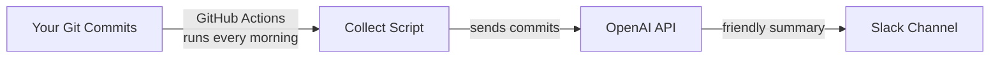
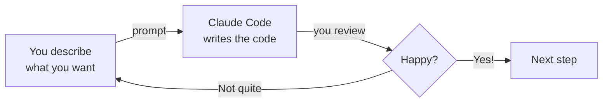

# Vibe Coding: Build a Daily Work Report Bot

## The Problem

You just joined a new team. Your manager posts in Slack: *"From now on, everyone posts a daily update — what you finished, what you're working on, any blockers."*

The first week, you do it diligently. By week two, you forget half the time. By week three, you're copy-pasting yesterday's message and changing a few words.

Sound familiar? You're not lazy — you're human. The information already exists in your git commits. You just need something to read those commits and turn them into a friendly daily update, automatically, every morning.

**That's what we're building.** And we're not writing a single line of code ourselves. Claude Code does all the coding — your job is to describe what you want, clearly.

## What Is Vibe Coding?

<Tip>
**Vibe coding** means describing what you want in plain language and letting AI write the code for you. You guide the direction, review the results, and iterate until it works. Think of it as directing a builder — you don't need to lay the bricks yourself, but you do need to explain what the house should look like.
</Tip>

## What You Will Build

<CardGroup cols={3}>
  <Card title="Collects" icon="code-branch">
    Gathers your recent git commits automatically
  </Card>
  <Card title="Summarises" icon="sparkles">
    Uses AI to write a friendly daily update from your commits
  </Card>
  <Card title="Posts" icon="comments">
    Sends it to your Slack channel every morning
  </Card>
</CardGroup>

## How It Works

Your git commits are the raw material. Every morning, a scheduled script collects them, sends them to an AI model to be rewritten as a human-friendly update, and posts the result straight to Slack.

## What You Will Learn

This tutorial focuses on **communication skills with AI**, not coding knowledge. You will learn how to:

- Write clear prompts that get the result you want on the first try
- Break a project into small, buildable steps
- Describe business logic in plain language so AI can implement it
- Iterate and refine when the first result isn't quite right
- Use multiple AI tools together (Claude Code for building, Claude in Chrome for research)

<Note>
You do not need to know how to code. Claude Code writes the code — your job is to describe what you want clearly. If you can explain an idea to a colleague, you can vibe code.
</Note>

## The Vibe Coding Workflow

Every step in this tutorial follows the same loop:

You describe. Claude Code builds. You review. Repeat until it's right, then move on.

## Tools You Will Use

<CardGroup cols={2}>
  <Card title="Claude Code" icon="terminal">
    Your AI coding partner. You describe what you want in plain language, and it writes the code. Runs in your terminal.
  </Card>
  <Card title="Claude in Chrome" icon="chrome">
    A browser extension that helps you research documentation, understand error messages, and find answers — without leaving your browser.
  </Card>
  <Card title="OpenAI API" icon="brain">
    The AI service that reads your git commits and writes a human-friendly daily update. We use this as the summariser inside the bot.
  </Card>
  <Card title="GitHub Actions" icon="clock">
    GitHub's built-in automation. It runs your bot every morning on a schedule — no server needed.
  </Card>
</CardGroup>

## Cost

| Tool | Cost |
|------|------|
| Claude Code | Free tier available |
| Claude in Chrome | Free |
| OpenAI API | ~$0.01/day (a few cents per month) |
| GitHub Actions | Free for public repos (2,000 mins/month for private) |
| Slack | Free |
| **Total** | **~$0/month** |

<Note>
Ready to get started? Head to [Set up your tools](/workshop/vibe-coding/setup) to get everything ready.
</Note>
